# Bonus! Red Log4Jack

The screen to start is very complex, but I'm going to copy paste specific things so they're readable. It generally looked like this:

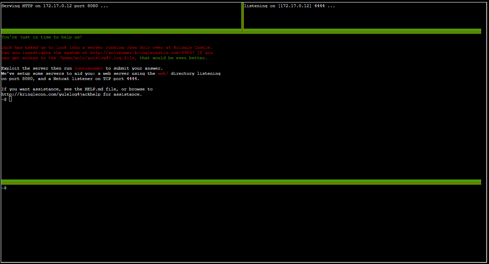

Confirmed the endpoint `http://solrpower.kringlecastle.com:8983/solr/` is running Solr

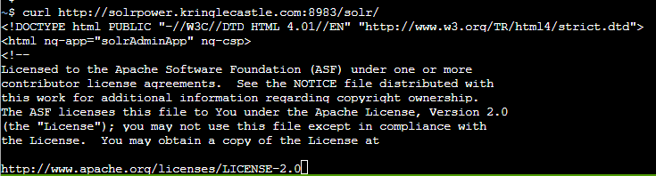

Running the marshalsec marshalling service to exploit:

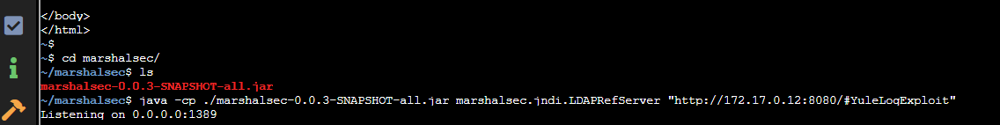

Code I'm going to compile which will be marshalled, waiting for java to pick it up an deserialize it, causing a shell to bounce back.

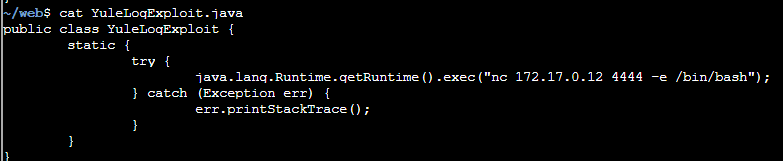

The result:

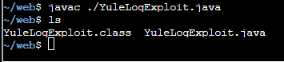

Triggering the exploit:

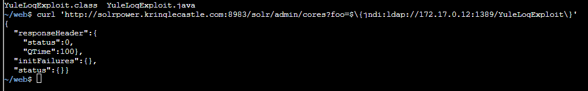

JNDI reaches out to my ldap server responder:

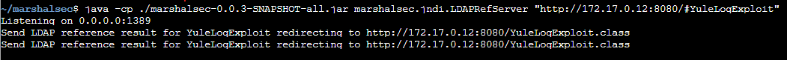

LDAP server responds with a redirection to my waiting web server to deliver the `YuleLogExploit.class` file:

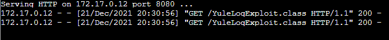

Netcat shell!

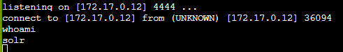

Found in `/home/solr`, the file `kringle.txt`

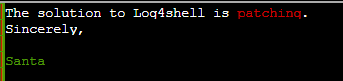

And submitting the answer:

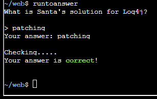