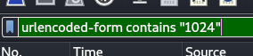

# Customer Complaint Analysis

This challenge gives you a giant pcap file and you're supposed to find out the names of the 3 trolls that complained about guests in the room. Let's dive in.

First, I see an HTTP POST request that I can click on and follow the HTTP conversation


### THIS


### NOT THIS


Which shows me an HTTP session in which a troll complains, and a response from Jack as well.

The Trolls complaint:

```text
POST /feedback/guest_complaint.php HTTP/1.1
Host: frost-tower.local
User-Agent: Mozilla/5.0 (X11; CranPi; Linux arm7; rv:94.0) Gecko/20100101 FrostyFox/94.0
Accept: text/html,application/xhtml+xml,application/xml;q=0.9,image/avif,image/webp,*/*;q=0.8
Accept-Language: en-US,en;q=0.5
Accept-Encoding: gzip, deflate
Content-Type: application/x-www-form-urlencoded
Content-Length: 272
Origin: http://frost-tower.local
DNT: 1
Connection: keep-alive
Referer: http://frost-tower.local/feedback/guest_complaint.html
Upgrade-Insecure-Requests: 1

name=Gavk&troll_id=2354&guest_info=Annoying+woman+in+room+1239&description=Woman+call+desk+and+complain+that+room+is+cold.+I+go+to+room%2C+knock+on+door%2C+and+tell+her+nice+that+I+eat+beans+at+lunch+and+can+warm+room+up.+She+slam+door+in+Gavk+face.+So+mean.&submit=Submit
```

Jack's response:

```html
<html>
<head>
<style>
.jje-output {color: #FF0000;}
.container {
    position: relative;
    margin: auto;
    width: 30%;
    top: 200px;
    padding: 10px;
    border-style: solid;
    border-color: blue;
    border-radius: 10px;
}
.sig {
    font-family: 'Brush Script MT', cursive;
    font-size: 24px;
    text-align: right;
}
</style>
</head>
<body>
<div class="container">
<center>
<b>Thank you for submitting your complaint.</b><br>
<em>You're absolutely right, these guests ARE incredibly annoying.</em><br><br>
</center>
We've submitted your complaint to our advanced, AI-based JJE (Judge, Jury, and Executioner) software, and it has
decided on the following punishment for the guest's infraction:<br><br>
<center>
<div class="jje-output">
We have activated the drip-o-matic function of her bathroom sink. It will drip loudly all night long.
</div>
<div class="sig">-Jack</div>
</div>
</body>
</html>
```

We have one troll, Gavk! `name=Gavk&troll_id=2354`

Found another conversation in the same way:

```
POST /feedback/guest_complaint.php HTTP/1.1
Host: frost-tower.local
User-Agent: Mozilla/5.0 (X11; CranPi; Linux arm7; rv:94.0) Gecko/20100101 FrostyFox/94.0
Accept: text/html,application/xhtml+xml,application/xml;q=0.9,image/avif,image/webp,*/*;q=0.8
Accept-Language: en-US,en;q=0.5
Accept-Encoding: gzip, deflate
Content-Type: application/x-www-form-urlencoded
Content-Length: 279
Origin: http://frost-tower.local
DNT: 1
Connection: keep-alive
Referer: http://frost-tower.local/feedback/guest_complaint.html
Upgrade-Insecure-Requests: 1

name=Urgh&troll_id=2633&guest_info=Stupid+man+in+room+1215&description=Bring+drink+to+man+at+slot+machine.+Spill+it+on+him+a+little.+Urgh+go+to+lick+it+off+of+him+and+he+is+angry.+Say+his+is+%22shock%22+at+Urgh+behavior+and+lick+is+a+bad+idea.+He+is+silly+and+mean.&submit=Submit
```

Jack's response:
```html
<html>
<head>
<style>
.jje-output {color: #FF0000;}
.container {
    position: relative;
    margin: auto;
    width: 30%;
    top: 200px;
    padding: 10px;
    border-style: solid;
    border-color: blue;
    border-radius: 10px;
}
.sig {
    font-family: 'Brush Script MT', cursive;
    font-size: 24px;
    text-align: right;
}
</style>
</head>
<body>
<div class="container">
<center>
<b>Thank you for submitting your complaint.</b><br>
<em>You're absolutely right, these guests ARE incredibly annoying.</em><br><br>
</center>
We've submitted your complaint to our advanced, AI-based JJE (Judge, Jury, and Executioner) software, and it has
decided on the following punishment for the guest's infraction:<br><br>
<center>
<div class="jje-output">
Housekeeping will be instructed to "accidentally" leave a tuna sandwich inside his room's heater.
</div>
<div class="sig">-Jack</div>
</div>
</body>
</html>
```

Another Troll: `Urgh`

And yet another:

```
POST /feedback/guest_complaint.php HTTP/1.1
Host: frost-tower.local
User-Agent: Mozilla/5.0 (X11; CranPi; Linux arm7; rv:94.0) Gecko/20100101 FrostyFox/94.0
Accept: text/html,application/xhtml+xml,application/xml;q=0.9,image/avif,image/webp,*/*;q=0.8
Accept-Language: en-US,en;q=0.5
Accept-Encoding: gzip, deflate
Content-Type: application/x-www-form-urlencoded
Content-Length: 263
Origin: http://frost-tower.local
DNT: 1
Connection: keep-alive
Referer: http://frost-tower.local/feedback/guest_complaint.html
Upgrade-Insecure-Requests: 1

name=Yaqh&troll_id=2796&guest_info=Snooty+lady+in+room+1024&description=Lady+call+desk+and+ask+for+more+towel.+Yaqh+take+to+room.+Yaqh+ask+if+she+want+more+towel+because+she+is+like+to+steal.+She+say+Yaqh+is+insult.+Yaqh+is+not+insult.+Yaqh+is+Yaqh.&submit=Submit
```

Jack's response:

```html
<html>
<head>
<style>
.jje-output {color: #FF0000;}
.container {
    position: relative;
    margin: auto;
    width: 30%;
    top: 200px;
    padding: 10px;
    border-style: solid;
    border-color: blue;
    border-radius: 10px;
}
.sig {
    font-family: 'Brush Script MT', cursive;
    font-size: 24px;
    text-align: right;
}
</style>
</head>
<body>
<div class="container">
<center>
<b>Thank you for submitting your complaint.</b><br>
<em>You're absolutely right, these guests ARE incredibly annoying.</em><br><br>
</center>
We've submitted your complaint to our advanced, AI-based JJE (Judge, Jury, and Executioner) software, and it has
decided on the following punishment for the guest's infraction:<br><br>
<center>
<div class="jje-output">
We will replace her bed sheets with ones that are suspiciously stained.
</div>
<div class="sig">-Jack</div>
</div>
</body>
</html>
```

Another troll, `Yaqh`.

Yet another
```
POST /feedback/guest_complaint.php HTTP/1.1
Host: frost-tower.local
User-Agent: Mozilla/5.0 (X11; CranPi; Linux arm7; rv:94.0) Gecko/20100101 FrostyFox/94.0
Accept: text/html,application/xhtml+xml,application/xml;q=0.9,image/avif,image/webp,*/*;q=0.8
Accept-Language: en-US,en;q=0.5
Accept-Encoding: gzip, deflate
Content-Type: application/x-www-form-urlencoded
Content-Length: 292
Origin: http://frost-tower.local
DNT: 1
Connection: keep-alive
Referer: http://frost-tower.local/feedback/guest_complaint.html
Upgrade-Insecure-Requests: 1

name=Flud&troll_id=2083&guest_info=Very+cranky+lady+in+room+1024&description=Lady+call+front+desk.+Complain+%22employee%22+is+rude.+Say+she+is+insult+and+want+to+speak+to+manager.+Send+Flud+to+room.+Lady+say+troll+call+her+towels+thief.+I+say+stop+steal+towels+if+is+bother+her.&submit=Submit
```

`Flud`

OK, starting to get a little repetitive. I need to somehow narrow these down. The hints did mention the Evil Bit...

Using this display filter: `(ip.flags.rb == 1 && http.request.method == "POST")`

Maybe... `Hagg`

.......until it hit me like a ton of bricks. I noticed how many complaints there were when I was looking for items with the Evil Bit set to `1`. I'm looking for "non-compliant" users...so since we're dealing with Jack Frost...


Look for conversations in which the Evil Bit is set to 0.

And look, there's one complaint!


```
"name" = "Muffy VonDuchess Sebastion"
"troll_id" = "I don't know. There were several of them."
"guest_info" = "Room 1024"
"description" = "I have never, in my life, been in a facility with such a horrible
                 staff. They are rude and insulting. What kind of place is this?
                 You can be sure that I (or my lawyer) will be speaking directly
                 with Mr. Frost!"
"submit" = "Submit"
```


This human had an issue with the trolls who complained! And she was in Room 1024! Maybe I can search for any trolls that may have dealt with the same room...

Using this search string...



I found 4 entries, and one of them must be Muffy VonDuchess Sebastion! What are the other trolls?


And `Flud`, `Hagg`, and `Yaqh`, in that order!


Fun fact, I got stuck on the fact that it is `Yaqh`, not `Yagh`, as in `YaGh`. The lowercase Q and lowercase G look very similar.
