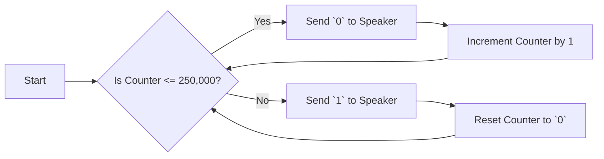
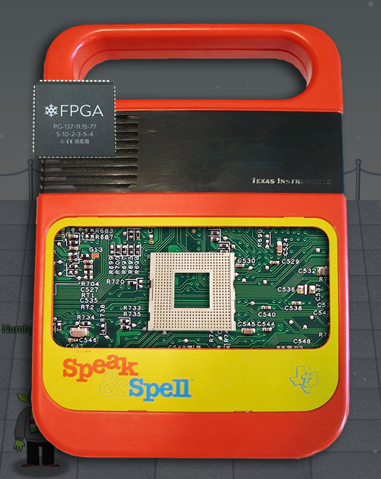
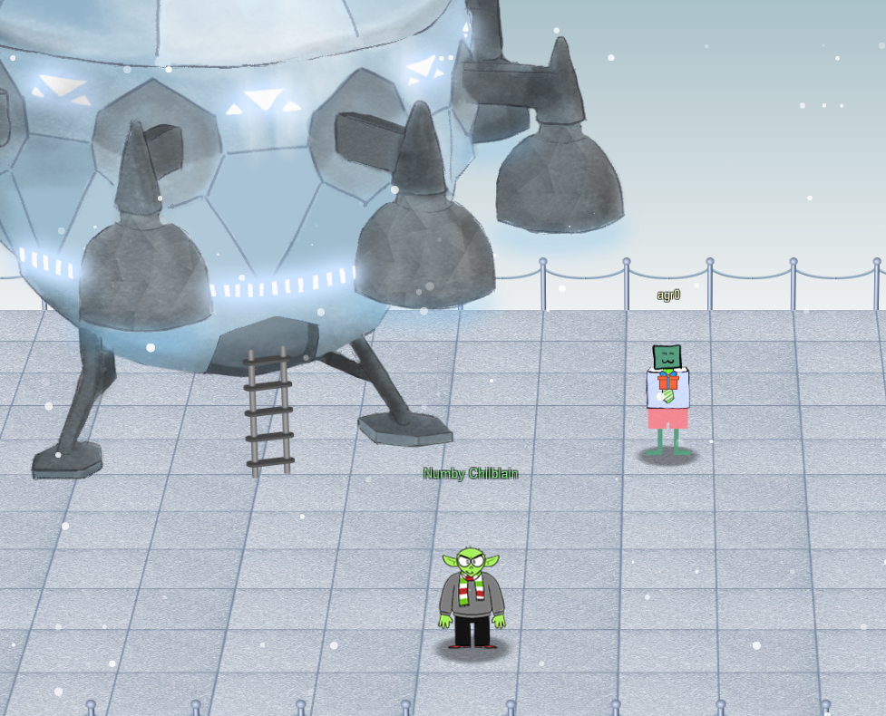
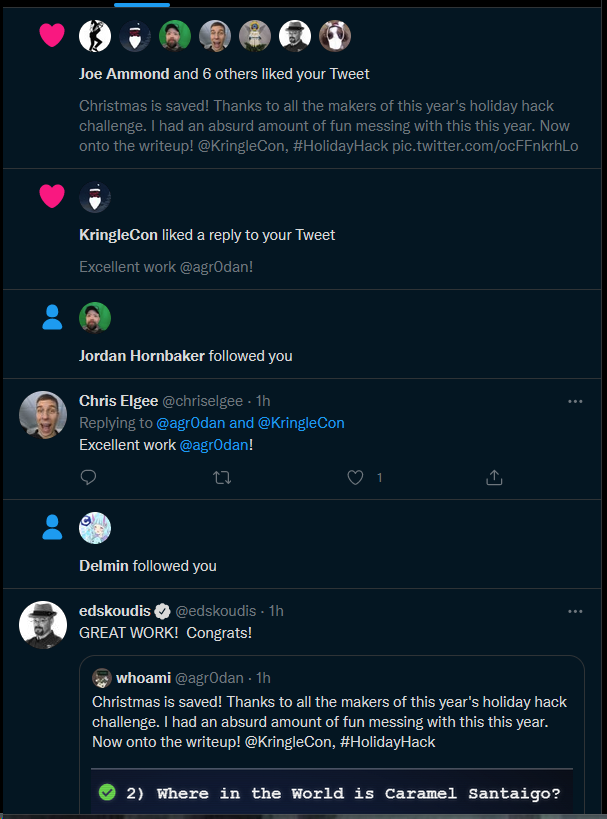

# FPGA Programming

The final challenge!

In this objective, my goal was to create a sound wave frequency generator, given a target frequency, a clock, and a speaker output, using Verilog. I would design a Field Programmable Gate Array (FPGA), presumably to design an Application Specific Integrated Circuit (ASIC) when this gets mass-produced for the Kurse-em Out Karen doll.

Verilog is the Hardware Description Language (HDL) used to create the FPGA application, and understanding it is to undo everything you've learned about application flow when programming something in C or Python. In Verilog, actions are performed only when a signal is sent across a physical wire. As a result, loops are not made in the conventional sense, only that a "loop" can be relied upon if the system gets a repetitive signal. In this case, that signal would come from a 125Mhz clock, or more specifically a wire that oscillates between `1` and `0` 125,000,000 times per second. To that end, knowing how fast the clock oscillates is the key to timing actions within the circuit.

The goal here is to read in a supplied frequency on the `freq` input, then output the same frequency as a tone from the speaker. So if the desired frequency comes in at `500 Hz`, I have to write the proper mathematical equation to somehow change the 125 million cycles per second into 500 pulses per second of the speaker. Finding out the proper math would end up not being the hard part, perhaps the hardest was fiddling with the numbers properly to obtain a crystal-clear frequency. But I digress.

## The Logic I Followed

Okay, so I know a few things here:

1. The clock is 125Mhz fast, so it cycles 125 million times per second.
2. We're given the desired frequency through the `freq` input.
3. The freq is a 6 digit integer that should be read in as a `float`, so basically `123456` should be interpreted as `1234.56 Hz`.
4. The first goal is to hit `500 Hz`, so the expected number on the `freq` input should be `050000`, or `500.00 Hz`.
5. This means we need to engage the speaker 500 times per second.

The way I thought to do that was to divide `125,000,000` by `500`, which becomes `250,000`. So my logic is to start up a counter that counts up to `250,000`, then resets the counter back to zero and engages the speaker only once. If the board does this sequence of counting up until it hits 250K and then pulses the speaker once 500 times in a second, then I have officially pulsed the speaker at 500 Hz.

To expand upon that, instead of using hard numbers, the logic will be the following. After getting the "cycle frequency," (which, in this case, is 250,000), set the counter to `0` and run the following loop:



This logic worked pretty well for most of the "easy" numbers, like `500`, `1000`, and `2000`. But when numbers got a little more complex, such as `1234.56`, it would not be as accurate. The way to fix this was through the usage of a rounding function. This rounding function would execute on every single positive edge of the clock, and consisted of the following:

```verilog
if (($rtoi(freq * 10) - ($rtoi(freq)*10)) > 4)
begin
    rounded_freq <= freq + 1;
end
else begin
    rounded_freq <= freq;
end
```

To break it down, using the number `1234.56`, we know that since the tens decimal point is greater than or equal to 5, then we need to round up. So given the above example, I'll go through each step.

1. First, get the _integer_ value of `(1234.56 * 10)`, which would be `12345`. Y'know, the same password I have on my luggage.
2. Second, get the _integer_ value of `(1234.56) * 10`, which would be `12340`.
3. Third, subtract the two. In this case, `12345 - 12340`, which would be `5`.
4. Finally, is the resulting number greater than `4`? It is, so then add 1 to the total frequency, which is then used to calculate how many times we should iterate before pulsing the speaker.

Ultimately, after a lot of trial and error, the following code is what finally got me to finish the challenge with 99.99% accuracy:

## The Code

```verilog
// Note: For this lab, we will be working with QRP Corporation's CQC-11 FPGA.
// The CQC-11 operates with a 125MHz clock.
// Your design for a tone generator must support the following 
// inputs/outputs:
// (NOTE: DO NOT CHANGE THE NAMES. OUR AUTOMATED GRADING TOOL
// REQUIRES THE USE OF THESE NAMES!)
// input clk - this will be connected to the 125MHz system clock
// input rst - this will be connected to the system board's reset bus
// input freq - a 32 bit integer indicating the required frequency
//              (0 - 9999.99Hz) formatted as follows:
//              32'hf1206 or 32'd987654 = 9876.54Hz
// output wave_out - a square wave output of the desired frequency
// you can create whatever other variables you need, but remember
// to initialize them to something!

`timescale 1ns/1ns
module tone_generator (
    input clk,
    input rst,
    input [31:0] freq,
    output wave_out
);
    // ---- DO NOT CHANGE THE CODE ABOVE THIS LINE ---- 
    // ---- IT IS NECESSARY FOR AUTOMATED ANALYSIS ----
    // TODO: Add your code below. 
    // Remove the following line and add your own implementation. 
    // Note: It's silly, but it compiles...
    // assign wave_out = (clk | rst | (freq > 0));
    
    real cycle_iter = 0;
    real rounded_freq = 0;
    real new_freq = 0;
    real clock_counter = 1;
    
    reg speak;
    
    assign wave_out = speak;
    
    always @(posedge clk or posedge rst)
    begin
        if (rst == 1)
        begin
            new_freq <= 0;
            cycle_iter <= 0;
            rounded_freq <= 0;
            clock_counter <= 0;
            speak <= 0;
        end
        
        if (($rtoi(freq * 10) - ($rtoi(freq) * 10)) > 4)
        begin
            rounded_freq <= freq + 1;
        end
        else begin
            rounded_freq <= freq;
        end
        
        new_freq <= rounded_freq / 100;
        cycle_iter <= (124999999 / new_freq);
        if (clock_counter <= cycle_iter)
        begin
            speak <= 0;
            clock_counter <= clock_counter + 1;
        end
        else begin
            speak <= 1;
            clock_counter <= 0;
        end
    end
endmodule
```

## The aftermath

Upon successfully completing all of the frequency challenges (500.00Hz, 1000.00Hz, 2000.00Hz, and a random 4-digit-2-decimal-points value), I was given the ability to generate a chip with my frequency generator. Upon doing so, I added the chip to a Texas Instrument Speak & Spell:



Which in turn emitted a cute little tone, and what showed up but...



...Whoa.

This was the final challenge I needed to solve! I was quick to post this to Twitter and soon I received a fair amount of Kudos!



Have I mentioned how much I love the SANS Holiday Hack Challenges?