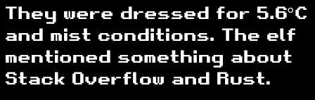

# Where in the World is Caramel Santaigo?

The second objective was a healthy exercise in OSINT, or Open Source INTelligence. By inspecting every single aspect of the clues discovered from pictures and what people say in the area, you can track the location of the next elf. In doing so, you can pick up various elements of what the elf does in their spare time and narrow down as much intelligence as you can on the missing elf. What is particularly fun about this challenge is that it changes each time you play it!

Accessing the terminal presents you with this greeting:


## Kringlecon

Starting it shows the entrance to Kringlecon, describing it as "Security Specialists from around the world travel here annually to enjoy each other's company, practice skills, and learn about the latest advancements in information security." We are also presented with 3 clues:




So with these clues, I can write down all of this information for later, but what interests me the most is the next location. Specifically the fact that there's a large Christmas Tree and an ice skating rink. I already kinda know the place they're talking about, but I can google "huge christmas tree ice skating", and the first entry is:


If I choose to depart by sleigh, I see the following choices:

1. New York, USA
2. Copenhagen, Denmark
3. Reykjavik, Iceland

There we go, we're heading to New York City!

First, before I go anywhere, I'm going to visit the InterRink and add that their preferred language is `Rust`. Respect. If I choose to filter out any of the potential elves, there are still too many to choose from. Oh well, onward!

## New York City

!!! info "Description"
    The United States' largest city has it all. Not only can you ice skate in Rockefeller Center and buy crafts and food at Bryant Park, but this is where Santa himself closes the annual Thanksgiving Day parade.

I can then investigate around, trying to find out everything I can.

!!! tip "Clue number 1"
    Their next waypoint was something like 51.219, 4.402

!!! tip "Clue number 2"
    They just contacted us from an address in the 81.244.0.0/14 range.

!!! tip "Clue number 3"
    They were dressed for 11.0°C and light drizzle conditions. Oh, I noticed they had a Doctor Who themed phone case. 


Interesting...I'll quickly add the Doctor Who fandom note to the InterRink (and notice I've narrowed it down to 2 elves), and focus on the other two clues. The waypoint mention probably was something to do with GPS coordinates, at least that's what it looks like. I can plug those in to [gps-coordinates.net](https://www.gps-coordinates.net) and see if it mentions a place in particular:


Antwerp, Belgium? Okay, what about that IP range? I can run a `whois` on it...

```sh hl_lines="39-40"
╭─agr0@spicytaco ~/Documents/hhc2021/writeup ‹main●› 
╰─$ whois 81.244.0.0/14
% This is the RIPE Database query service.
% The objects are in RPSL format.
%
% The RIPE Database is subject to Terms and Conditions.
% See http://www.ripe.net/db/support/db-terms-conditions.pdf

% Note: this output has been filtered.
%       To receive output for a database update, use the "-B" flag.

% Information related to '81.240.0.0 - 81.247.255.255'

% Abuse contact for '81.240.0.0 - 81.247.255.255' is 'abuse@proximus.com'

inetnum:        81.240.0.0 - 81.247.255.255
netname:        BE-BELGACOM-20021129
country:        BE
org:            ORG-BA4-RIPE
admin-c:        BIEC1-RIPE
tech-c:         BIEC1-RIPE
status:         ALLOCATED PA
mnt-by:         RIPE-NCC-HM-MNT
mnt-by:         SKYNETBE-MNT
mnt-lower:      SKYNETBE-MNT
mnt-lower:      SKYNETBE-ROBOT-MNT
mnt-domains:    SKYNETBE-MNT
mnt-routes:     SKYNETBE-MNT
created:        2003-10-27T12:13:19Z
last-modified:  2016-05-18T12:41:00Z
source:         RIPE # Filtered

organisation:   ORG-BA4-RIPE
org-name:       Proximus NV
country:        BE
org-type:       LIR
address:        Koning AlbertII-laan 27
address:        1030
address:        Brussels
address:        BELGIUM
phone:          +32 2 514 43 66
admin-c:        SVdS1-RIPE
admin-c:        MN1190-RIPE
admin-c:        KB905-RIPE
admin-c:        PD756-RIPE
abuse-c:        BIAC1-RIPE
mnt-ref:        RIPE-NCC-HM-MNT
mnt-ref:        SKYNETBE-MNT
mnt-by:         RIPE-NCC-HM-MNT
mnt-by:         SKYNETBE-MNT
created:        2004-04-17T11:00:05Z
last-modified:  2020-12-16T13:36:07Z
source:         RIPE # Filtered

role:           Belgacom Internet Expertise Center
address:        Proximus SA de droit public
address:        Network Engineering & Operations
address:        Boulevard du Roi Albert II, 27
address:        B-1030 Bruxelles
address:        Belgium
phone:          +32 2 202-4111
abuse-mailbox:  abuse@proximus.com
admin-c:        MN1190-RIPE
tech-c:         SVDS1-RIPE
tech-c:         PD756-RIPE
tech-c:         KB905-RIPE
nic-hdl:        BIEC1-RIPE
remarks:        -------------------------------------------
remarks:        Network problems to: noc@skynet.be
remarks:        Peering requests to: peering@skynet.be
remarks:        Abuse notifications to: abuse@belgacom.be
remarks:        abuse requests sent to another address
remarks:        will be ignored.
remarks:        -------------------------------------------
mnt-by:         SKYNETBE-MNT
created:        2004-08-06T09:18:56Z
last-modified:  2019-12-17T08:58:50Z
source:         RIPE # Filtered

% Information related to '81.244.0.0/14AS5432'

route:          81.244.0.0/14
descr:          SKYNETBE-CUSTOMERS
origin:         AS5432
mnt-by:         SKYNETBE-MNT
created:        2002-12-02T11:47:14Z
last-modified:  2002-12-02T11:47:14Z
source:         RIPE # Filtered

% This query was served by the RIPE Database Query Service version 1.102.2 (ANGUS)

```

Even the IP range points to Belgium. Is that one of the choices? I click on "Depart by sleigh" and...

1. New York, USA
2. Antwerp, Belgium
3. Rovaniemi, Finland

Off to Antwerp!

## Antwerp, Belgium

!!! info "Description"
    Where else can you celebrate Christmas with a Ferris wheel but Antwerp? Visit the markets, go ice skating, and try the glüwein or Belgian waffles and smoutebollen. 

And the clues gained from investigating around...

!!! tip "Clue number 1"
    I think they left to check out the Défilé de Noël.

!!! tip "Clue number 2"
    They called me and mentioned they were connected via Rogers Wireless.

!!! tip "Clue number 3"
    They were dressed for -5.0°C and overcast conditions. The elf got really heated about using tabs for indents.

So right off the bat we know that the elf is just plain wrong about tabs, since everyone knows tabs screw everything up. Spaces make the most sense.


I note that in the InterRink and click "Filter Elves," and see that I've narrowed it down to `Piney Sappington`! The elf that uses tabs instead of spaces because it compresses his code as if that makes a lick of difference!

 But beyond that, I have some interesting things to google. Specifically the "Défilé de Noël." I googled that plus "location" and it mentioned "Montreal", and further googling Rogers Wireless I visited their website. It was a standard cell phone service site, so I clicked on their "Network Coverage" page, and according to them the results are in: they are Canada's most reliable 5G network as recognized by Umlaut and Opensignal for best in class 5G experience. Well there you go, I learned something today.

Is Montreal a location I can whisk away to?

1. Antwerp, Belgium
2. London, England
3. Montreal, Canada

Yup! Off to visit our friends up north!

## Montreal, Canada

!!! info "Description"
    French-Canadian city Montréal proudly hosts lovely, unique Christmas traditions. This is home to the Défilé de Noël festival, fairs, fireworks displays, and a decades-old Santa parade. You might even spot Québec City's Bonhomme de Neige.

While attempting to sniff around for more clues, I discovered that I had just caught up to the elf! I had to guess which elf it was based on the clues I had gathered previously. Since I had already discovered that I was chasing Piney Sappington, I guessed it and...

