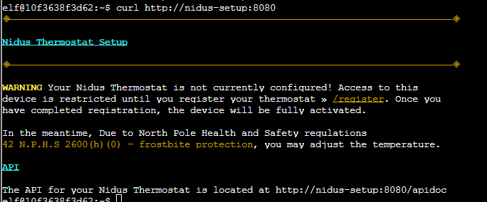

# Thaw Frost Tower's Entrance

Scanning for access points:

```sh
elf@10f3638f3d62:~$ iwlist wlan0 scanning
wlan0     Scan completed :
          Cell 01 - Address: 02:4A:46:68:69:21
                    Frequency:5.2 GHz (Channel 40)
                    Quality=48/70  Signal level=-62 dBm  
                    Encryption key:off
                    Bit Rates:400 Mb/s
                    ESSID:"FROST-Nidus-Setup"
```

Associating with AP:

```sh
elf@10f3638f3d62:~$ iwconfig wlan0 essid FROST-Nidus-Setup   
** New network connection to Nidus Thermostat detected! Visit http://nidus-setup:8080/ to complete setup
(The setup is compatible with the 'curl' utility)
```

Running curl



`curl http://nidus-setup:8080/apidoc`

```sh
elf@10f3638f3d62:~$ curl http://nidus-setup:8080/apidoc  
◈──────────────────────────────────────────────────────────────────────────────◈

Nidus Thermostat API

◈──────────────────────────────────────────────────────────────────────────────◈

The API endpoints are accessed via:

http://nidus-setup:8080/api/<endpoint>

Utilize a GET request to query information; for example, you can check the
temperatures set on your cooler with:

curl -XGET http://nidus-setup:8080/api/cooler

Utilize a POST request with a JSON payload to configuration information; for
example, you can change the temperature on your cooler using:

curl -XPOST -H 'Content-Type: application/json' \
  --data-binary '{"temperature": -40}' \
  http://nidus-setup:8080/api/cooler


● WARNING: DO NOT SET THE TEMPERATURE ABOVE 0! That might melt important furniture

Available endpoints

┌─────────────────────────────┬────────────────────────────────┐
│ Path                        │ Available without registering? │ 
├─────────────────────────────┼────────────────────────────────┤
│ /api/cooler                 │ Yes                            │ 
├─────────────────────────────┼────────────────────────────────┤
│ /api/hot-ice-tank           │ No                             │ 
├─────────────────────────────┼────────────────────────────────┤
│ /api/snow-shower            │ No                             │ 
├─────────────────────────────┼────────────────────────────────┤
│ /api/melted-ice-maker       │ No                             │ 
├─────────────────────────────┼────────────────────────────────┤
│ /api/frozen-cocoa-dispenser │ No                             │ 
├─────────────────────────────┼────────────────────────────────┤
│ /api/toilet-seat-cooler     │ No                             │ 
├─────────────────────────────┼────────────────────────────────┤
│ /api/server-room-warmer     │ No                             │ 
└─────────────────────────────┴────────────────────────────────┘
```

```sh
elf@10f3638f3d62:~$ curl http://nidus-setup:8080/api/cooler
{
  "temperature": -39.87,
  "humidity": 93.38,
  "wind": 2.09,
  "windchill": -42.24
}
elf@10f3638f3d62:~$ curl -XPOST -H 'Content-Type: application/json' -d '{"temperature": 40}' http://nidus-setup:8080/api/cooler
{
  "temperature": 39.89,
  "humidity": 95.51,
  "wind": 1.45,
  "windchill": 42.63,
  "WARNING": "ICE MELT DETECTED!"
}
```

Got the door open