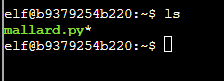
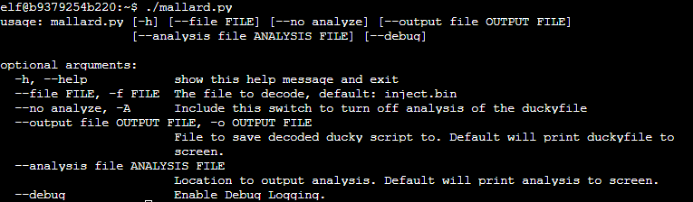
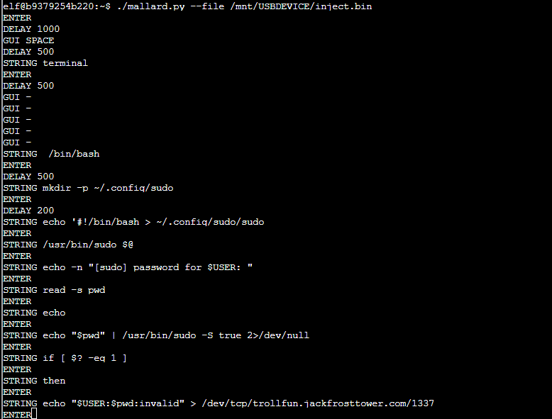
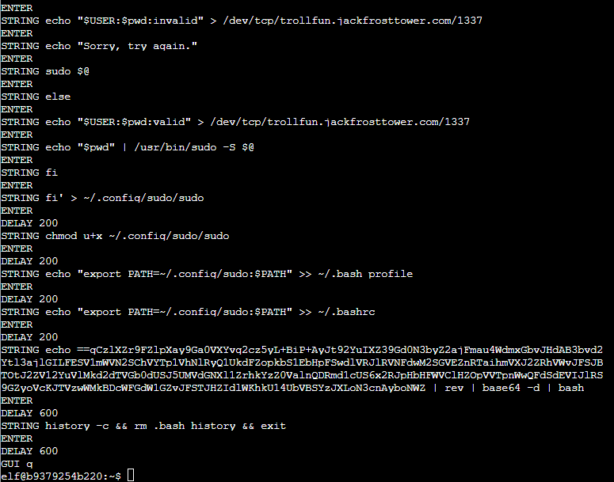
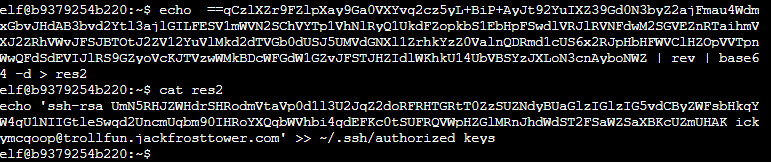

# Strange USB Device

The file in question is mounted under `/mnt/USBDEVICE`

it is `inject.bin`, an encoded duckyscript file. The problem here is the VM it is on doesn't have a whole lot of ways to copy the data to a place I can feasbily use it. curl, ping, etc -- they don't exist on this machine.

I would love to pull this inject script, but copy-paste does not work too well with this type of terminal. Thinking that I would have to pull this somewhere else and investigate it, I wondered how I would get the inject.bin file off of the server without having to painstakingly type out the base64 of the .bin file so I could investigate it with `mallard`, a duckyscript reverse engineer tool. Only after scratching my head for a while I realized...

It was right there the whole time. ok!

## Usage

## Results

There's some more base64 there that's been obfuscated by reversing it, then executing it.

But we have the script, and a base64 blob that I can manipulate. Sadly the VM doesn't have basic tools so I'll have to hope the copy-paste works in the terminal, and thankfully it seems to work:

The user is `ickymcgoop`, or Icky McGoop. That sounds like one of the trolls!