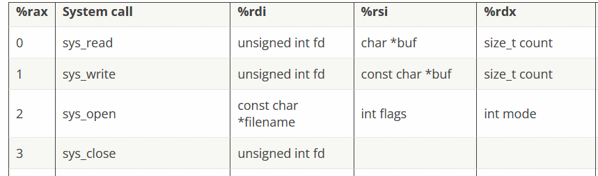

# Opening a File

??? cite
    # Opening a File

    We're getting dangerously close to do something interesting! How about that?

    Can you use the `sys_open` syscall to open `/etc/passwd`, then return the file handle (in rax)?

    Have another look [at the syscall table](https://blog.rchapman.org/posts/Linux_System_Call_Table_for_x86_64/). Can you call `sys_open` on the file `/etc/passwd`, then return the file handle? Here's the [syscall table](https://blog.rchapman.org/posts/Linux_System_Call_Table_for_x86_64/) again.

    ## Hints
    -   This is nearly the same as `Hello, World!!`, only using `sys_open` instead of `sys_write`!
    -   Don't forget to read the boilerplate comments!

Looking back at the syscall table



We need `2` in `rax` to denote we are using `sys_open`

We need an address to a string denoting the filename in `rdi`

We need `0` in `rsi` (no flags)

We need `0` in `rdx` (mode of 0 I guess?)

```asm
; TODO: Get a reference to this string into the correct register

call spreading_joy
db '/etc/passwd',0

spreading_joy:
pop rax

; Moves the address to the filename string into rdi
mov rdi, rax

; Set up a call to sys_open
; TODO: Set rax to the correct syscall number
mov rax, 2

; TODO: Set rdi to the first argument (the filename)
; did this already

; TODO: Set rsi to the second argument (flags - 0 is fine)
mov rsi, 0

; TODO: Set rdx to the third argument (mode - 0 is also fine)
mov rdx, 0

; Perform the syscall
syscall

; syscall sets rax to the file handle, so to return the file handle we don't
; need to do anything else!
ret

```

yay