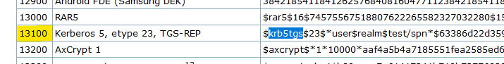
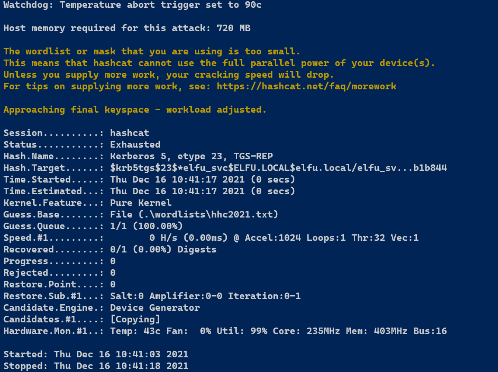
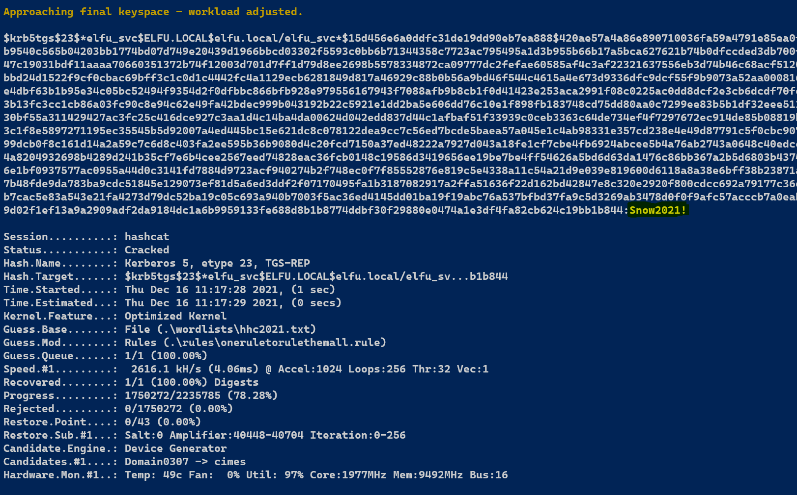

# Crackin dat Hash

So...let's step outside of the challenge for a bit. In any normal engagement, I would attempt to send my newly found hash to a dedicated cracking rig (preferably one that isn't in the cloud as this is basically company-specific sensitive data that should never leave the hands of the ethical penetration tester) and try this hash against some of the more known password cracking lists that many have, such as the latest [RockYou2021.txt](https://github.com/ohmybahgosh/RockYou2021.txt) wordlist. But thinking back, the source code of the registration page had some *interesting* words.

It became fairly obvious that the next step here is to build our own wordlist. And I can do that using CeWL!

```sh
┌─[agr0@spicytaco]─[~/Documents/SANS/hhc2021/kerb]
└──╼ $ cewl -d 2 -m 5 --with-numbers -w happyholidays.txt https://register.elfu.org/register
CeWL 5.5.2 (Grouping) Robin Wood (robin@digi.ninja) (https://digi.ninja/)
┌─[agr0@spicytaco]─[~/Documents/SANS/hhc2021/kerb]
└──╼ $ cat happyholidays.txt 
domain
University
Student
Registration
students
account
Login
Domain
Portal
register
registered
access
internal
services
person
First
identity
Email
Please
please
patient
could
minute
process
request
email
Submit
Rights
Reserved
Remember
groups
battling
karaoke
contest
earleir
think
rocks4socks
cookiepella
asnow2021
v0calprezents
Hexatonics
reindeers4fears
times
```

Good times. I have a feeling this won't work, but let's try cracking the hash with this wordlist.

First, we'll need to find the mode for hashcat to work with. To do that, I can dump the example hashes, or I can just visit the site:

[Hashcat Example Hashes](https://hashcat.net/wiki/doku.php?id=example_hashes)

And search for the beginning of the hash:

`$krb5tgs$23$`

So I'll search for krb5tgs with a `CTRL+f`...



And we have a match! Mode `13100`!

So attempting with what little I currently have...



Oh well. Let's massage the wordlist a bit!

Using the "[One Rule To Rule Them All](https://github.com/NotSoSecure/password_cracking_rules)" ruleset...

Instead of creating a new wordlist, I am just going to apply a password ruleset with my wordlist that I created from the above.

`.\hashcat.exe -m 13100 -a 0 .\hashes\hhc2021.txt --potfile-disable -r .\rules\oneruletorulethemall.rule --force -O -w 4 --opencl-device-types 1,2 .\wordlists\hhc2021.txt`

aaaaand...

Cracked!



Password is `Snow2021!`