# Splunk!

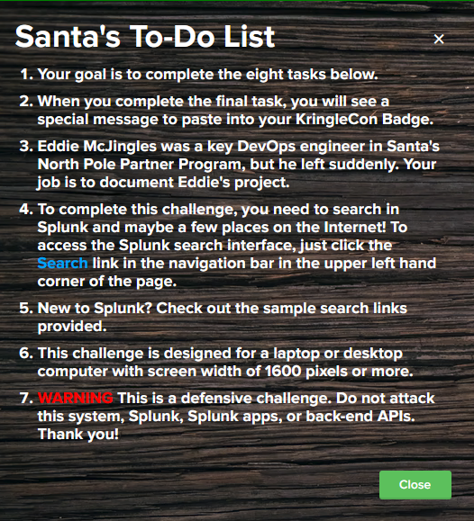

## To-Do List

### 1) Capture the commands Eddie ran most often, starting with git. Looking only at his process launches as reported by Sysmon, record the most common git-related CommandLine that Eddie seemed to use. `git status`

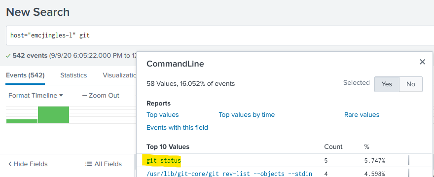

### 2) Looking through the git commands Eddie ran, determine the remote repository that he configured as the origin for the 'partnerapi' repo. The correct one! `git@github.com:elfnp3/partnerapi.git`

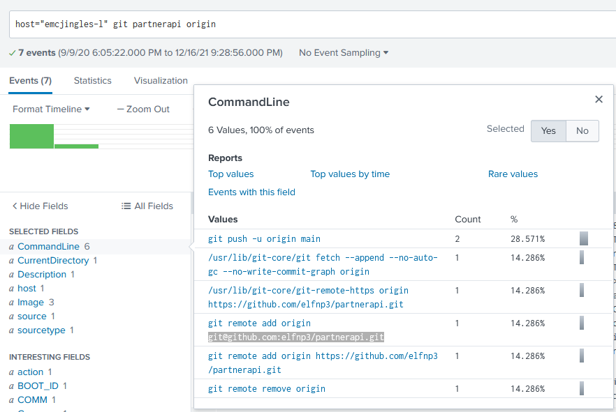

### 3) The 'partnerapi' project that Eddie worked on uses Docker. Gather the full docker command line that Eddie used to start the 'partnerapi' project on his workstation. `docker compose up`

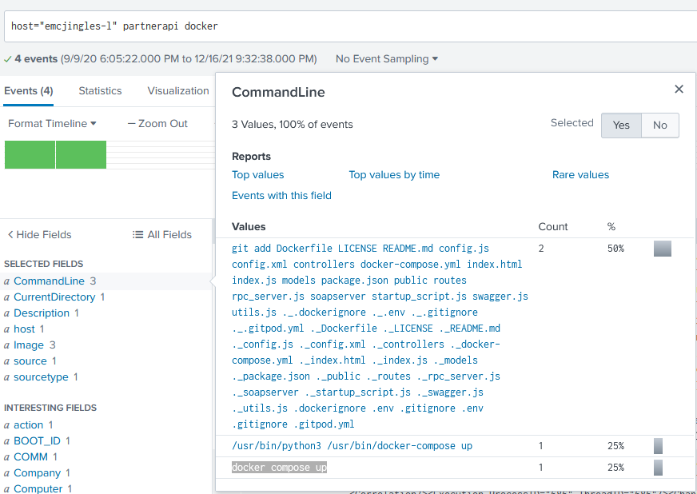

### 4) Eddie had been testing automated static application security testing (SAST) in GitHub. Vulnerability reports have been coming into Splunk in JSON format via GitHub webhooks. Search all the events in the main index in Splunk and use the sourcetype field to locate these reports. Determine the URL of the vulnerable GitHub repository that the elves cloned for testing and document it here. You will need to search outside of Splunk (try GitHub) for the original name of the repository. `https://github.com/snoopysecurity/dvws-node`

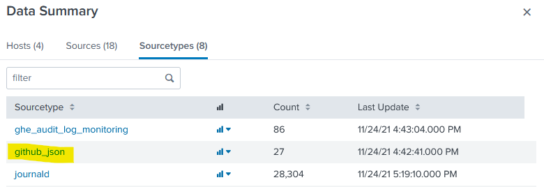

Then looking with `sourcetype=github_json`, I found the github url the elves had:

`https://github.com/elfnp3/dvws-node`

This was mentioned further down in the readme...

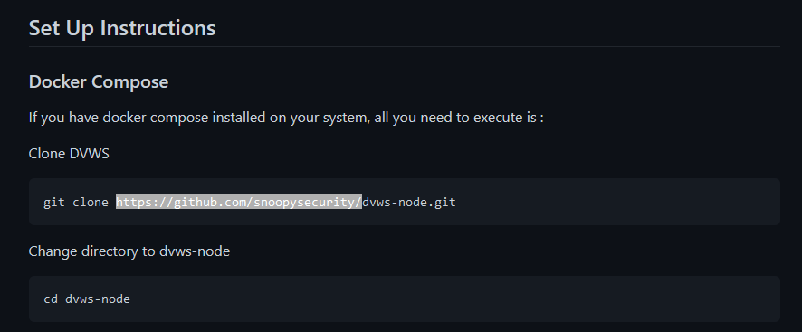

And finally, this is the repo:

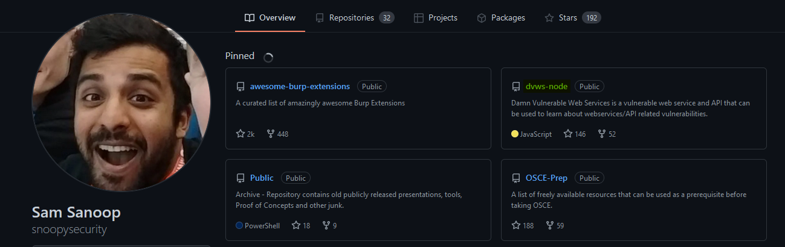

### 5) Santa asked Eddie to add a JavaScript library from NPM to the 'partnerapi' project. Determine the name of the library and record it here for our workshop documentation. `holiday-utils-js`

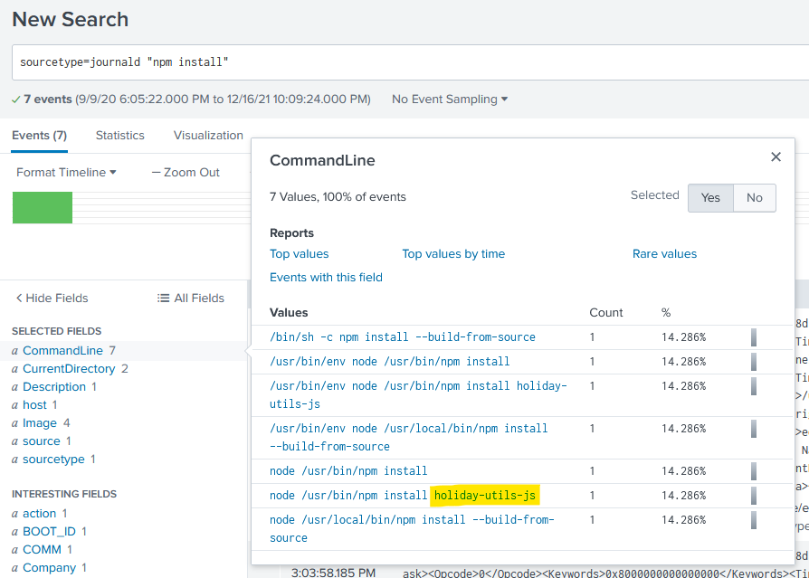

### 6) Another elf started gathering a baseline of the network activity that Eddie generated. Start with _their search_ and capture the full `process_name` field of anything that looks suspicious. `/usr/bin/nc.openbsd`

NOTE: "Their search" is: `index=main sourcetype=journald source=Journald:Microsoft-Windows-Sysmon/Operational EventCode=3 user=eddie NOT dest_ip IN (127.0.0.*) NOT dest_port IN (22,53,80,443) 
| stats count by dest_ip dest_port`

The IPs of this search are `192.30.255.113` and `54.175.69.219`.

I trimmed the search to: `index=main sourcetype=journald source=Journald:Microsoft-Windows-Sysmon/Operational EventCode=3 user=eddie`

Then scrolled down to the `process_name` and chose to view it:

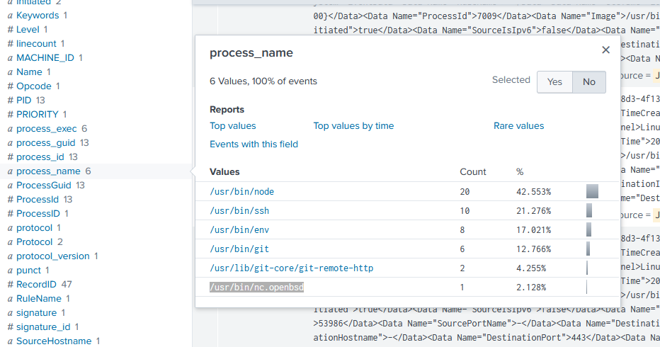

### 7) Uh oh. This documentation exercise just turned into an investigation. Starting with the process identified in the previous task, look for additional suspicious commands launched by the same parent process. One thing to know about these Sysmon events is that Network connection events don't indicate the parent process ID, but Process creation events do! Determine the number of files that were accessed by a related process and record it here. `6`

First, searching through with this `index=main sourcetype=journald /usr/bin/nc.openbsd` gives me 3 entries.

I can look for the parent process ID here:

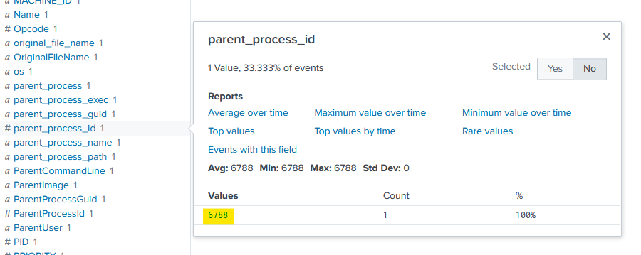

Incidentally, this is the parent process name:

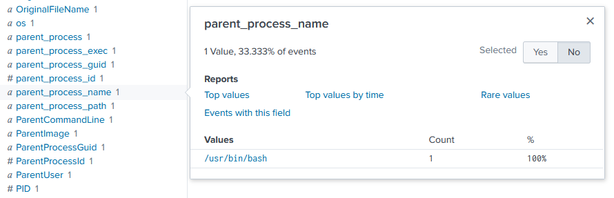

I can now search for `process_id=6788`

The process is bash! Now, knowing that bash is a shell that itself can spawn processes, I can flip the script and search for `6788` as the parent process ID: `parent_process_id=6788`

And I can see the command run from the bash prompt! Six files!

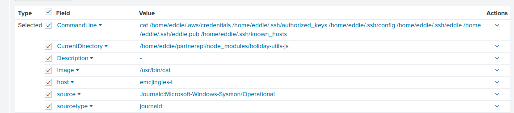

### 8) Use Splunk and Sysmon Process creation data to identify the name of the Bash script that accessed sensitive files and (likely) transmitted them to a remote IP address. `preinstall.sh`

Using the generic search string of: `index=main sourcetype=journald 6788`, I am able to return only 5 events. Looking through that I can find the `Process Creation` event that gives away a pretty telling value:

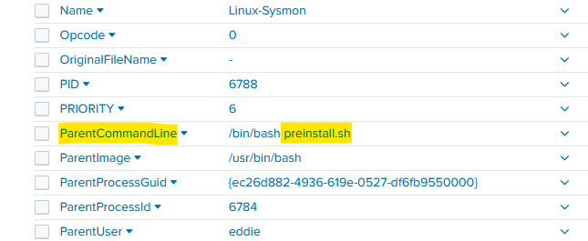

Ta da!

The resulting message:

`Thank you for helping Santa complete his investigation! Santa says you're a whiz!`