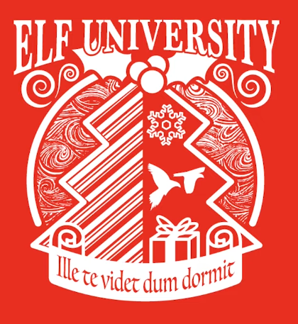
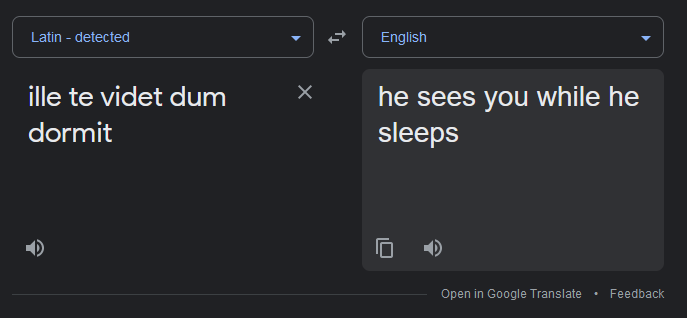
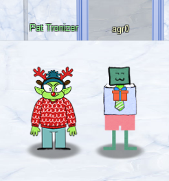
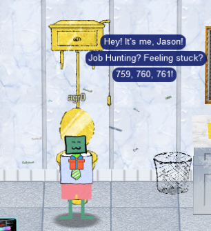
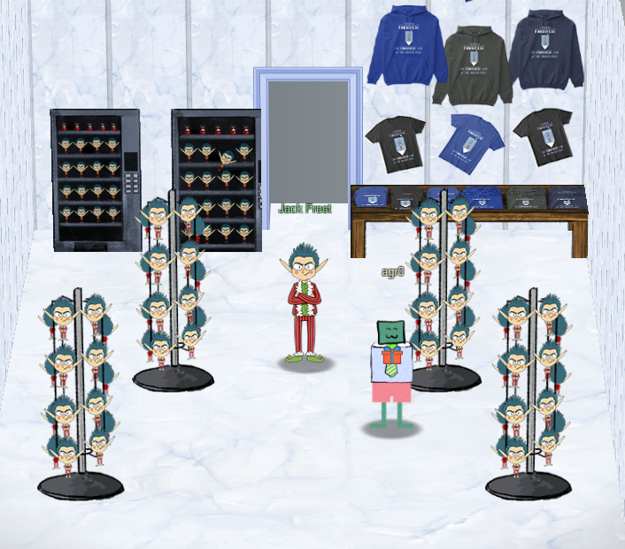

# Oddities I've discovered

Some may call these easter eggs, but I call them oddities because some of them I just can't explain.

## Elf University Logo

The "Elf University" logo has the following words: `Ille te videt dum dormit`.

Translated from Google Translate:

"He sees you while he sleeps." I'd like to think that this is a simple lost-in-translation issue where it's _supposed_ to say "He sees you when you're sleeping," and not a much more sinister Lovecraftian warning of an ancient horror whose sole purpose is to watch you while it sleeps. But then I love HP Lovecraft so either is fun!

## No 13th Floor

Jack's tower does not have a 13th floor. This was kind of a cool discovery and I wanted to explore this a bit more, but then I realized that most hotels don't have a 13th floor anyway. I even checked for the 7 1/2th floor (in a nod to last year's Kringlecon, or Being John Malkovich, whichever), and no dice. Just a neat thing.

## Jason Blanchard is the Only One to respond to Frost Fest.

According to Pat Tronizer...

!!! quote "Pat Tronizer"
    Hrmph. Oh hey, I'm Pat Tronizer.

    I'm SO glad to have all these first-rate talks here.

    We issued a Call for Talks, but only one person responded...We put him in track 1.

    But Jack came up with an ingenious way to borrow additional talks for FrostFest! You can hardly tell where we got these great speakers!

    Anyway, I cannot believe an actual human connected to the Tower network. It's supposed to be the domain of us trolls and of course Jack Frost himself.

    Mr. Frost has a strict policy: all devices must be RFC3514 compliant. It fits in with our nefarious plans.

    Some human had the nerve to use our complaint website to submit a complaint!

    That website is for trolls to complain about guests, NOT the other way around.

    Humans have some nerve.

That person that responded was Jason Blanchard, and his talk can be found [here](https://www.youtube.com/watch?v=jpGVhAf9MI8). Oddly enough though, while up in Jack Frost's executive washroom, I noticed that the toilet handle spoke:

I imagine the reference to "Job Hunting" probably has something to do with [this talk](https://www.youtube.com/watch?v=Air1c697tjw) that he did for BHIS. Beyond that, [this tweet](https://twitter.com/BanjoCrashland/status/1448059040987291653) contains some of the same verbiage. Maybe 759, 760, 761 has to do with the amount of people that have landed new jobs since? 

## Exit Through the Gift Shop

Even though you enter Jack's Frost Tower casino through the same entrance you would exit to, exiting the tower always forces you to exit through Jack's SWAG gift shop.

Everything clickable points you to an online gift shop where you can obtain T-shirts and hoodies, all adorned with the likeness of Mr. Frost himself.