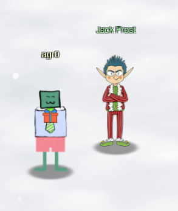

# The Story So Far...

## Objective 1: KringleCon Orientation

Our journey begins at the North Pole, a far cry farther than last year's Kringlecon (which started just off of the New Jersey Turnpike). I am met with [my first challenge](obj1.md) given by Jingle Ringford, who stands in front of a Cranberry Pi terminal.

Upon completing this challenge, the gates swing open, I'm given a badge and a USB Wifi Dongle to use throughout the convention. Admittedly, this is one of the cooler bits of swag I've ever received just for going to a con.

Just outside of Santa's castle, who greets me but the big man himself! Along with four calling birds as well.

Santa welcomes me to the conference an introduces me to the Calling Birds, but also mentions _another_ conference going on nearby. Upon hearing this, I looked around and discovered Jack Frost...next to a huge casino?

Jack talks about how his plans was foiled last year, and this time he hopes to beat Santa at his own game. _His_ conference is better in every way, including the swag. He mentions that he honors *all* badges, "even those from the lame con next door." Sadly, despite those promises, the door is frozen shut to the casino, so it doesn't look like I can get in just yet. Probably for the best!

Looking at my badge objectives, it looks like the next objective leads me to Santa's courtyard, where I have to help Tangle Coalbox find a wayward elf. But to first go to Piney Sappington nearby for hints. Off to see Piney!

## Objective 2

### Exif-Metadata

In the courtyard, I come across good old Piney Sappington, who offers to help if I can help him first:

???+ quote
    Hi ho, Piney Sappington at your service!

    Well, honestly, I could use a touch of _your_ services.

    You see, I've been looking at these documents, and I know someone has tampered with one file.

    Do you think you could log into this Cranberry Pi and take a look?

    It has `exiftool` installed on it, if that helps you at all.

    I just... Well, I have a feeling that someone at that other conference might have fiddled with things.

    And, if you help me figure this tampering issue out, I'll give you some hints about OSINT, especially associated with geographic locations!

Time to complete the [Exif-Metadata Terminal Challenge](term_em.md)!

Upon completing that, Piney gives me more to go on:

???+ quote
    Wow, you figured that out in no time! Thanks!

    I *knew* they were up to no good.

    So hey, have you tried the Caramel Santaigo game in this courtyard?

    Carmen? No, I haven't heard of her.

    So anyway, some of the hints use obscure coordinate systems like MGRS and even what3words.

    In some cases, you might get an image with location info in the metadata. Good thing you know how to see that stuff now!
    (And they say, for those who *don't* like gameplay, there might be a way to bypass by looking at some flavor of cookie...)
    And Clay Moody is giving a talk on OSINT techniques right now!

    Oh, and don't forget to learn about your target elf and filter in the InterRink system!

### Where in the World is Caramel Santaigo?

After hearing this, I sidled on over to Tangle Coalbox to hear what they had to say:

???+ quote
    Hey there, Gumshoe. Tangle Coalbox here again.
    
    I've got a real doozy of a case for you this year.
    
    Turns out some elves have gone on some misdirected journeys around the globe. It seems that someone is messing with their travel plans.
    
    We could sure use your open source intelligence (OSINT) skills to find them.
    
    Why dontcha' log into this vintage Cranbberry Pi terminal and see if you have what it takes to track them around the globe.
    
    If you're having any trouble with it, you might ask Piney Sappington right over there for tips.

Time to take on the [Caramel Santaigo](obj2.md) Objective!

Upon completing that, I get a hearty pat on the back from Tangle, saying "You never cease to amaze, Kid. Thanks for your help." I smiled sheepishly and moved on to the next objective on my badge. Time to thaw the Frost Tower's entrance!

## Objective 3

Making my way over to Frost Tower, I'm met with a frozen door! Not good for business if nobody can even get inside! My objective reads:

???+ quote
    Turn up the heat to defrost the entrance to Frost Tower. Click on the Items tab in your badge to find a link to the Wifi Dongle's CLI interface. Talk to Greasy Gopherguts outside the tower for tips.

Since it first asks me to go to Greasy Gopherguts for help, I go visit him.

### Grepping for Gold

???+ quote
    Grnph. Blach! Phlegm.

    I'm Greasy Gopherguts. I need help with parsing some Nmap output.

    If you help me find some results, I'll give you some hints about Wi-Fi.

    Click on the terminal next to me and read the instructions.

    Maybe search for a cheat sheet if the hints in the terminal don't do it for ya'.

    You'll type `quizme` in the terminal and `grep` through the Nmap bigscan.gnmap file to find answers.

Time to complete the [Grepping for Gold Terminal Challenge](term_gfg.md)!

Upon completing that, Greasy has more to say:

???+ quote
    Grack. Ungh. ... Oh!

    You really did it?

    Well, OK then. Here's what I know about the wifi here.

    Scanning for Wi-Fi networks with iwlist will be location-dependent. You may need to move around the North Pole and keep scanning to identify a Wi-Fi network.

    Wireless in Linux is supported by many tools, but `iwlist` and `iwconfig` are commonly used at the command line.

    The `curl` utility can make HTTP requests at the command line!

    By default, `curl` makes an HTTP GET request. You can add `--request POST` as a command line argument to make an HTTP POST request.

    When sending HTTP POST, add `--data-binary` followed by the data you want to send as the POST body.

OK! Over to Grimy McTrollkins!

### Thaw Frost Tower's Entrance

???+ quote
    Yo, I'm Grimy McTrollkins.

    I'm a troll and I work for the big guy over there: Jack Frost

    I'd rather not be bothered talking with you, but I'm kind of in a bind and need your help.

    Jack Frost is so obsessed with icy cold that he accidentally froze shut the door to Frost Tower!

    I wonder if you can help me get back in.

    I think we can melt the door open if we can just get access to the thermostat inside the building.

    That thermostat uses Wi-Fi. And I'll bet you picked up a Wi-Fi adapter for your badge when you got to the North Pole.

    Click on your badge and go to the Items tab. There, you should see your Wi-Fi Dongle and a button to "Open Wi-Fi CLI." That'll give you command-line interface access to your badge's wireless capabilities.

Time to finish the [Thaw Frost Tower's Entrance Objective](obj3.md)!

And now I have access inside the casino!

## Objective 4

Inside Frost Tower, I'm greeted with Jack Frost...somehow. Wait, wasn't he behind me outside? Whatever.

He goes on about how much better his convention is than Santa's next door, and that _his_ convention celebrates the _true_ meaning of Christmas. Which is to say money. Giant piles of money. Huge chests overflowing with cash. Jack is apparently more of a realist, I think.

But that's beside the point! On to the objective!

My badge tells me that I have to investigate the potential to manipulate the slot machines in Jack's Tower, but first I should go visit Noel Boetie outside of Santa's Castle for help. Okay!

### Logic Munchers

???+ quote
    Hello there! Noel Boetie here. We're all so glad to have you attend KringleCon IV and work on the Holiday Hack Challenge!

    I'm just hanging out here by the Logic Munchers game.

    You know...logic: that thing that seems to be in short supply at the tower on the other side of the North Pole?

    Oh, I'm sorry. That wasn't terribly kind, but those frosty souls do confuse me...

    Anyway, I'm working my way through this Logic Munchers game.

    A lot of it comes down to understanding boolean logic, like `True And False` is `False`, but `True And True` is `True`.

    It _can_ get a tad complex in the later levels.

    I need some help, though. If you can show me how to complete a stage in Potpourri at the Intermediate (Stage 3) or higher, I'll give you some hints for how to find vulnerabilities.

    Specifically, I'll give you some tips in finding flaws in some of the weeb applications I've heard about here at the North Pole, especially those associated with slot machines!

Time for the [Logic Munchers Terminal Challenge](term_lm.md)!

Upon completing that, Noel has more info for me!

???+ quote
    Wow - amazing score! Great work!

    So hey, those slot machines. It seems that in his haste, Jack bought some terrible hardware.

    It seems they're susceptible to [parameter tampering](https://owasp.org/www-community/attacks/Web_Parameter_Tampering).

    You can modify web request parameters with an intercepting proxy or tools built into Firefox.

Now, armed with new information, I tipped my hat forward and marched back into Frost Tower to see Hubris Selfington:

### Slot Machine Investigation

???+ quote
    Snarf. Hrung. Phlthth.

    I'm Hubris Selfington.

    The big boss told me he's worried about vulnerabilities in his slot machines, especially this one.

    Statistically speaking, it seems to be paying out way too much.

    He asked me to see if there are any security flaws in it.

    The boss has HUGE plans and we've gotta make sure we are running a tight ship here at Frost Tower.

    Can you help me find the issue?

    I mean, I could TOTALLY do this on my own, but I want to give you a chance first.

Sure you can, Hubris. Sometimes if you want something done right, you've just gotta [do it yourself (Slot Machine Investigation)](obj4.md)!

## Objective 5

Whoops, looks like there isn't much of a house advantage when there's such a glaring security flaw! Well, onward and upward. My next 