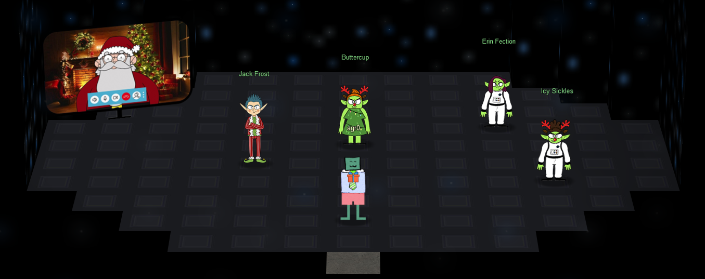

# The End ...?

I climbed up into the UFO despite my better judgement, and I see a bunch of trolls with Jack Frost!

Icy Sickles is the first to speak:

!!! quote "Icy Sickles"
    We come in peace! I am Icy Sickles from ice Planet Frost.

    Many centuries ago, we Frostian trolls sent an expedition to study your planet and peoples.

    Jack Frost, scion of Planet Frost's ruling family, captained that long-ago mission, which carried many hundreds of our people to your planet to conduct our research.

Followed by Erin Fection:

!!! quote "Erin Fection"
    I'm Erin Fection, the pilot of this interstellar spaceship.

    Our first expedition established a base in the land of Oz, where our researchers became known as "Munchkins."

    We received a message from them long ago about a Great Schism, where the Frostian expedition split into two warning factions: Munchkins and Elves.

    Thankfully, they managed to establish an uneasy peace by relocating the Elves to the North Pole.

    Since then, we have heard nothing from the expedition. They went interstellar radio silent. Until NOW.

Then Princess Buttercup:

!!! quote "Princess Buttercup"
    I am Buttercup, Princess of ice Planet Frost.

    Thanks to your help, we received the message from the device summoning us back to Earth to address the recent unpleasantness.

    We had no idea that Jack Frost would cause such trouble! We sincerely apologize.

    We will take Jack back home to Planet Frost, along with all the other trolls.

    The Elves and Munchkins, of course, can remain if they opt to do so.

    Fear not, we WILL bring Jack and any guilty trolls to justice for their infractions. They will not bother your planet any longer.

    Again, we apologize for all the troubles he has caused, and we sincerely THANK YOU for your help!

    **And**, now that you've helped us solve everything, feel free to show off your skills with some swag - only for our victors!

Then Jack Frost:

!!! quote "Jack Frost"
    ...

    ...

    I was just having a little fun. C'mon man!

    And, I was just getting started! I had such big plans!

    I don't want to go home!!!

And finally, Santa:

!!! quote "Santa"
    The Frostians have reached out to me via video link. They've explained to me all that has happened.

    I'd like to thank you for your truly excellent work in foiling Jack's plans and ensuring that he is finally brought to justice.

    On behalf of all of us here at the North Pole, we wish you and yours a happy and healthy Holiday Season.

    Thank you and HAPPY HOLIDAYS from me and all of the elves. Ho Ho Ho!

Christmas is saved!