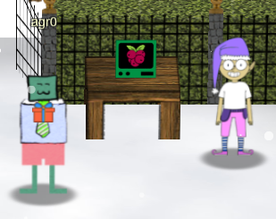
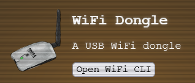
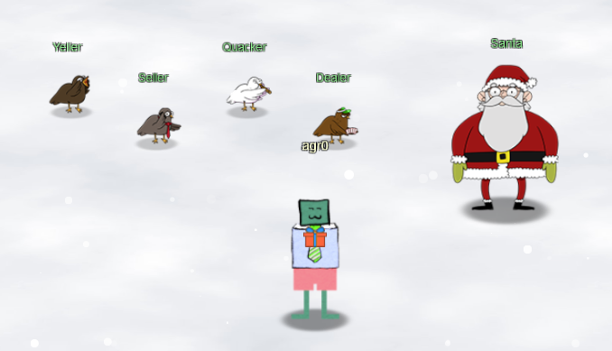
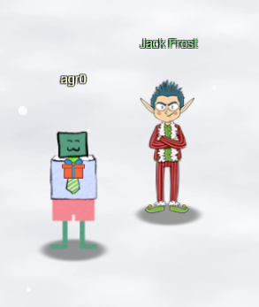

# Chapter I

## Objective 1: KringleCon Orientation

Our journey begins at the North Pole, a far cry farther than last year's Kringlecon (which started just off of the New Jersey Turnpike). I am met with [my first challenge](../obj1.md) given by Jingle Ringford, who stands in front of a Cranberry Pi terminal.

Upon completing this challenge, the gates swing open, I'm given a badge and a USB Wifi Dongle to use throughout the convention. Admittedly, this is one of the cooler bits of swag I've ever received just for going to a con.

Just outside of Santa's castle, who greets me but the big man himself! Along with four calling birds as well.

Santa welcomes me to the conference an introduces me to the Calling Birds, but also mentions _another_ conference going on nearby. Upon hearing this, I looked around and discovered Jack Frost...next to a huge casino?

Jack talks about how his plans was foiled last year, and this time he hopes to beat Santa at his own game. _His_ conference is better in every way, including the swag. He mentions that he honors *all* badges, "even those from the lame con next door." Sadly, despite those promises, the door is frozen shut to the casino, so it doesn't look like I can get in just yet. Probably for the best!

Looking at my badge objectives, it looks like the next objective leads me to Santa's courtyard, where I have to help Tangle Coalbox find a wayward elf. But to first go to Piney Sappington nearby for hints.

[Off to see Piney](obj2.md)!
