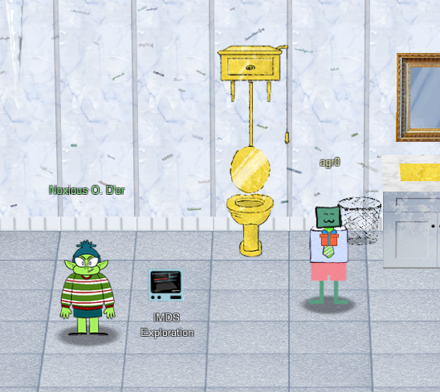

# Chapter X

I glance at my badge, and see that Jack Frost has apparently been busy attempting to hire new employees for his casino. No doubt to be underpaid and overworked! I am instructed to obtain the secret access key for the Jack Frost Tower job applications server. Now this is a little bit too red-teamy for Santa I think...issuing cyber-warfare against Jack Frost? I mean I'm sure he probably deserves it but...ack! No time to determine ethics! I apparently need to brave the perils of Jack's bathroom to speak to Noxious O. D'or. Yuck. Just...yuck.

But I can't think about that now! On to the bathroom!

## IMDS Exploration

Jack's throne is not only golden but is one of those toilets where the flusher is a pull chain above your head. To each their own I suppose! Noxious O. D'or stands here for some reason next to the IMDS Exploration terminal challenge and had this to say:

!!! quote "Noxious O. D'or"
    Hey, this is the executive restroom. Wasn't that door closed?

    I'm Noxious O. D'or. And I've gotta say, I think that Jack Frost is just messed up.

    I mean, I'm no expert, but his effort to "win" against Santa by going bigger and bolder seems bad.

    You know, I'm having some trouble with this IMDS exploration. I'm hoping you can give me some help in solving it.

    If you do, I'll be happy to trade you for some hints on SSRF! I've been studying up on that and have some good ideas on how to attack it!

You're on, Noxious. Time for the [IMDS Exploration Challenge](../term_ie.md)

## Now Hiring!

Upon completing that, Noxious had a few more things to discuss:

!!! quote "Noxious O. D'or"
    Phew! That is something extra! Oh, and you solved the challenge too? Great!

    Cloud assets are interesting targets for attackers. Did you know they automatically get IMDS access?

    I'm very concerned about the combination of SSRF and IMDS access.

    Did you know it's possible to harvest cloud keys through SSRF and IMDS attacks?

    Dr. Petabyte told us, "anytime you see URL as an input, test for SSRF."

    With an SSRF attack, we can make the server request a URL. This can reveal valuable data!

    The AWS documentation for IMDS is interesting reading.

Alrighty then. Armed with this new found knowledge, I then set my sights on attacking [Jack Frost Tower's job application server](../obj10.md)

And now only three more objectives to go! We're getting there! To [Objective 11](obj11.md)!