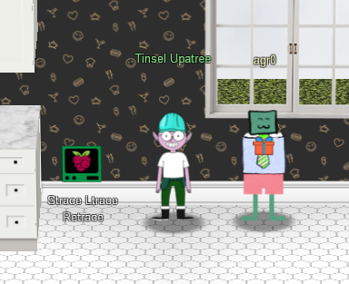

# Chapter XI

I grab my badge and read the next objective. A human has accessed the Jack Frost Tower network with a non-compliant host! I am instructed to find which three trolls complained about this human, but first I should go visit Tinsel Upatree in Santa's kitchen for details. Off to the Kitchen!

## Strace Ltrace Retrace

Tinsel stands next to the "Strace Ltrace Retrace" terminal challenge.

!!! quote "Tinsel Upatree"
    Hiya hiya, I'm Tinsel Upatree!

    Say, do you know what's going on next door?

    I'm a bit worried about the whole FrostFest event.

    It feels a bit...ill-conceived, somehow. Nasty even.

    Well, regardless -- and more to the point, what do you know about tracing processes in Linux?

    We rebuild this here Cranberry Pi that runs the cotton candy machine, but we seem to be missing a file.

    Do you think you can use `strace` or `ltrace` to help us rebuild the missing config?

    We'd like to help some of our favorite children enjoy the sweet spun goodness again!

    And, if you help me with this, I'll give you some hints about using Wireshark filters to look for unusual options that might help you achieve Objectives here at the North Pole.

Okay Tinsel, I'll play your little game...

## Customer Complaint Analysis

I completed the [Strace Ltrace Retrace terminal challenge](../term_slr.md), and Tinsel had this to say in return:

!!! quote "Tinsel Upatree"
    Great! Thanks so much for your help!

    I'm sure I can put those skills I just learned from you to good use.

    Are you familiar with [RFC3514](https://datatracker.ietf.org/doc/html/rfc3514)?

    Wireshark uses a different name for the Evil Bit: `ip.flags.rb`

    HTTP Responses are often gzip compressed. Fortunately, Wireshark decompresses them for us automatically.

    You can search for strings in [Wireshark](https://www.wireshark.org/) fields using display filters with the `contains` keyword.

Ooooo, that wily little Evil Bit. I wonder how this will come into play for the challenge?

I rolled up my sleeves again and got to work on the [Customer Complaint Analysis Objective](../obj11.md)

How about that? Only 2 more challenges to go! [What's next for our hero](obj12.md)?