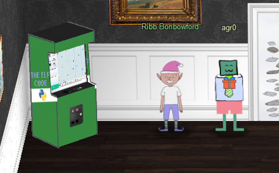

# Chapter XII

"I'm so close I can almost taste it," I mutter under my breath. I glance down at my badge and peek at the next Objective, "Frost Tower Website Checkup." I have to investigate Frost Tower's website for security issues. However, this is not a black box penetration testing exercise as I am given the source code to the site itself! I have to obtain Jack Frost's TODO list and uncover his evil plot. But before I delve deep into this, I should first visit Ribb Bonbowford in Santa's dining room. Let's go!

## The Elf Code

The Elf Code! Now with more creamy Python filling! Actually ew. But still, Python!

!!! quote "Ribb Bonbowford"
    Hello, I'm Ribb Bonbowford. Nice to meet you!

    Are you new to programming? It's a handy skill for anyone in cyber security.

    This here machine lets you control an Elf using Python 3. It's pretty fun, but I'm having trouble getting beyond Level 8.

    Tell you what... if you help me get past Level 8, I'll share some of my SQLi tips with you. You may find them handy sometime around the North Pole this season.

    Most of the information you'll need is provided during the game, but I'll give you a few more pointers, if you want them.

    Not sure what a lever requires? Click it in the `Current Level Objectives` panel.

    You can move the elf with commands like `elf.moveLeft(5)`, `elf.moveTo({"x":2, "Y":2})`, or `elf.moveTo(lever0.position)`.

    Looping through long movements? Don't be afraid to `moveUp(99)` or whatever. Your elf will stop at any obstacle.

    You can call functions like `myFunction()`. If you ever need to pass a function to a munchkin, you can use `myFunction` without the ().

I belly up to the arcade machine and try my luck at [The Elf Code](../elf_code/term_tec_0.md). Spoiler alert: I complete all the levels!

## Frost Tower Website Checkup

!!! quote "Ribb Bonbowford"
    Wow - Even the bonus levels! That's amazing!

    Gosh, with skills like that, I'll bet you could help figure out what's really going on next door...

    And, as I promised, let me tell you what I know about SQL Injection.
    
    I hear that having source code for vulnerability discovery dramatically changes the vulnerability discovery process.

    I imagine it changes how you approach an assessment too.

    When you have the source code, API documentation becomes tremendously valuable.

    Who knows? Maybe you'll even find more than one vulnerability in the code.

With this knowledge in hand, I turn my attention over to Frost Tower's Website. [What secrets will I uncover](../frost_tower/obj12-1.md)?

This challenge took the better part of a day for me to figure out, but I learned a great deal about SQL Injections, especially when in such a constrained environment!

This is it, the last objective...[Onward ho (ho ho)](obj13.md)!