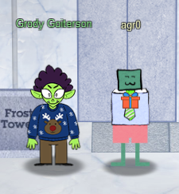
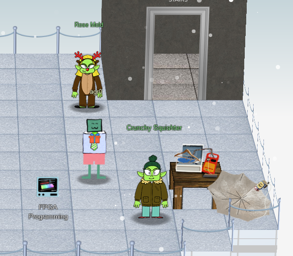
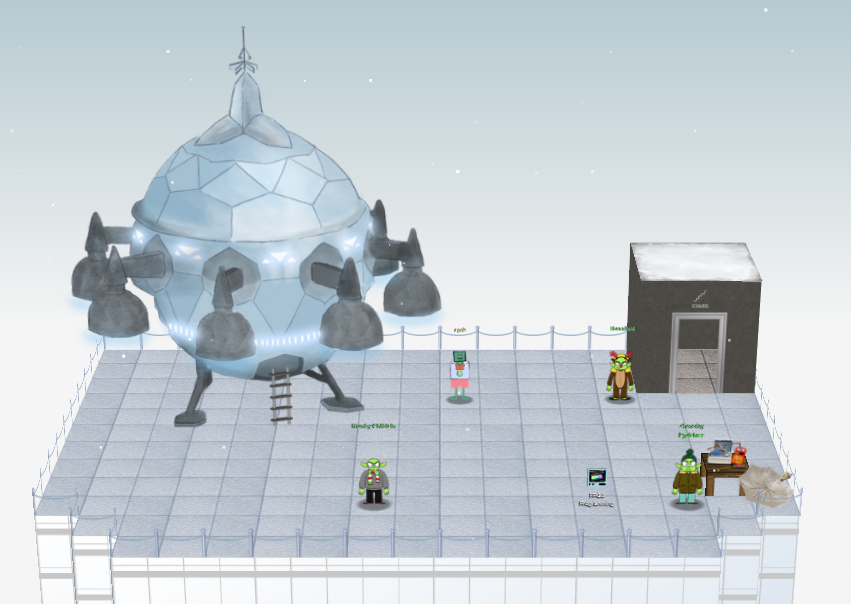

# Chapter XIII

My badge tells me to write my first FPGA program to make a doll sing. I can learn more about this if I visit Grody Goiterson near Jack's elevator. Looks like I'm fixing a broken elevator!

## Broken Elevator Logic Gates Challenge

!!! quote "Grody Goiterson"
    Hrmph. Snrack! Pthbthbthb.

    Gnerphk. Well, on to business.

    I'm Grody Goiterson. ... It's a family name.

    So hey, this is the Frostavator. It runs on some logic chips... that fell out.

    I put them back in, but I must have mixed them up, because it isn't working now.

    If you don't know much about logic gates, it's something you should look up.

    If you help me run the elevator, maybe I can help you with something else.

    I'm pretty good with FPGAs, if that's worth something to ya'.

Welp, time to play elevator repair technician with the [Broken Elevator terminal challenge](../term_ec.md).

## FPGA Programming

Upon completion of this and getting the elevator working again, Grody has more to tell me!

!!! quote "Grody Goiterson"
    Ooo... That's it!

    A deal's a deal. Let's talk FPGA.

    First, did you know there are people who do this stuff [for fun](https://www.fpga4fun.com/MusicBox.html)??

    I mean, I'm more into picking on other trolls for fun, but whatever.

    Also, that Prof Petabyte guy is giving [a talk](https://www.youtube.com/watch?v=GFdG1PJ4QjA) about FPGAs. Weirdo.

    So hey, good luck or whatever.

With access to the elevator, I take it straight up to the top floor and exit out onto the roof. There I'm met with...a few trolls.

There, Rose Mold basically just makes fun of me for not teleporting everywhere. Jokes on you, Rose. I like it!

Crunchy Squishter on the other hand had a few things to say:

!!! quote "Crunchy Squishter"
    Greetings Earthlink! I'm Crunchy Squishter.

    Hey, could you help me get this device on the table working? We've cobbled it together with primitive parts we've found on your home planet.

    We need an FPGA though - and someone who knows how to program them.

    If you haven't talked with Grody Goiterson by the Frostavator, you might get some FPGA tips there.

Ok Crunchy. I take a deep breath and get my hands dirty with [FPGA Programming](../obj13.md).

Upon completing that, I program a chip and insert it into the weird slapped-together Speak & Spell contraption there...and a UFO appears on top of the building!

[The Thrilling Conclusion...](conclusion.md)