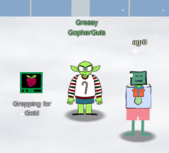

# Chapter III

Making my way over to Frost Tower, I'm met with a frozen door! Not good for business if nobody can even get inside! My objective reads:

!!! summary
    Turn up the heat to defrost the entrance to Frost Tower. Click on the Items tab in your badge to find a link to the Wifi Dongle's CLI interface. Talk to Greasy Gopherguts outside the tower for tips.

Since it first asks me to go to Greasy Gopherguts for help, I go visit him.

## Grepping for Gold

!!! quote "Greasy Gopherguts"
    Grnph. Blach! Phlegm.

    I'm Greasy Gopherguts. I need help with parsing some Nmap output.

    If you help me find some results, I'll give you some hints about Wi-Fi.

    Click on the terminal next to me and read the instructions.

    Maybe search for a cheat sheet if the hints in the terminal don't do it for ya'.

    You'll type `quizme` in the terminal and `grep` through the Nmap bigscan.gnmap file to find answers.

Time to complete the [Grepping for Gold Terminal Challenge](../term_gfg.md)!

Upon completing that, Greasy has more to say:

!!! quote "Greasy Gohperguts"
    Grack. Ungh. ... Oh!

    You really did it?

    Well, OK then. Here's what I know about the wifi here.

    Scanning for Wi-Fi networks with iwlist will be location-dependent. You may need to move around the North Pole and keep scanning to identify a Wi-Fi network.

    Wireless in Linux is supported by many tools, but `iwlist` and `iwconfig` are commonly used at the command line.

    The `curl` utility can make HTTP requests at the command line!

    By default, `curl` makes an HTTP GET request. You can add `--request POST` as a command line argument to make an HTTP POST request.

    When sending HTTP POST, add `--data-binary` followed by the data you want to send as the POST body.

OK! Over to Grimy McTrollkins!

## Thaw Frost Tower's Entrance

!!! quote "Grimy McTrollkins"
    Yo, I'm Grimy McTrollkins.

    I'm a troll and I work for the big guy over there: Jack Frost

    I'd rather not be bothered talking with you, but I'm kind of in a bind and need your help.

    Jack Frost is so obsessed with icy cold that he accidentally froze shut the door to Frost Tower!

    I wonder if you can help me get back in.

    I think we can melt the door open if we can just get access to the thermostat inside the building.

    That thermostat uses Wi-Fi. And I'll bet you picked up a Wi-Fi adapter for your badge when you got to the North Pole.

    Click on your badge and go to the Items tab. There, you should see your Wi-Fi Dongle and a button to "Open Wi-Fi CLI." That'll give you command-line interface access to your badge's wireless capabilities.

Time to finish the [Thaw Frost Tower's Entrance Objective](../obj3.md)!

[And now I have access inside the casino](obj4.md)!