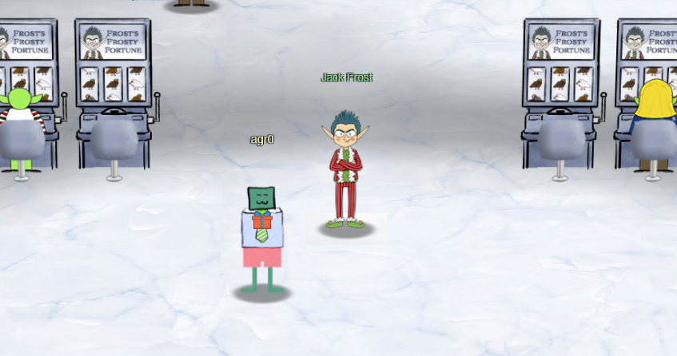
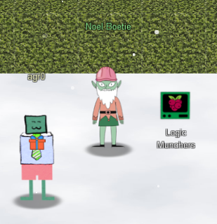
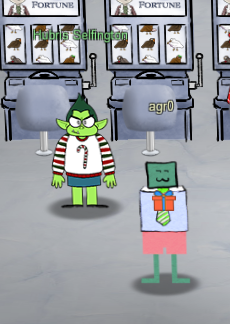

# Chapter IV

Inside Frost Tower, I'm greeted with Jack Frost...somehow. Wait, wasn't he behind me outside? Whatever.

He goes on about how much better his convention is than Santa's next door, and that _his_ convention celebrates the _true_ meaning of Christmas. Which is to say money. Giant piles of money. Huge chests overflowing with cash. Jack is apparently more of a realist, I think.

But that's beside the point! On to the objective!

My badge tells me that I have to investigate the potential to manipulate the slot machines in Jack's Tower, but first I should go visit Noel Boetie outside of Santa's Castle for help. Okay!

## Logic Munchers

!!! quote "Noel Boetie"
    Hello there! Noel Boetie here. We're all so glad to have you attend KringleCon IV and work on the Holiday Hack Challenge!

    I'm just hanging out here by the Logic Munchers game.

    You know...logic: that thing that seems to be in short supply at the tower on the other side of the North Pole?

    Oh, I'm sorry. That wasn't terribly kind, but those frosty souls do confuse me...

    Anyway, I'm working my way through this Logic Munchers game.

    A lot of it comes down to understanding boolean logic, like `True And False` is `False`, but `True And True` is `True`.

    It _can_ get a tad complex in the later levels.

    I need some help, though. If you can show me how to complete a stage in Potpourri at the Intermediate (Stage 3) or higher, I'll give you some hints for how to find vulnerabilities.

    Specifically, I'll give you some tips in finding flaws in some of the weeb applications I've heard about here at the North Pole, especially those associated with slot machines!

Time for the [Logic Munchers Terminal Challenge](../term_lm.md)!

Upon completing that, Noel has more info for me!

!!! quote "Noel Boetie"
    Wow - amazing score! Great work!

    So hey, those slot machines. It seems that in his haste, Jack bought some terrible hardware.

    It seems they're susceptible to [parameter tampering](https://owasp.org/www-community/attacks/Web_Parameter_Tampering).

    You can modify web request parameters with an intercepting proxy or tools built into Firefox.

Now, armed with new information, I tipped my hat forward and marched back into Frost Tower to see Hubris Selfington:

## Slot Machine Investigation

!!! quote "Hubris Selfington"
    Snarf. Hrung. Phlthth.

    I'm Hubris Selfington.

    The big boss told me he's worried about vulnerabilities in his slot machines, especially this one.

    Statistically speaking, it seems to be paying out way too much.

    He asked me to see if there are any security flaws in it.

    The boss has HUGE plans and we've gotta make sure we are running a tight ship here at Frost Tower.

    Can you help me find the issue?

    I mean, I could TOTALLY do this on my own, but I want to give you a chance first.

Sure you can, Hubris. Sometimes if you want something done right, you've just gotta [do it yourself (Slot Machine Investigation)](../obj4.md)!

And once that's done with, time to move onto the [Strange USB Device](obj5.md)!