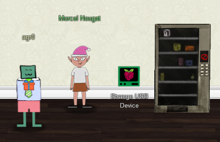

# Chapter V

Whoops, looks like there isn't much of a house advantage when there's such a glaring security flaw! Well, onward and upward. My next objective tells me that I need to assist the elves in reverse engineering a strange USB device. But before I go about doing that, I first have to visit Jewel Loggins to help them first since she is apparently an expert at strange USB devices! She is located on Santa's Talks Floor, so let's head over there now.

## IPv6 Sandbox

!!! quote "Jewel Loggins"
    Well hello! I'm Jewel Loggins.

    I have to say though, I'm a bit distressed.

    The con next door? Oh sure, I'm concerned about that too, but I was talking about the issues I'm having with IPv6.

    I mean, I know it's an old protocol now, but I've just never checked it out.

    So now I'm trying to do simple things like Nmap and cURL using IPv6, and I can't quite get them working!

    Would you mind taking a look for me on this terminal?

    I think there's a Github Gist that covers tool usage with IPv6 targets.

    The tricky parts are knowing when to use [] around IPv6 addresses and where to specify the source interface.

    I've got a deal for you. If you show me how to solve this terminal, I'll provide you with some nice tips about a topic I've been researching a lot lately - Ducky Scripts! They can be really interesting and fun!

Ducky scripts, huh? This strange USB device is becoming [all too familiar...](https://shop.hak5.org/products/usb-rubber-ducky-deluxe?variant=353378649). Okay then, let's see what we can do about this IPv6 problem.

### [IPv6 Sandbox](../term_is.md)

Once that was done, Jewel has some info for me!

!!! quote "Jewel Loggins"
    Great work! It seems simpler now that I've seen it once. Thanks for showing me!

    Prof Petabyte warned us about random USB devices. They might be malicious keystroke injectors!

    A troll could program a keystroke injector to deliver malicious keystrokes when it is plugged in.

    Ducky Script is a language used to specify those keystrokes.

    What commands would a troll try to run on our workstations?

    I heard that SSH keys can be used as backdoors. Maybe that's useful?

Interesting...let's head on over to the Speaker UNPreparation Room to meet up with Morcel Nougat.

## Strange USB Device

There he is, hanging out next to the Strange USB Device terminal, as well as a vending machine that seemed to be giving [everyone trouble last year](https://hhc2020.agrohacksstuff.io/#kiosk4/#the-vending-machine).

!!! quote "Morcel Nougat"
    Hello and welcome to the speaker UNPreparedness Room!

    I'm Morcel Nougat, elf extraordinaire.

    I've heard the talks at the other con across the way are a bit...off.

    I really don't think they have the right sense about what makes for a wonderful holiday season. But anyway!

    Say, do you know anything about USB Rubber Duckies?

    I've been playing around with them a bit myself.

    Please see what you can do to help solve the Rubber Ducky Objective!

    Oh, and if you need help, I hear Jewel Loggins, on this floor outside this room, has some experience.

Already spoke to Jewel, thanks Morcel. But time to roll up my sleeves and get my hands dirty.

[Strange USB Device](../obj5.md)

And with that done, time to head to the [Shellcode Primer objective](obj6.md)!