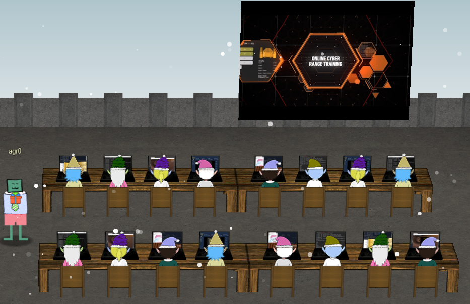
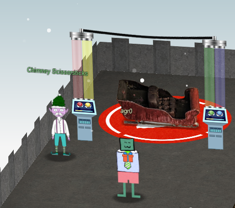
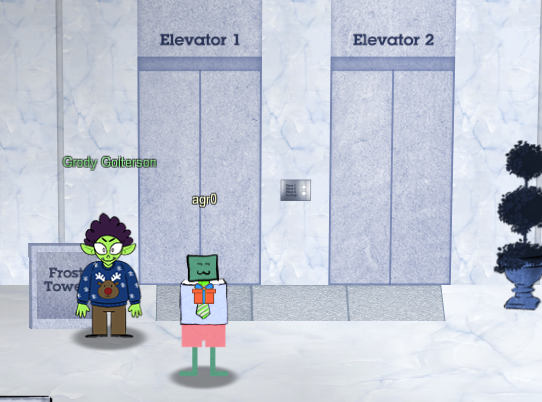
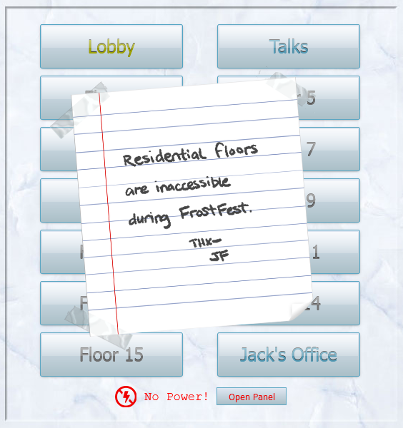
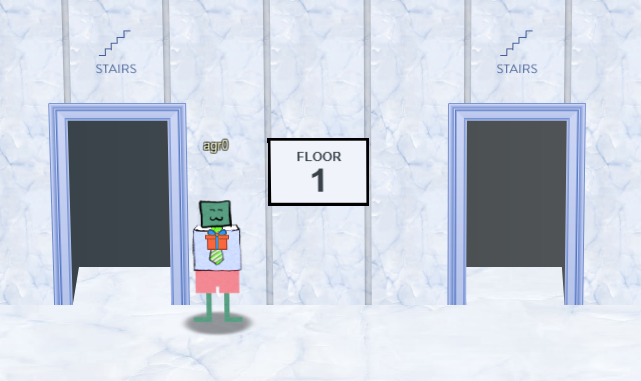
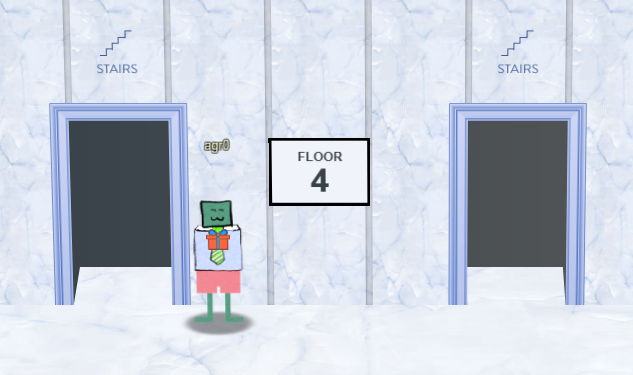
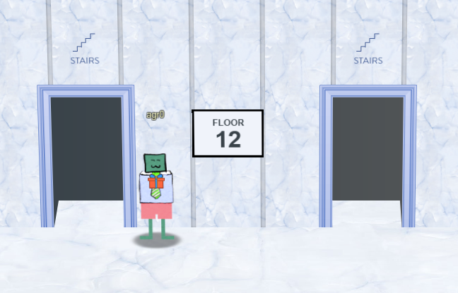
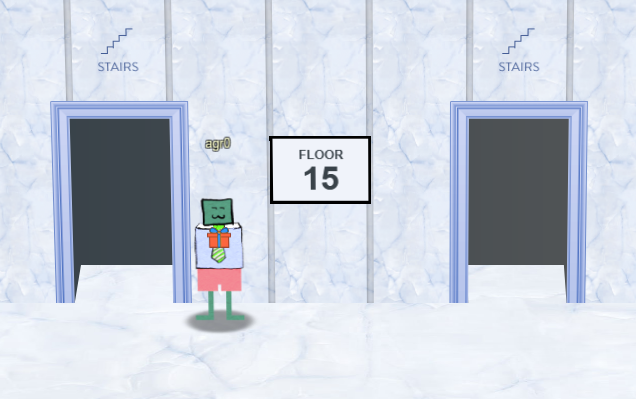
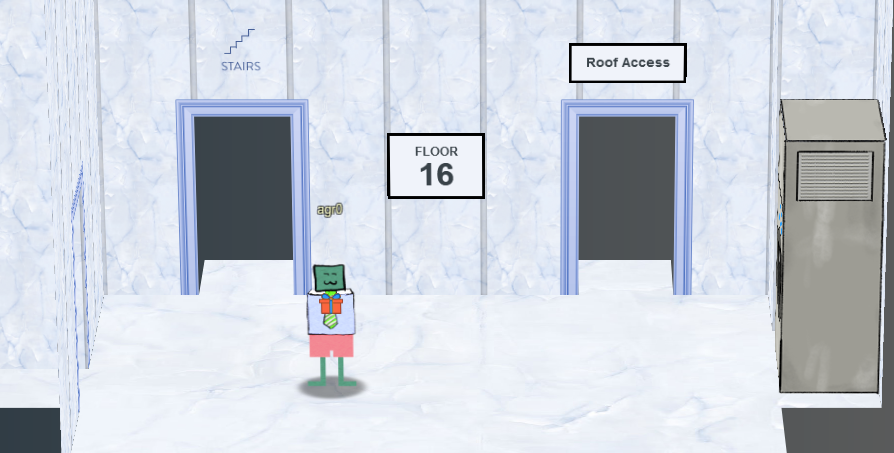
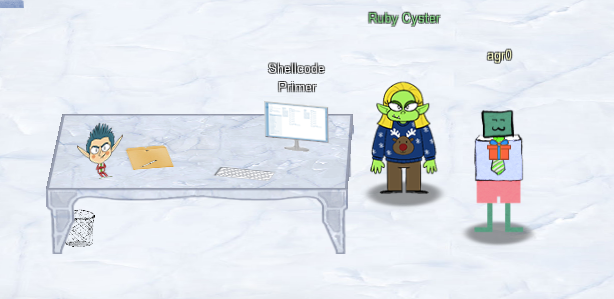

# Chapter VI

The objective on my badge tells me to complete the Shellcode Primer challenge in Jack's office. Haven't been there yet. But before I make the trek to the top of the tower, it first tells me to speak to Chimney Scissorsticks in the Netwars area for hints. Okay, up to the top of Santa's castle!

At the top of the roof I see 16 elves all partaking in NetWars! Nice.

But just to the left of all that stands Chimney Scissorsticks, right next to the sleigh. Oh man, are there weird CAN-D-Bus issues again?

## Santa's Holiday Hero

!!! quote "Chimney Scissorsticks"
    Woo! I'm Chimney Scissorsticks, and I'm having a great time up here!

    I've been hanging out with all these NetWars players and *not* worrying about what's going on next door.

    In fact, I've really been having fun playing with this Holiday Hero terminal. You can use it to generate some jamming holiday tunes that help power Santa's sleigh!

    It's more fun to play with a friend, but I've also heard there's a clever way to enable single player mode.

    Single player mode? I heard it can be enabled by fiddling with two client-side values, one of which is passed to the server.

    It's so much more fun and easier with a friend though!

    Either way, we'd really appreciate your help getting the sleigh all fueled up.

    Then I can get back to thinking about shellcode...

Oh, okay. Well at least whatever I fixed last year seems to remain fixed. Still though, time to finish the [Santa's Holiday Hero Challenge](../term_shh.md)!

And upon completing that, Chimney has more to say!

!!! quote "Chimney Scissorsticks"
    You did it - rock on! We're all set now that the sleigh is fueled!

    So hey, let me talk to you a bit about manual exploitation.

    If you run into any shellcode primers at the North Pole, be sure to read the directions and the comments in the shellcode source!

    Also, troubleshooting shellcode can be difficult. Use the debugger step-by-step feature to watch values.

    Lastly, be careful not to overwrite any register values you need to reference later in your shellcode.

    That's it! I know you can do it!

Okay, nice! Now...off to Jack's office. Say, where is his office anyway?

Apparently at the top of Frost Tower!

I made my way over to the Lobby of Frost Tower to take the elevator...

Only to find out it was out of order!

I don't have time to fix Jack's elevator problems, I have Christmas to save! To the stairs!

Huff...puff...

Where are we?

Looks like we're in the teens...somewhere.

Well when we get to twenty, tell me...I'm gonna throw up.

Finally. The 16th floor! Though I could've sworn we skipped floor 13...no matter. Jack's office!

## Shellcode Primer

!!! quote "Ruby Cyster"
    Hey, I'm Ruby Cyster. Don't listen to anything my sister, Ingreta, says about me.

    So I'm looking at this system, and it has me a *little* bit worried.

    If I didn't know better, I'd say someone here is learning how to hack North Pole systems.

    Who's got that kind of nerve!

    Anyway, I hear some elf on the other roof knows a bit about this type of thing.

There's the introduction. Time to do the [Shellcode Primer Objective](../shellcode_primer/obj6-1.md)!

Upon completion, Ruby has more to tell me!

!!! quote "Ruby Cyster"
    Oh man - what is this all about? Great work though.

    So first things first, you should definitely take a look at the firmware.

    With that in-hand, you can pick it apart and see what's there.

    Did you know that if you append multiple files of that type, the last one is processed?

    Have you heard of Hash Extension Attacks?

    If something isn't working, be sure to check the output! The error messages are very verbose.

    Everything else accomplished, you just might be able to get shell access to that dusty old thing!

Challenge Accepted, Ruby! On to the [Printer Exploitation Objective](obj7.md)!