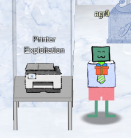

# Objective VII

Right there in Jack's office is a printer, just waiting to be exploited.

## Printer Exploitation

My badge tells me that this printer was stolen from Kringle Castle! It also tells me that Ruby Cyster would know more about it, but since I already helped her in the previous objective it looks like I'm on my own to solve this one. Luckily I was prepared, so read on about how I [successfully exploited the printer](../obj7.md).

Once completing that, my next objective was a doozy!

[Objective 8](obj8.md)