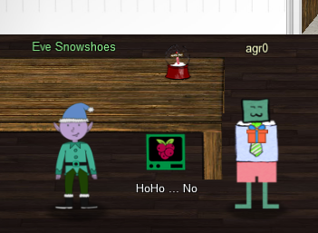

# Chapter VII

My badge is telling me that I have to obtain the secret sleigh research document from a host within the Elf University domain. That seems like a tall order, but first I should go and see Eve Snowshoes over in Santa's office for more information about Active Directory exploitation. Ugh, that's the exact opposite side of the map! Good thing I can teleport to previous locations. Onward to Santa's office, the 3rd floor of Kringle Castle!

I am greeted by Eve Snowshoes, who stands next to the "HoHo...No" challenge terminal.

## HoHo...No

!!! quote "Eve Snowshoes"
    Hey there, how's it going? I'm Eve Snowshoes.

    Lately I've been spending a lot of cycles worrying about what's going on next door.

    Before that, I was checking out Fail2Ban.

    It's this slick log scanning tool for Apache web servers.

    If you can complete this terminal challenge, I'd be happy to give you some things I've learned about Kerberoasting and Active Directory permissions!

    Why don't you do some work with Fail2Ban on this Cranberry Pi terminal first, then we'll talk Kerberoasting and Active Directory, OK?

Alright Eve, you got it. Time to complete the [HoHo...No Terminal Challenge](../term_hhn.md)!

## Kerberoasting on an Open Fire

Upon completing that, I get more information that can be used to finish the Active Directory Objective:

!!! quote "Eve Snowshoes"
    Fantastic! Thanks for the help!

    Hey, would you like to know more about Kerberoasting and Active Directory permissions abuse?

    There's a great talk by Chris Davis on this exact subject!

    There are also plenty of resources available to learn more about Kerberoasting specifically.

    If you have any trouble finding the domain controller on the `10.X.X.X` network, remember that, when not running as root, `nmap` default probing relies on connecting to TCP 80 and 443.

    Got a hash that won't crack with your wordlist? OneRuleTopRuleThemAll rule is a great way to grow your keyspace.

    Where'd you get your wordlist? CeWL might generate a great wordlist from the ElfU website, but it will ignore digits in terms by default.

    So, apropos of nothing, have you ever known system administrators who store credentials in scripts? I know, I know, *you* understand the folly and would never do it!

    The easy way to investigate Active Directory misconfigurations (for Blue and Red alike!) is with Bloodhound, but there are native methods as well.

    Oh, and one last thing: once you've granted permissions to your user, it might take up to five minutes for it to propogate throughout the domain.

Man, lots of work ahead of me. But still no match! Time to [Kerberoast our way to the Top](../kerberoasting/obj8-1.md)!

Once that was done, I had to take a break. What a ride!

But Christmas waits for no man! On to [Objective 9](obj9.md)!