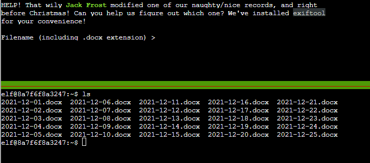
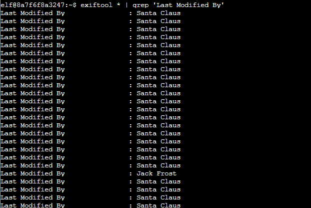
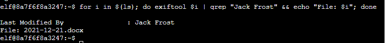
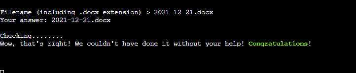

# Exif Metadata

We need to find out which document out of a bunch was modified recently by Jack Frost. Running `ls` in the current directory shows:

Running `exiftool * | grep 'Last Modified By'` in the directory parses through the exif data of all of the documents, and finds something interesting:

Now we know what we're looking for. "Jack Frost" is the string!

A little fancy shell footwork, I made the following:

`for i in $(ls); do exiftool $i | grep "Jack Frost" && echo "File: $i"; done`

Putting that in as the answer...

