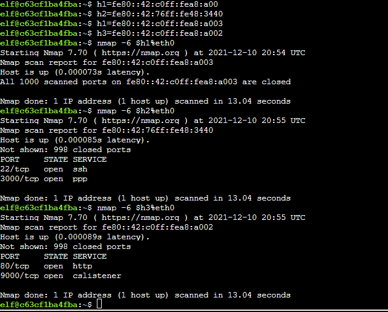
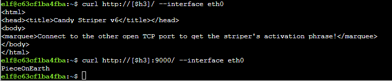

# Terminal Challenge: IPv6 Sandbox

Can ping the neighbors with:

`ping6 ff02::1 -c2`

Discovered the following IPs:

- fe80::42:c0ff:fea8:a003
- fe80::42:76ff:fe48:3440
- fe80::42:c0ff:fea8:a002

Nmapping all of them:

Note how I assigned them to variables first so I didn't have to type them out all the time.

Curling all of them:

Answer: `PieceOnEarth`
Done

# WEIRD STUFF

Incidentally, curling http://[fe80::42:76ff:fe48:3440]:3000 gave me a really weird WeTTY terminal. It wasn't my IP address so I'm not quite sure what this was. I imagine some 4th wall stuff.

The hint:
---
Some tools allow or even require `-6` as a command line option, and `curl` requires an IPv6 address to be in `[]` (square brackets).  Also, for link local addresses, you usually have to specify the local interface you want to use.

- `ping 2001:7b8:666:ffff::1:42 -I eth0`
- `nmap -6 2001:7b8:666:ffff::1:42%eth0`
- `curl http://[2001:7b8:666:ffff::1:42]:8080/ --interface eth0`
- `wget http://[2001:7b8:666:ffff::1:42]:8080/`
- `telnet -6 2001:7b8:666:ffff::1:42`
- `nc -6 2001:7b8:666:ffff::1:42%eth0 23`

Want to find link local addresses for systems in your network segment?  Try hitting local hosts and routers with these multicast addresses:
- `ping6 ff02::1 -c2`
- `ping6 ff02::2 -c2`
Then see what's in your ~ARP cache~ NDISC cache list:
- `ip neigh`