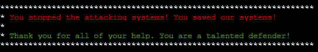

# HoHo...No

Messing with Fail2ban!

```text
Jack is trying to break into Santa's workshop!

Santa's elves are working 24/7 to manually look through logs, identify the
malicious IP addresses, and block them. We need your help to automate this so
the elves can get back to making presents!

Can you configure Fail2Ban to detect and block the bad IPs?

 * You must monitor for new log entries in /var/log/hohono.log
 * If an IP generates 10 or more failure messages within an hour then it must
   be added to the naughty list by running naughtylist add <ip>
        /root/naughtylist add 12.34.56.78
 * You can also remove an IP with naughtylist del <ip>
        /root/naughtylist del 12.34.56.78
 * You can check which IPs are currently on the naughty list by running
        /root/naughtylist list

You'll be rewarded if you correctly identify all the malicious IPs with a
Fail2Ban filter in /etc/fail2ban/filter.d, an action to ban and unban in
/etc/fail2ban/action.d, and a custom jail in /etc/fail2ban/jail.d. Don't
add any nice IPs to the naughty list!

*** IMPORTANT NOTE! ***

Fail2Ban won't rescan any logs it has already seen. That means it won't
automatically process the log file each time you make changes to the Fail2Ban
config. When needed, run /root/naughtylist refresh to re-sample the log file
and tell Fail2Ban to reprocess it.
```

Example from log file:
```text
2021-12-15 00:33:23 Valid heartbeat from 47.33.116.144
2021-12-15 00:33:24 137.14.224.43: Request completed successfully
2021-12-15 00:33:25 16.23.179.241: Request completed successfully
2021-12-15 00:33:26 Login from 22.243.77.173 successful
2021-12-15 00:33:26 Valid heartbeat from 27.252.33.153
2021-12-15 00:33:27 Valid heartbeat from 183.169.175.196
2021-12-15 00:33:28 171.70.28.249 sent a malformed request
2021-12-15 00:33:28 Valid heartbeat from 171.187.206.231
2021-12-15 00:33:29 2.196.232.137: Request completed successfully
2021-12-15 00:33:29 Valid heartbeat from 23.224.208.60
2021-12-15 00:33:30 193.2.189.189: Request completed successfully
2021-12-15 00:33:30 23.224.208.60: Request completed successfully
2021-12-15 00:33:30 49.2.30.217: Request completed successfully
2021-12-15 00:33:30 Login from 63.13.46.40 successful
2021-12-15 00:33:31 167.2.226.167: Request completed successfully
2021-12-15 00:33:31 Invalid heartbeat 'charlie' from 69.79.209.175
2021-12-15 00:33:32 Login from 99.90.215.16 rejected due to unknown user name
2021-12-15 00:33:32 Valid heartbeat from 54.150.249.29
2021-12-15 00:33:33 Login from 161.161.132.87 successful
2021-12-15 00:33:35 22.190.153.33: Request completed successfully
2021-12-15 00:33:35 59.169.147.14: Request completed successfully
2021-12-15 00:33:35 Valid heartbeat from 151.136.111.122
2021-12-15 00:33:36 Login from 68.239.36.121 successful
2021-12-15 00:33:36 Login from 85.42.95.206 successful
2021-12-15 00:33:37 108.179.197.19: Request completed successfully
2021-12-15 00:33:37 Login from 142.190.169.180 rejected due to unknown user name
2021-12-15 00:33:37 Login from 71.121.43.178 successful
2021-12-15 00:33:38 199.49.81.232: Request completed successfully
2021-12-15 00:33:38 Login from 184.239.116.110 successful
2021-12-15 00:33:38 Login from 40.67.40.98 successful
2021-12-15 00:33:39 153.163.120.240: Request completed successfully
2021-12-15 00:33:39 Login from 199.49.81.232 successful
2021-12-15 00:33:40 Valid heartbeat from 136.153.2.39
2021-12-15 00:33:40 Valid heartbeat from 197.79.154.140
2021-12-15 00:33:40 Valid heartbeat from 63.13.46.40
2021-12-15 00:33:41 Invalid heartbeat 'charlie' from 197.91.239.99
2021-12-15 00:33:42 131.89.88.103: Request completed successfully
2021-12-15 00:33:42 Login from 173.35.104.101 successful
```


## For the action.conf file

This is my proposed action.conf file, `hoho.conf`

```ini
[Definition]
actionban = /root/naughtylist add <ip>
actionunban = /root/naughtylist del <ip>
```

## For the filter.conf file

My processed filter file so far, created the file `hoho-filter.conf`
```ini
[Definition]
failregex = Login from <HOST> rejected .*$
            <HOST> sent a malformed request.*$
            Invalid heartbeat.*from <HOST>.*$
            Failed login from <HOST> .*$
```

Tested the above with `fail2ban-regex /var/log/hohono.log /etc/fail2ban/filter.d/hoho.conf`

```text
Running tests
=============

Use   failregex filter file : hoho, basedir: /etc/fail2ban
Use         log file : /var/log/hohono.log
Use         encoding : UTF-8


Results
=======

Failregex: 3554 total
|-  #) [# of hits] regular expression
|   1) [954] Login from <HOST> rejected .*$
|   2) [867] <HOST> sent a malformed request.*$
|   3) [866] Invalid heartbeat.*from <HOST>.*$
|   4) [867] Failed login from <HOST> .*$
`-

Ignoreregex: 0 total

Date template hits:
|- [# of hits] date format
|  [34920] {^LN-BEG}ExYear(?P<_sep>[-/.])Month(?P=_sep)Day(?:T|  ?)24hour:Minute:Second(?:[.,]Microseconds)?(?:\s*Zone offset)?
`-

Lines: 34920 lines, 0 ignored, 3554 matched, 31366 missed
[processed in 3.19 sec]

Missed line(s): too many to print.  Use --print-all-missed to print all 31366 lines
```

## For the jail.d file
Created the file jail.local

```ini
[hohoho]
enabled = true
filter = hoho-filter
action = hoho
logpath = /var/log/hohono.log
maxretry = 10
findtime = 3600
bantime = 2592000
```

## Restarted the service...
`/etc/init.d/fail2ban restart`

## Refreshed the naughtylist...
`/root/naughtylist refresh`

## Profit
```text
192.251.123.92 has been added to the naughty list!
118.12.190.168 has been added to the naughty list!
215.136.76.176 has been added to the naughty list!
188.108.178.222 has been added to the naughty list!
181.53.130.194 has been added to the naughty list!
200.2.139.75 has been added to the naughty list!
174.177.149.209 has been added to the naughty list!
64.1.56.159 has been added to the naughty list!
161.50.136.5 has been added to the naughty list!
149.11.246.71 has been added to the naughty list!
62.198.43.91 has been added to the naughty list!
84.159.43.145 has been added to the naughty list!
195.193.119.108 has been added to the naughty list!
36.129.235.158 has been added to the naughty list!
174.154.204.220 has been added to the naughty list!
41.123.26.131 has been added to the naughty list!
61.170.12.80 has been added to the naughty list!
219.76.180.71 has been added to the naughty list!
You correctly identifed 18 IPs out of 18 bad IPs
You incorrectly added 0 benign IPs to the naughty list
```

