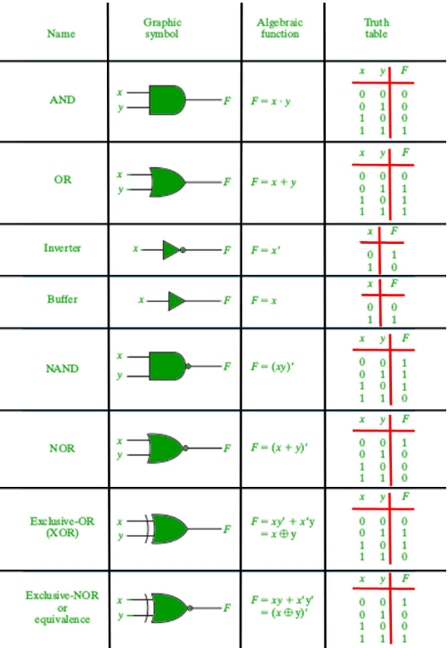
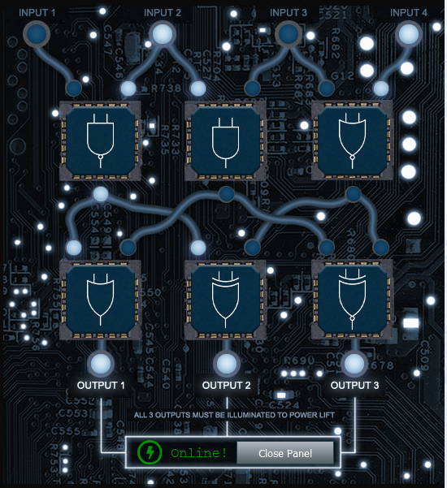

# Elevator
# Frostavator Circuitry

To understand how to re-start the frostavator, you need to learn logic gates

This is a guide to help you understand it all:

After a lot of fiddling, I eventually got the Frostavator working:

