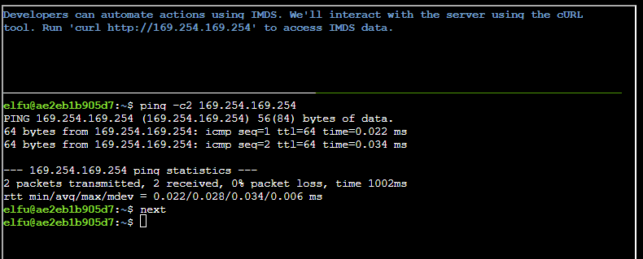

# IMDS Exploration

Opening screen:

First challenge

After the ping

Next

After curling

After curling latest endpoint

After curling latest/dynamic

Curling latest/dynamic/instance-identity/document

Piping output to jq

After typing next

After curling latest/meta-data/

query public-hostname

Add trailing newline

Access iam/security-credentials

Access `security-deploy-role`

Hitting next

examine `gettoken.sh`

sourcing `gettoken.sh`

Examining contents of token

All done!

