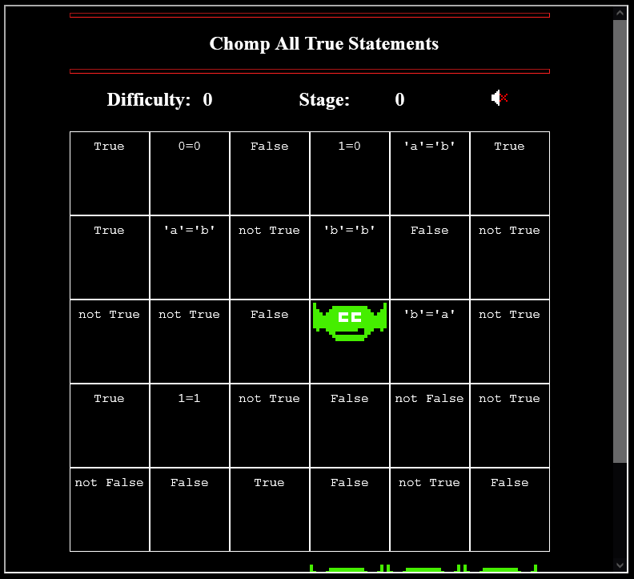
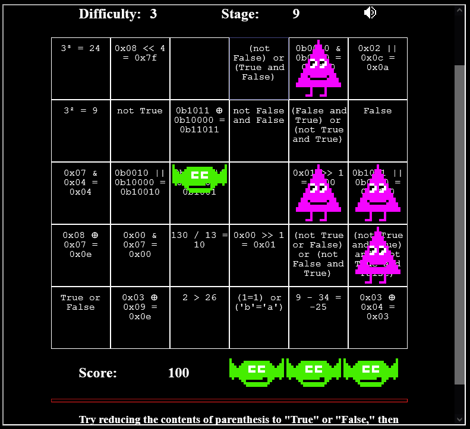
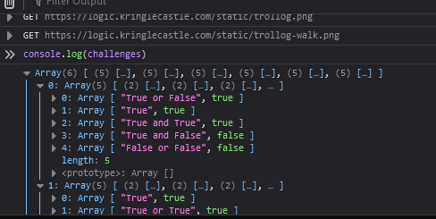

# Logic Munchers

The Logic Munchers game (or Logic Chompers, depending on who you ask I suppose) is a game of cat & mouse with logic, if you can believe that. The basic premise of the game is that you are a Logic Muncher whose sole purpose is to chomp up the True statements of the area. Given the following grid layout:



You can see the basic strategy. You simply move your logic muncher over to a piece on the grid that is True, and you munch it. The board is over when you rid the board of all True statements. This is made harder with Trollogs which cross the board horizontally or vertically, randomly changing the state of the square they are residing on. They could add or remove a True statement, or otherwise mess with your Muncher. If you shared a space with a Trollog, you lose a life -- as you would if you munch on a Falsehood. The above example is one of an easy level. A more advanced level can look like this:



You can see the difficulty raises considerably the higher the stage level. Some squares require some serious bitwise math, as well as some hexidecimal math. At first I started to do this with a python terminal nearby to quickly do some bitwise math like `hex(0x03 ^ 0x04)` to determine that it is indeed not `0x03`, but rather `0x07`. This gets harder, especially as more Trollogs show up and get faster, flipping bits as often as possible.

This system got harder and harder, and while I did my best to get the highest score, I found it more interesting to review the source code, as it became evident that this game was a combination of local Javascript and websockets to compare against a server. Knowing this, I reviewed the source code by inspecting the element of the game, and discovered an interesting set of variables when opening the debugging console and reviewing the code of `chompy.js`. This is something I found most interesting: a set of initialized variables!

```javascript hl_lines="1 4 5"
var challenges; // track challenges from server
var chomper; // player's avatar object
var chompySleepTime;
var score = 0; // start at 0 points
var lives = 3; // start with 3 extra lives
var stage = level *3; // every three stages means an increase in difficulty level
var trollogs = []; // array of bad guy objects
var chompyMoving = false; // tracks when he's on the move!
var gridStyle = getComputedStyle(document.getElementById("gamegrid")); // movement requires cell dimensions
var boxHeight = parseInt(gridStyle.gridAutoRows.replace("px",""));
var boxWidth  = parseInt(gridStyle.gridTemplateColumns.split(" ")[0].replace("px",""));
var ws; // will hold websocket connection
var icons = false;
var paused = false;
var sound = false;

// << snip >>
```

On the highlighted lines, I discovered a way to cheat the game!

## Give yourself more lives

You can give yourself more lives than the standard 3 by executing the command in the Developer Tools' Console: `lives = 999;`

## Change the Level

You can change the level by simply executing `stage = 100;`

## Cheat by getting the answers

You can simply get all the answers by executing the command: `console.log(challenges);` and it outputs the following:



The answers to each column! In the above, the top-left cell can be successfully munched, as it is True. Same as the cell below it. As long as you easily avoid the Trollogs, you can bypass every single level with this above cheat. Neato!