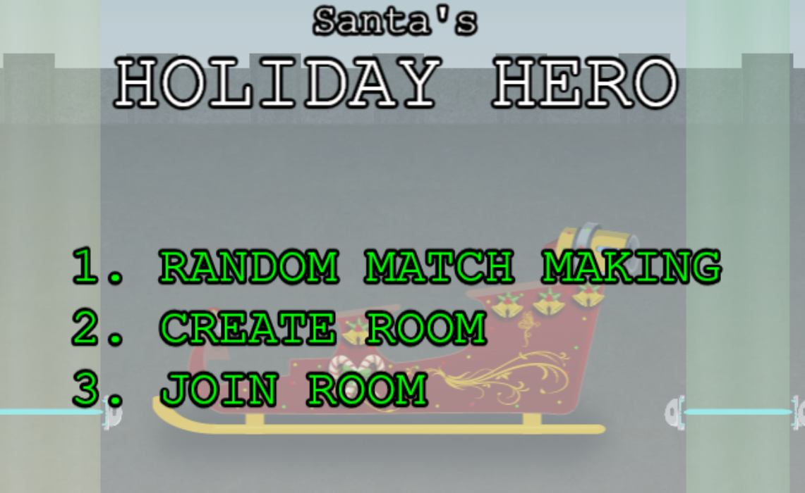
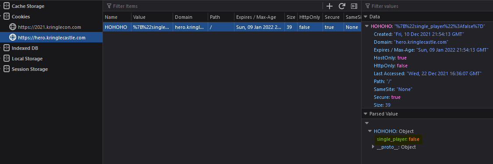
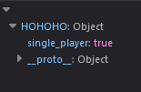
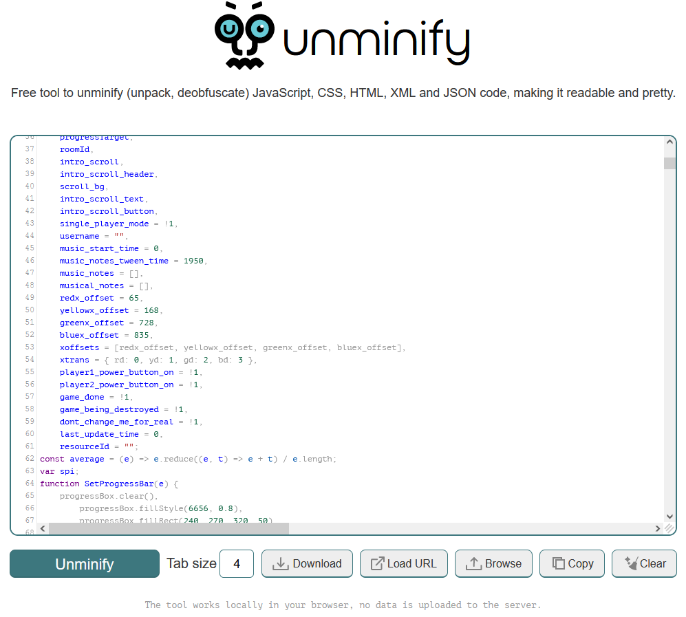
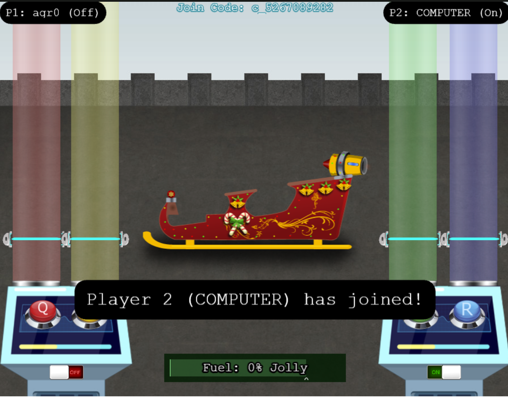
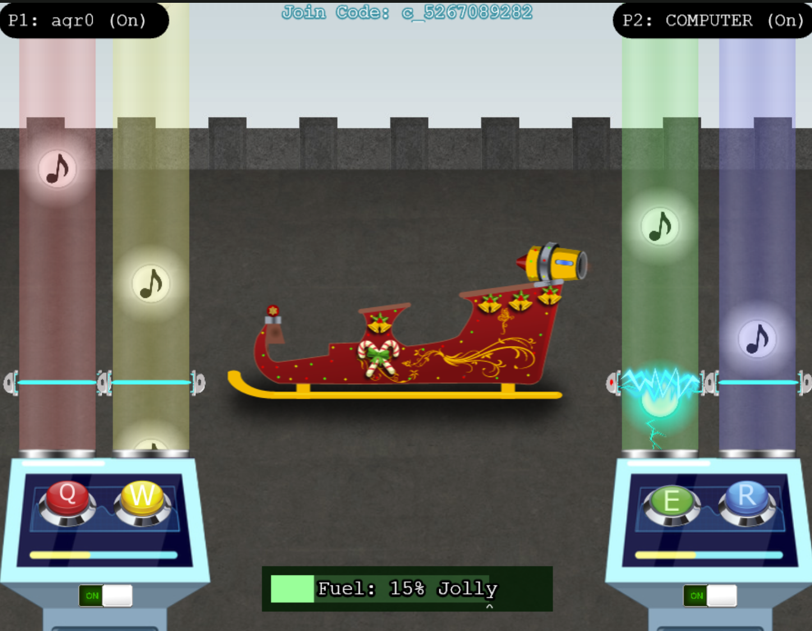

# Santa's Holiday Hero
You can play the Holiday hero game with two players to get the sleigh fueled properly. This will complete the challenge, but let's try to make it single player only. There are two variables that must be changed manually to accomplish this, so let's dig in.

The first thing I checked was to see if any cookies were created, and low and behold there was one that certainly stood out, according to my browser's dev tools:

A cookie called `HOHOHO` with a URL-encoded data blob stating `{"single_player":false}`. That's a simple change, so I just replaced `false` with `true`. 

Now let's poke around some more. When beginning a game, a new javascript file is loaded, but it is minified and near-impossible to read in its current form. Luckily there exists such sites as [Unminify JS](https://unminify.com/) which comes in handy in a situation like this. I copy-pasted the code from `holidayhero.min.js` into the site and it displayed a lot cleaner.

It displays a bunch of variable declarations before the code gets executed, and some variables that particularly stand out. `dont_change_me_for_real`, which from what I can tell just breaks the game I guess? But what gets my attention the most is `single_player_mode = !1`. So making sure I was in the context of the game (right clicking on the game and hitting inspect, then going to the console) and typing in `single_player_mode=1;` in the console. Once I did both of those things, I saw the following:

Success! Let's try and get this to work now...

Yeah...not too easy.

Ultimately I just played with a random and got the challenge completed. yay!