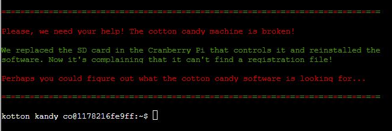

# Strace Ltrace Retrace

Get this cotton candy machine working



Contents of the current directory is a binary called `make the candy*`

Running it gives an error message:

```sh
kotton_kandy_co@1178216fe9ff:~$ ./make_the_candy 
Unable to open configuration file.
```

So let's run ltrace on it and find out where this conf file is!

```sh
kotton_kandy_co@1178216fe9ff:~$ ltrace ./make_the_candy 
fopen("registration.json", "r")                           = 0
puts("Unable to open configuration fil"...Unable to open configuration file.
)               = 35
+++ exited (status 1) +++
kotton_kandy_co@1178216fe9ff:~$ 
```

Looking for `registration.json`.


So what happens if we touch `registration.json` and run it?

```sh
kotton_kandy_co@1178216fe9ff:~$ touch registration.json
kotton_kandy_co@1178216fe9ff:~$ ltrace ./make_the_candy 
fopen("registration.json", "r")                           = 0x561c4cbc2260
getline(0x7fff62d86180, 0x7fff62d86188, 0x561c4cbc2260, 0x7fff62d86188) = -1
puts("Unregistered - Exiting."Unregistered - Exiting.
)                           = 24
+++ exited (status 1) +++
kotton_kandy_co@1178216fe9ff:~$
```

A new error, "Unregistered."

What happens if I run strace on it?

```sh
kotton_kandy_co@1178216fe9ff:~$ strace ./make_the_candy 
execve("./make_the_candy", ["./make_the_candy"], 0x7ffd2288b560 /* 12 vars */) = 0
brk(NULL)                               = 0x55baf9840000
access("/etc/ld.so.nohwcap", F_OK)      = -1 ENOENT (No such file or directory)
access("/etc/ld.so.preload", R_OK)      = -1 ENOENT (No such file or directory)
openat(AT_FDCWD, "/etc/ld.so.cache", O_RDONLY|O_CLOEXEC) = 3
fstat(3, {st_mode=S_IFREG|0644, st_size=19540, ...}) = 0
mmap(NULL, 19540, PROT_READ, MAP_PRIVATE, 3, 0) = 0x7f504b607000
close(3)                                = 0
access("/etc/ld.so.nohwcap", F_OK)      = -1 ENOENT (No such file or directory)
openat(AT_FDCWD, "/lib/x86_64-linux-gnu/libc.so.6", O_RDONLY|O_CLOEXEC) = 3
read(3, "\177ELF\2\1\1\3\0\0\0\0\0\0\0\0\3\0>\0\1\0\0\0\20\35\2\0\0\0\0\0"..., 832) = 832
fstat(3, {st_mode=S_IFREG|0755, st_size=2030928, ...}) = 0
mmap(NULL, 8192, PROT_READ|PROT_WRITE, MAP_PRIVATE|MAP_ANONYMOUS, -1, 0) = 0x7f504b605000
mmap(NULL, 4131552, PROT_READ|PROT_EXEC, MAP_PRIVATE|MAP_DENYWRITE, 3, 0) = 0x7f504aff2000
mprotect(0x7f504b1d9000, 2097152, PROT_NONE) = 0
mmap(0x7f504b3d9000, 24576, PROT_READ|PROT_WRITE, MAP_PRIVATE|MAP_FIXED|MAP_DENYWRITE, 3, 0x1e7000) = 0x7f504b3d9000
mmap(0x7f504b3df000, 15072, PROT_READ|PROT_WRITE, MAP_PRIVATE|MAP_FIXED|MAP_ANONYMOUS, -1, 0) = 0x7f504b3df000
close(3)                                = 0
arch_prctl(ARCH_SET_FS, 0x7f504b6064c0) = 0
mprotect(0x7f504b3d9000, 16384, PROT_READ) = 0
mprotect(0x55baf7d10000, 4096, PROT_READ) = 0
mprotect(0x7f504b60c000, 4096, PROT_READ) = 0
munmap(0x7f504b607000, 19540)           = 0
brk(NULL)                               = 0x55baf9840000
brk(0x55baf9861000)                     = 0x55baf9861000
openat(AT_FDCWD, "registration.json", O_RDONLY) = 3
fstat(3, {st_mode=S_IFREG|0644, st_size=0, ...}) = 0
read(3, "", 4096)                       = 0
fstat(1, {st_mode=S_IFCHR|0620, st_rdev=makedev(136, 0), ...}) = 0
write(1, "Unregistered - Exiting.\n", 24Unregistered - Exiting.
) = 24
exit_group(1)                           = ?
+++ exited with 1 +++
kotton_kandy_co@1178216fe9ff:~$
```

A bit more output! One thing I'm focusing on however that it looks like it's reading the file but since it's a zero-length file, it just bombs out. What happens if I add something to the file?

```sh
kotton_kandy_co@a33d11cdcb37:~$ echo -n "Merry Christmas!" > ./registration.json
kotton_kandy_co@a33d11cdcb37:~$ ltrace ./make_the_candy 
fopen("registration.json", "r")                           = 0x558383f74260
getline(0x7fff255f9630, 0x7fff255f9638, 0x558383f74260, 0x7fff255f9638) = 16
strstr("Merry Christmas!", "Registration")                = nil
getline(0x7fff255f9630, 0x7fff255f9638, 0x558383f74260, 0x7fff255f9638) = -1
puts("Unregistered - Exiting."Unregistered - Exiting.
)                           = 24
+++ exited (status 1) +++
kotton_kandy_co@a33d11cdcb37:~$ 
```

Interesting...it looks like it read in the string I fed it (`Merry Christmas!`) and compared it to the string `Registration`.  Since this is a JSON file I probably have to format it as such. Let's give it what it wants!

```sh
kotton_kandy_co@a33d11cdcb37:~$ echo -n '{"Registration"}' > ./registration.json
kotton_kandy_co@a33d11cdcb37:~$ ltrace ./make_the_candy 
fopen("registration.json", "r")                           = 0x5560ebc0a260
getline(0x7fff34503c20, 0x7fff34503c28, 0x5560ebc0a260, 0x7fff34503c28) = 16
strstr("{"Registration"}", "Registration")                = "Registration"}"
strchr("Registration"}", ':')                             = nil
getline(0x7fff34503c20, 0x7fff34503c28, 0x5560ebc0a260, 0x7fff34503c28) = -1
puts("Unregistered - Exiting."Unregistered - Exiting.
)                           = 24
+++ exited (status 1) +++
kotton_kandy_co@a33d11cdcb37:~$ 
```

A little bit better. Looks like it's looking for a literal colon `:`. Let's accommodate!

```sh
kotton_kandy_co@a33d11cdcb37:~$ echo -n '{"Registration":"yes please"}' > ./registration.json
kotton_kandy_co@a33d11cdcb37:~$ ltrace ./make_the_candy 
fopen("registration.json", "r")                           = 0x556010eb3260
getline(0x7ffe901b0590, 0x7ffe901b0598, 0x556010eb3260, 0x7ffe901b0598) = 29
strstr("{"Registration":"yes please"}", "Registration")   = "Registration":"yes please"}"
strchr("Registration":"yes please"}", ':')                = ":"yes please"}"
strstr(":"yes please"}", "True")                          = nil
getline(0x7ffe901b0590, 0x7ffe901b0598, 0x556010eb3260, 0x7ffe901b0598) = -1
puts("Unregistered - Exiting."Unregistered - Exiting.
)                           = 24
+++ exited (status 1) +++
kotton_kandy_co@a33d11cdcb37:~$ 
```

So I was almost right with assuming `yes please` was enough. Intead it looks like it's comparing it against the string `True`. Could that be all it needs?

```sh
kotton_kandy_co@a33d11cdcb37:~$ echo -n '{"Registration":"True"}' > ./registration.json
kotton_kandy_co@a33d11cdcb37:~$ ltrace ./make_the_candy 
fopen("registration.json", "r")                           = 0x55e2bba1c260
getline(0x7ffea4f6cb80, 0x7ffea4f6cb88, 0x55e2bba1c260, 0x7ffea4f6cb88) = 23
strstr("{"Registration":"True"}", "Registration")         = "Registration":"True"}"
strchr("Registration":"True"}", ':')                      = ":"True"}"
strstr(":"True"}", "True")                                = "True"}"
getline(0x7ffea4f6cb80, 0x7ffea4f6cb88, 0x55e2bba1c260, 0x7ffea4f6cb88) = -1
system("/bin/initialize_cotton_candy_sys"...


Launching..
```


```
                    **
                   *  *
                  *    *
                 *      *
                *        *
               *          *
              *            *
             *              *
            *                *
           *                  *
          *                    *
         *                      *
        *                        *
       *                          *
      *                            *
     *                              *
     *                              *
     *                              *
     *                              *
      *                            *
       *                          *
        *                        *
         *                      *
          *                    *
           *                  *
            *                *
             *              *
              *            *
               *          *
                *        *
                 *      *
                  *    *
                   *  *
                    **
                    **
                   *  *
                  *    *
                 *      *
                *        *
               *          *
              *            *
             *              *
            *                *
           *                  *
          *                    *
         *                      *
        *                        *
       *                          *
      *                            *
     *                              *
     *                              *
     *                              *
     *                              *
      *                            *
       *                          *
        *                        *
         *                      *
          *                    *
           *                  *
            *                *
             *              *
              *            *
               *          *
                *        *
                 *      *
                  *    *
                   *  *
                    **
                    **
                   *  *
                  *    *
                 *      *
                *        *
               *          *
              *            *
             *              *
            *                *
           *                  *
          *                    *
         *                      *
        *                        *
       *                          *
      *                            *
     *                              *
     *                              *
     *                              *
     *                              *
      *                            *
       *                          *
        *                        *
         *                      *
          *                    *
           *                  *
            *                *
             *              *
              *            *
               *          *
                *        *
                 *      *
                  *    *
                   *  *
                    **
                    **
                   *  *
                  *    *
                 *      *
                *        *
               *          *
              *            *
             *              *
            *                *
           *                  *
          *                    *
         *                      *
        *                        *
       *                          *
      *                            *
     *                              *
     *                              *
     *                              *
     *                              *
      *                            *
       *                          *
        *                        *
         *                      *
          *                    *
           *                  *
            *                *
             *              *
              *            *
               *          *
                *        *
                 *      *
                  *    *
                   *  *
                    **
         Candy making in progress
```


Christmas is saved again!