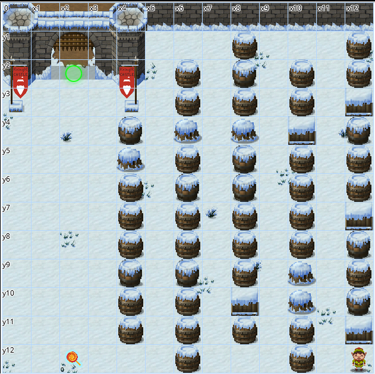

# The Elf Code

I was so looking forward to this challenge. Python baby!


The elf code!

## How to Play
The objective here is to use python to collect all the lollipops and return to the KringleCon entrance. Look out for munchkins and traps!

Use the console to move your elf in the game window. Use commands like

`elf.moveLeft(1)` or `elf.moveRight(2)` to move the elf around, collect the lollipops and reach the green circle found at the KringleCon entrance.

Sometimes you need to solve a python challenge to get past a Munchkin. To answer the challenge, use `munchkin.answer(answer)`. Just make sure you are within 1 grid square of a munchkin before submitting the answer.


## Level 0


This is a freebie, as the code is already provided.


Challenge: Use no more than 22 lines of code and 8 object function calls.

```python
import elf, munchkins, levers, lollipops, yeeters, pits
# Grab our lever object
lever = levers.get(0)
munchkin = munchkins.get(0)
lollipop = lollipops.get(0)
# move to lever position
elf.moveTo(lever.position)
# get lever int and add 2 and submit val
leverData = lever.data() + 2
lever.pull(leverData)
# Grab lollipop and stand next to munchkin
elf.moveLeft(1)
elf.moveUp(8)
# Solve the munchkin's challenge
munchList = munchkin.ask() # e.g. [1, 3, "a", "b", 4]
answer_list = []
for elem in munchList:
    if type(elem) == int:
        answer_list.append(elem)
munchkin.answer(answer_list)
elf.moveUp(2) # Move to finish
```


## Level 1 - *Get Moving*
Objective: Move the elf to collect the lollipops and get to the KringleCon entrance at `dict` location `{"x":2,"y":2}`.

Hint: You can click on the **Elf** picture in the **OBJECT HELP** menu for information on all of the elf move functions.

Solution
```python
import elf, munchkins, levers, lollipops, yeeters, pits
elf.moveLeft(10)
elf.moveUp(10)
```


## Level 2 - *Get moveTo'ing*
Objective: Move the elf to collect the lollipops and get to the KingleCon entrance
Hint: The `elf.moveTo` function should help reduce the number of elf move function calls, if used properly.


The code I started with
```python
import elf, munchkins, levers, lollipops, yeeters, pits
# Gets all lollipops as a list
all_lollipops = lollipops.get()
# Can set lollipop1 using:
lollipop1 = all_lollipops[1]
# Can also set lollipop0 using:
lollipop0 = lollipops.get(0)
# or:
lollipop0 = all_lollipops[1]
elf.moveTo(lollipop1.position)
```

What I finished with:
```python
import elf, munchkins, levers, lollipops, yeeters, pits
all_lollipops = lollipops.get()
elf.moveTo(all_lollipops[1].position)
elf.moveTo(all_lollipops[0].position)
elf.moveLeft(3)
elf.moveUp(6)
```


## Level 3 - *Don't Get Yeeted!*
Objective: Move the elf to collect the lollipops and get to the KringleCon entrance.
Hint: You can walk past the Yeeter once you complete `lever0`'s task and `lever0.pull(modified_data)` in the desired way to disable to Yeeter trap. Click on the lever 0 object in the **CURRENT LEVEL OBJECTS** panel for more information.


The code I started with:
```python
import elf, munchkins, levers, lollipops, yeeters, pits
lever0 = levers.get(0)
lollipop0 = lollipops.get(0)
```

This lever has an objective:

### Lever objective
**Objective**  

_Add_ **2** to the returned `int` value of running the function `lever0.data()` .  
  
For example, if you wanted to _multiply_ the value by **3** and store to a variable, you could do:  
`sum = lever0.data() * 3`  
  
Then submit the sum using:  
`lever0.pull(sum)`

**Note**  
  
If you submit a correct answer to `lever.pull(answer)`, then the lever and its corresponding trap will be disabled.  
  
In order to run `lever.pull(answer)` with lever _(#0)_, you **must** be standing in its grid square located at _(x:6,y:12)_.  
  
This particular lever object can be saved to a variable named lever using `lever = levers.get(0)`

Answer
```python
import elf, munchkins, levers, lollipops, yeeters, pits
lever0 = levers.get(0)
lollipop0 = lollipops.get(0)
elf.moveTo(lever0.position)
lever0.pull(lever0.data()+2)
elf.moveTo(lollipop0.position)
elf.moveUp(10)
```


## Level 4 - *Data Types*
Yay

### Objective

Pull ALL of the levers by submitting the requested data for each using `lever.pull(data)` to disable the Yeeter trap at the KringleCon entrance.

### Hints

Move the elf to the lever. Get the lever data `lever.data()` and perform the appropriate action to the data. Submit the modified data using `lever.pull(modified_data)`.

This level requires you to check and convert variable data types (bool, int, str, float, list, dict, etc.) This [link](https://www.freecodecamp.org/news/the-python-guide-for-beginners/#types) should prove useful. Some data type examples include:

-   `10` - This has a data type of `int`
-   `"Hello World"` - This has a data type of `str`
-   `[1,2,3]` - This has a data type of `list`. This list contains three `int` objects.


What I started with:
```python
import elf, munchkins, levers, lollipops, yeeters, pits
# Complete the code below:
lever0, lever1, lever2, lever3, lever4 = levers.get()
# Move onto lever4
elf.moveLeft(2)
# This lever wants a str object:
lever4.pull("A String")
# Need more code below:
```

All the levers here asked to send it a specific datatype. Strings, booleans, integers, lists, and dictionaries.

How I finished it:
```python
import elf, munchkins, levers, lollipops, yeeters, pits
lever0, lever1, lever2, lever3, lever4 = levers.get()
elf.moveLeft(2)
lever4.pull("Ho ho ho!")
elf.moveTo(lever3.position)
lever3.pull(True)
elf.moveTo(lever2.position)
lever2.pull(1225)
elf.moveTo(lever1.position)
lever1.pull(['Merry', 'Christmas!'])
elf.moveTo(lever0.position)
lever0.pull({'Merriness': 100})
elf.moveUp(2)
```

## Level 5 - *Conversions and Comparisons*
### Objective

Pull all of the levers by submitting the requested data for each using `lever.pull(data)` to disable the Yeeter trap at the KringleCon entrance.

### Hint

Move the elf to the lever. Get the lever data `lever.data()` and perform the appropriate action to the data. Submit the modified data using `lever.pull(modified_data)`.


What I started with
```python
import elf, munchkins, levers, lollipops, yeeters, pits
# Fix/Complete Code below
lever0, lever1, lever2, lever3, lever4 = levers.get()
# Solve for each lever, moving to the space
# on the lever before calling leverN.pull()

# Don't forget to move to the KringleCon entrance!
```

#### Lever 4 challenge:
Calling `lever.data()` will return a string to you. Take this string and concatenate it with a string of `" concatenate"`. Submit these two concatenated strings using `lever.pull(concatenated_strings)` .

#### Lever 3 challenge:
**Objective**  

Submit the inverse bool object returned by pulling `lever.data()` to this lever using `lever.pull(inversed_bool_object)`. For example, if `True` is returned, then you must submit `False`.

#### Lever 2 challenge:
**Objective**  

Add one `1 +` to the integer returned from running `lever.data()`. Then submit this modified int using `lever.pull(int_one_plus)`.

EZ

#### Lever 1 challenge
**Objective**  

Append the int `1` to the end of the list returned from running `lever.data()`. Submit this new list using `lever.pull(appended_list)`.


#### Lever 0 challenge
**Objective**  

lever.data() will return a `dict` object. Add a key and value pair to this dictionary of `"strkey":"strvalue"` and then submit this modified dictionary using `lever.pull(modified_dict)`.

Solution:
```python
import elf, munchkins, levers, lollipops, yeeters, pits
lever0, lever1, lever2, lever3, lever4 = levers.get()
elf.moveTo(lever4.position)
lever4.pull(lever4.data()+" concatenate")
elf.moveTo(lever3.position)
lever3.pull(not lever3.data())
elf.moveTo(lever2.position)
lever2.pull(lever2.data()+1)
elf.moveTo(lever1.position)
hohoho = lever1.data()
hohoho.append(1)
lever1.pull(hohoho)
elf.moveTo(lever0.position)
hohoho = lever0.data()
hohoho['strkey'] = 'strvalue'
lever0.pull(hohoho)
elf.moveUp(2)
```

## Level 6 - *Types and Conditionals*
### Objective

Move the elf to the lever. Get the lever data `lever.data()` and perform the appropriate action to the data. Submit the modified data using `lever.pull(modified_data)`.

### Hints

This level requires the use of operators to compare and modify data. This [link](https://www.freecodecamp.org/news/the-python-guide-for-beginners/#operators) on operators should help.  
  
Data types will also need to be checked using conditionals in `if`, `elif`, `else` statements. This [link](https://www.freecodecamp.org/news/the-python-guide-for-beginners/#operators) on conditionals should help.  
  
You will also need to use conditionals to check data types. This [link](https://www.freecodecamp.org/news/the-python-guide-for-beginners/#types) on types should help.

For example, if you want to check the type of a variable, you could use:

`if type(var) == str:`  
 `print("Its a string!")`
 
 
 
 #### Lever Objective
 **Objective**  

Calling `lever.data()` will return a boolean, a number, a list of integers, a string, or a dict with `"a"` and an integer to you. For a boolean, return the inverse. For a number, return double the number. For a list of integers, return that list with each integer incremented by 1. For a string, return the string concatenated with itself. For a dict, return the dict with `a`'s value + 1. Submit this response using `lever.pull(conditional_answer)` .

**Note**  
  
If you submit a correct answer to `lever.pull(answer)`, then the lever and its corresponding trap will be disabled.  
  
In order to run `lever.pull(answer)` with lever _(#0)_, you **must** be standing in its grid square located at _(x:2,y:4)_.  
  
This particular lever object can be saved to a variable named lever using `lever = levers.get(0)`

Solution (You can't stop me baby!)
```python
import elf, munchkins, levers, lollipops, yeeters, pits
def holiday_cheer(obj):
    if type(obj) is str:
        return obj+obj
    if type(obj) is bool:
        return not obj
    if type(obj) is int:
        return obj*2
    if type(obj) is list:
        return [i+1 for i in obj]
    if type(obj) is dict:
        obj['a'] += 1
        return obj

lever = levers.get(0)
elf.moveTo(lever.position)
lever.pull(holiday_cheer(lever.data()))
elf.moveUp(2)
```
 
## Level 7 - *Up Down Loopiness*
### Objective

Navigate through the obstacles and collect the lollipop before arriving at the KringleCon entrance.

### Hints

Using a `for` loop can reduce how many lines and/or object function calls are used. This [link](https://www.freecodecamp.org/news/the-python-guide-for-beginners/#forloops) on `for` loops may be helpful.

Using `elf.moveLeft(40)` will move your elf as far as possible before hitting an obstacle or the end of the screen. Use however large a number you think you need!



No levers, just restrictive as to how much code you can enter.

Solution
```python
import elf, munchkins, levers, lollipops, yeeters, pits
lollipop = lollipops.get(0)
for num in range(2): #not sure if number is right
    elf.moveLeft(2)
    elf.moveUp(11)
    elf.moveLeft(2)
    elf.moveDown(11)

elf.moveTo(lollipop.position)
elf.moveUp(10)
```

## Level 8 - *Two Paths, Your Choice*
### Objective

Navigate past the obstacles and avoid the munchkin watching the KringleCon entrance.

### Hints

Reduce the number of lines necessary to reach the KringleCon entrance by using a loop. This [link](https://www.freecodecamp.org/news/the-python-guide-for-beginners/#forloops) on `for` loops will be helpful.

There are two paths for you to choose from. Choosing the lever takes more steps but may be easier to solve.


This one has a munchkin! I have the choice of asking the munchkin to pass, or pulling the lever and ending his tyranny.

First, the munchkin solution:

```python
import elf, munchkins, levers, lollipops, yeeters, pits
all_lollipops = lollipops.get()
for lollipop in all_lollipops:
    elf.moveTo(lollipop.position)
# After loop we solve the lever or munchkin challenge and move to end.
elf.moveLeft(8)
elf.moveUp(2)
munchkin = munchkins.get(0)
munchkin.answer(next((k for k, v in munchkin.ask().items() if v == 'lollipop')))
elf.moveUp(2)
```

## Level 9 - *Yeeter Swirl*
This looks familiar...
### Objective

Follow the swirl being careful not to step on any traps (or get yeeted off the map). **Note:** The `elf.moveTo(object)` function has been disabled for this challenge.

### Hint

Use loops and an incrementing count to take the exact number of steps. Some sample code has been started for you but needs to be fixed/finished.


The levers all ask that you pull with a number that is incremented, for example lever0 is pulled with `lever.pull(0)`, lever1 is `lever.pull(1)`, etc.

Starting code, most of the fun stuff is already completed:
```python
import elf, munchkins, levers, lollipops, yeeters, pits

def func_to_pass_to_mucnhkin(list_of_lists):
    sum_of_ints_in_list_of_lists = 9
    return sum_of_ints_in_list_of_lists

all_levers = levers.get()
# Create Movement pattern:
moves = [elf.moveDown, elf.moveLeft, elf.moveUp, elf.moveRight] * 2

# We iterate over each move in moves getting an index (i) number that increments by one each time
for i, move in enumerate(moves):
    # We need to call each move
    # if i is less than the len(all_levers), we pull the lever
    
# We should be at lollipop 2. We need to 
# Get to munchkin and answer their question
# by passing our finished function

```

#### The Munchkin's challenge:
**Objective**  

`munchkin.ask()` will not be used for my challenge. Instead, create a function that will accept one argument.

For example:

```
def YourFunctionNameHere(one_argument):
    // some function code will go here
    return some_desired_data
```

  
Your created function will be passed a randomized `list` containing `list`'s which contain `str`'s and `int`'s.

For example:

```
[
    [1,"sdff",2,9,"olidfhj",6],
    [2,5,1,"jdhgwe",4],
    ["wyuier",2,2,9,2,"jfghwgfb",5],
    [4,"bnwc",9]
]
```

  
Your created function must be able to iterate over this randomized list and each of its child `list`'s and return the total sum of adding all of the `int`'s in all of the child `list`'s.

Once you have created this function and are sure it will return the desired sum, pass your created function as an argument to me:

`munchkin.answer(YourFunctionNameHere)`

If your passed function works properly, I will become friendly and move out of your way.

Solution

```python
import elf, munchkins, levers, lollipops, yeeters, pits

def func_to_pass_to_munchkin(list_of_lists):
    sum_of_ints_in_list_of_lists = 0
    for i in list_of_lists:
        for j in i:
            if type(j) is int:
                sum_of_ints_in_list_of_lists += j
    return sum_of_ints_in_list_of_lists

all_levers = levers.get()
# Create Movement pattern:
moves = [elf.moveDown, elf.moveLeft, elf.moveUp, elf.moveRight] * 2

# We iterate over each move in moves getting an index (i) number that increments by one each time
for i, move in enumerate(moves):
    move(i+1)
    if i < len(all_levers):
        all_levers[i].pull(i)
elf.moveUp(2)
elf.moveLeft(4)
munchkin = munchkins.get(0)
munchkin.answer(func_to_pass_to_munchkin)
elf.moveUp(1)
```

## Level 10 - *Munchkin Dodging Finale*
BRING IT ON

### Objective

Dodge the munchkins to get to the KringleCon entrance.

### Hints

You want to move once each munchkin is the furthest grid coordinates aways on the x axis (which will be `6` for each munchkin). Use while loops and implement a conditional check using the `elf.position["x"]` and `munchkin.position["x"]` values to check how far away the munchkin is before using `moveTo` to the next lollipops position. When using while loops, use a small delay of `time.sleep(0.05)` to ensure the browser does not lock up.


These munchkins are under strict orders to never be friendly! I have to sneak past them as they move back and forth.

Original code:
```python
import elf, munchkins, levers, lollipops, yeeters, pits
import time
muns = munchkins.get()
lols = lollipops.get()[::-1]
for index, mun in enumerate(muns):
    # need to wait while absolute distance between
    # elf.position["x"] and mun.position['x'] is less than 6
    # then we move to next lollipop
    # We can use time.sleep(0.05) to add a small delay in a while loop
```

GOT IT!
```python
import elf, munchkins, levers, lollipops, yeeters, pits
import time
muns = munchkins.get()
lols = lollipops.get()[::-1]
for index, mun in enumerate(muns):
    while abs(elf.position["x"]-mun.position["x"]) < 6:
        time.sleep(0.05)
    
    elf.moveTo(lols[index].position)

elf.moveLeft(6)
elf.moveUp(2)
```

ELVES RULE MUNCHKINS DROOL

