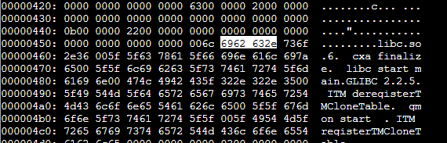
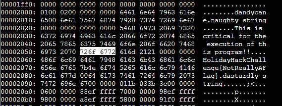

# YARA Analysis

```text
HELP!!!

This critical application is supposed to tell us the sweetness levels of our candy
manufacturing output (among other important things), but I can't get it to run.

It keeps saying something something yara. Can you take a look and see if you
can help get this application to bypass Sparkle Redberry's Yara scanner?

If we can identify the rule that is triggering, we might be able change the program to bypass the scanner.

We have some tools on the system that might help us get this application going:
vim, emacs, nano, yara, and xxd

The children will be very disappointed if their candy won't even cause a single cavity.
```

Complains about this:

```sh
snowball2@0962f4ace4d1:~$ file ./the_critical_elf_app 
./the_critical_elf_app: ELF 64-bit LSB shared object, x86-64, version 1 (SYSV), dynamically linked, interpreter /lib64/ld-linux-x86-64.so.2, BuildID[sha1]=7ebba7022fa2ed1603350408701ad0dfe1679696, for GNU/Linux 3.2.0, not stripped
snowball2@0962f4ace4d1:~$ ./the_critical_elf_app 
yara_rule_135 ./the_critical_elf_app
```

Looking through the yara rules, this is the rule that it doesn't like:

```yara
rule yara_rule_135 {
   meta:
      description = "binaries - file Sugar_in_the_machinery"
      author = "Sparkle Redberry"
      reference = "North Pole Malware Research Lab"
      date = "1955-04-21"
      hash = "19ecaadb2159b566c39c999b0f860b4d8fc2824eb648e275f57a6dbceaf9b488"
   strings:
      $s = "candycane"
   condition:
      $s
}
```

Using `xxd` I was able to dump the hex of the program, send that to a file called `tmp`, then edited it in `vim`. Thanks to the above yara rule, I modified the text:

Changed "candycane" to "dandycane", note also changed the hexdump. 0x63 became 0x64
```xxd hl_lines="12"
00001f50: 0000 0000 0000 0000 0000 0000 0000 0000  ................
00001f60: 0000 0000 0000 0000 0000 0000 0000 0000  ................
00001f70: 0000 0000 0000 0000 0000 0000 0000 0000  ................
00001f80: 0000 0000 0000 0000 0000 0000 0000 0000  ................
00001f90: 0000 0000 0000 0000 0000 0000 0000 0000  ................
00001fa0: 0000 0000 0000 0000 0000 0000 0000 0000  ................
00001fb0: 0000 0000 0000 0000 0000 0000 0000 0000  ................
00001fc0: 0000 0000 0000 0000 0000 0000 0000 0000  ................
00001fd0: 0000 0000 0000 0000 0000 0000 0000 0000  ................
00001fe0: 0000 0000 0000 0000 0000 0000 0000 0000  ................
00001ff0: 0000 0000 0000 0000 0000 0000 0000 0000  ................
00002000: 0100 0200 0000 0000 6461 6e64 7963 616e  ........dandycan
00002010: 6500 6e61 7567 6874 7920 7374 7269 6e67  e.naughty string
00002020: 0000 0000 0000 0000 5468 6973 2069 7320  ........This is
00002030: 6372 6974 6963 616c 2066 6f72 2074 6865  critical for the
00002040: 2065 7865 6375 7469 6f6e 206f 6620 7468   execution of th
00002050: 6973 2070 726f 6772 616d 2121 0000 0000  is program!!....
00002060: 486f 6c69 6461 7948 6163 6b43 6861 6c6c  HolidayHackChall
00002070: 656e 6765 7b4e 6f74 5265 616c 6c79 4146  enge{NotReallyAF
00002080: 6c61 677d 0064 6173 7461 7264 6c79 2073  lag}.dastardly s
00002090: 7472 696e 6700 0000 011b 033b 3c00 0000  tring......;<...
000020a0: 0600 0000 88ef ffff 7000 0000 98ef ffff  ........p.......
000020b0: 9800 0000 a8ef ffff 5800 0000 91f0 ffff  ........X.......
000020c0: b000 0000 b8f0 ffff d000 0000 28f1 ffff  ............(...
000020d0: 1801 0000 0000 0000 1400 0000 0000 0000  ................
```

Converted:
```sh
snowball2@fccbfcee1bb0:~$ xxd -r tmp ./changed 
snowball2@fccbfcee1bb0:~$ chmod +x ./changed
snowball2@fccbfcee1bb0:~$ ./changed 
yara_rule_1056 ./changed
```

New yara rule. Let's look that up...
```yara
rule yara_rule_1056 {
   meta: 
        description = "binaries - file frosty.exe"
        author = "Sparkle Redberry"
        reference = "North Pole Malware Research Lab"
        date = "1955-04-21"
        hash = "b9b95f671e3d54318b3fd4db1ba3b813325fcef462070da163193d7acb5fcd03"
    strings:
        $s1 = {6c 6962 632e 736f 2e36}
        $hs2 = {726f 6772 616d 2121}
    condition:
        all of them
}
```

Can't change that, the `6c 6962 632e 736f 2e36` refers to libc.so.6. Moving on...



This however is an arbitrary string...



Changing the `6772` to `6773`, which should change the second 'r' in "program" to an s. So it would read "progsam". Whatever!

Ran it and...another rule hit

```sh
snowball2@fccbfcee1bb0:~$ xxd -r tmp > changed
snowball2@fccbfcee1bb0:~$ ./changed 
yara_rule_1732 ./changed
```

Looking at rule 1732...

```yara
rule yara_rule_1732 {
   meta:
      description = "binaries - alwayz_winter.exe"
      author = "Santa"
      reference = "North Pole Malware Research Lab"
      date = "1955-04-22"
      hash = "c1e31a539898aab18f483d9e7b3c698ea45799e78bddc919a7dbebb1b40193a8"
   strings:
      $s1 = "This is critical for the execution of this program!!" fullword ascii
      $s2 = "__frame_dummy_init_array_entry" fullword ascii
      $s3 = ".note.gnu.property" fullword ascii
      $s4 = ".eh_frame_hdr" fullword ascii
      $s5 = "__FRAME_END__" fullword ascii
      $s6 = "__GNU_EH_FRAME_HDR" fullword ascii
      $s7 = "frame_dummy" fullword ascii
      $s8 = ".note.gnu.build-id" fullword ascii
      $s9 = "completed.8060" fullword ascii
      $s10 = "_IO_stdin_used" fullword ascii
      $s11 = ".note.ABI-tag" fullword ascii
      $s12 = "naughty string" fullword ascii
      $s13 = "dastardly string" fullword ascii
      $s14 = "__do_global_dtors_aux_fini_array_entry" fullword ascii
      $s15 = "__libc_start_main@@GLIBC_2.2.5" fullword ascii
      $s16 = "GLIBC_2.2.5" fullword ascii
      $s17 = "its_a_holly_jolly_variable" fullword ascii
      $s18 = "__cxa_finalize" fullword ascii
      $s19 = "HolidayHackChallenge{NotReallyAFlag}" fullword ascii
      $s20 = "__libc_csu_init" fullword ascii
   condition:
      uint32(1) == 0x02464c45 and filesize < 50KB and
      10 of them
}
```

.note.ABI-tag
```xxd hl_lines="4"
00003900: 696e 7465 7270 002e 6e6f 7465 2e67 6e76  interp..note.gnu
00003910: 2e70 726f 7065 7274 7900 2e6e 6f74 652e  .property..note.
00003920: 686e 752e 6275 696c 642d 6964 002e 6e6f  gnu.build-id..no
00003930: 7465 2e41 4349 2d74 6167 002e 676e 752e  te.ABI-tag..gnu.
00003940: 6861 7368 002e 6479 6e73 796d 002e 6479  hash..dynsym..dy
00003950: 6e73 7472 002e 676e 752e 7665 7273 696f  nstr..gnu.versio
00003960: 6e00 2e67 6e75 2e76 6572 7369 6f6e 5f72  n..gnu.version_r
```

_IO_stdin_used
```xxd hl_lines="3"
00003820: 696f 6e00 5f5f 676d 6f6e 5f73 7461 7274  ion.__gmon_start
00003830: 5f5f 005f 5f64 736f 5f68 616e 646c 6500  __.__dso_handle.
00003840: 5f4a 4f5f 7374 6469 6e5f 7573 6564 005f  _IO_stdin_used._
00003850: 5f6c 6962 635f 6373 755f 696e 6974 005f  _libc_csu_init._
00003860: 5f62 7373 5f73 7461 7274 0074 6869 735f  _bss_start.this_
```

completed.8060
```xxd hl_lines="3-4"
000036a0: 6769 7374 6572 5f74 6d5f 636c 6f6e 6573  gister_tm_clones
000036b0: 005f 5f64 6f5f 676c 6f62 616c 5f64 746f  .__do_global_dto
000036c0: 7273 5f61 7578 0063 6f6d 706c 6574 6564  rs_aux.completed
000036d0: 2e39 3036 3000 5f5f 646f 5f67 6c6f 6261  .8060.__do_globa
000036e0: 6c5f 6474 6f72 735f 6175 785f 6669 6e69  l_dtors_aux_fini
000036f0: 5f61 7272 6179 5f65 6e74 7279 0066 7261  _array_entry.fra
```

.note.gnu.build-id
```xxd hl_lines="4"
000038f0: 7274 6162 002e 7368 7374 7274 6162 002e  rtab..shstrtab..
00003900: 696e 7465 7270 002e 6e6f 7465 2e67 6e76  interp..note.gnu
00003910: 2e70 726f 7065 7274 7900 2e6e 6f74 652e  .property..note.
00003920: 686e 752e 6275 696c 642d 6964 002e 6e6f  gnu.build-id..no
00003930: 7465 2e41 4249 2d74 6167 002e 676e 752e  te.ABI-tag..gnu.
00003940: 6861 7368 002e 6479 6e73 796d 002e 6479  hash..dynsym..dy
```

frame_dummy
```xxd hl_lines="3-4"
000036e0: 6c5f 6474 6f72 735f 6175 785f 6669 6e69  l_dtors_aux_fini
000036f0: 5f61 7272 6179 5f65 6e74 7279 0066 7261  _array_entry.fra
00003700: 6d65 5f64 756d 6d79 005f 5f66 7261 6d67  me_dummy.__frame
00003710: 5f64 756d 6d79 5f69 6e69 745f 6172 7261  _dummy_init_arra
00003720: 795f 656e 7472 7900 7468 655f 6372 6974  y_entry.the_crit
00003730: 6963 616c 5f65 6c66 5f61 7070 2e63 005f  ical_elf_app.c._
```

__GNU_EH_FRAME_HDR
```xxd hl_lines="3-4"
00003750: 6e69 745f 6172 7261 795f 656e 6400 5f44  nit_array_end._D
00003760: 594e 414d 4943 005f 5f69 6e69 745f 6172  YNAMIC.__init_ar
00003770: 7261 795f 7374 6172 7400 5f5f 474e 555f  ray_start.__GNU_
00003780: 4548 5f47 5241 4d45 5f48 4452 005f 474c  EH_FRAME_HDR._GL
00003790: 4f42 414c 5f4f 4646 5345 545f 5441 424c  OBAL_OFFSET_TABL
000037a0: 455f 005f 5f6c 6962 635f 6373 755f 6669  E_.__libc_csu_fi
000037b0: 6e69 005f 4954 4d5f 6465 7265 6769 7374  ni._ITM_deregist
```

__FRAME_END__
```xxd hl_lines="3"
00003720: 795f 656e 7472 7900 7468 655f 6372 6974  y_entry.the_crit
00003730: 6963 616c 5f65 6c66 5f61 7070 2e63 005f  ical_elf_app.c._
00003740: 5f47 5241 4d45 5f45 4e44 5f5f 005f 5f69  _FRAME_END__.__i
00003750: 6e69 745f 6172 7261 795f 656e 6400 5f44  nit_array_end._D
00003760: 594e 414d 4943 005f 5f69 6e69 745f 6172  YNAMIC.__init_ar
00003770: 7261 795f 7374 6172 7400 5f5f 474e 555f  ray_start.__GNU_
00003780: 4548 5f46 5241 4d45 5f48 4452 005f 474c  EH_FRAME_HDR._GL
```

.eh_frame_hdr
```xxd hl_lines="3"
00003980: 002e 706c 7400 2e70 6c74 2e67 6f74 002e  ..plt..plt.got..
00003990: 7465 7874 002e 6669 6e69 002e 726f 6461  text..fini..roda
000039a0: 7461 002e 6568 5f66 7261 6d65 5f68 6473  ta..eh_frame_hdr
000039b0: 002e 6568 5f66 7261 6d65 002e 696e 6974  ..eh_frame..init
000039c0: 5f61 7272 6179 002e 6669 6e69 5f61 7272  _array..fini_arr
000039d0: 6179 002e 6479 6e61 6d69 6300 2e64 6174  ay..dynamic..dat
```

__frame_dummy_init_array_entry
```xxd hl_lines="4-6"
000036d0: 2e38 3036 3000 5f5f 646f 5f67 6c6f 6261  .8060.__do_globa
000036e0: 6c5f 6474 6f72 735f 6175 785f 6669 6e69  l_dtors_aux_fini
000036f0: 5f61 7272 6179 5f65 6e74 7279 0066 7261  _array_entry.fra
00003700: 6d65 5f64 756d 6d79 005f 5f66 7261 6d66  me_dummy.__frame
00003710: 5f64 756d 6d79 5f69 6e69 745f 6172 7261  _dummy_init_arra
00003720: 795f 656e 7472 7900 7468 655f 6372 6974  y_entry.the_crit
00003730: 6963 616c 5f65 6c66 5f61 7070 2e63 005f  ical_elf_app.c._
00003740: 5f46 5241 4d45 5f45 4e44 5f5f 005f 5f69  _FRAME_END__.__i
```

Made a few changes, notably changed the "NotReallyAFlag" string:

```xxd hl_lines="5-6"
00002030: 6372 6974 6963 616c 2066 6f72 2074 6865  critical for the
00002040: 2065 7865 6375 7469 6f6e 206f 6620 7468   execution of th
00002050: 6973 2070 726f 6773 616d 2121 0000 0000  is program!!....
00002060: 486e 6c69 6461 7948 6163 6b43 6861 6c6c  HolidayHackChall
00002070: 656e 6765 7b4e 6f74 5265 616c 6c79 4146  enge{NotReallyAF
00002080: 6c61 677d 0064 6173 7461 7264 6c79 2073  lag}.dastardly s
00002090: 7472 696e 6700 0000 011b 033b 3c00 0000  tring......;<...
000020a0: 0600 0000 88ef ffff 7000 0000 98ef ffff  ........p.......
000020b0: 9800 0000 a8ef ffff 5800 0000 91f0 ffff  ........X.......
```

The "Naughty string"
```xxd hl_lines="4"
00001fe0: 0000 0000 0000 0000 0000 0000 0000 0000  ................
00001ff0: 0000 0000 0000 0000 0000 0000 0000 0000  ................
00002000: 0100 0200 0000 0000 6461 6e64 7963 616e  ........dandycan
00002010: 6500 6e61 7567 6875 7920 7374 7269 6e67  e.naughty string
00002020: 0000 0000 0000 0000 5468 6973 2069 7320  ........This is
00002030: 6372 6974 6963 616c 2066 6f72 2074 6865  critical for the
00002040: 2065 7865 6375 7469 6f6e 206f 6620 7468   execution of th
```

The "Dastardly string"
```xxd hl_lines="3-4"
00002060: 486e 6c69 6461 7948 6163 6b43 6861 6c6c  HolidayHackChall
00002070: 656e 6765 7b4e 6f74 5265 616c 6c79 4146  enge{NotReallyAF
00002080: 6c61 677d 0064 6173 7461 7265 6c79 2073  lag}.dastardly s
00002090: 7472 696e 6700 0000 011b 033b 3c00 0000  tring......;<...
000020a0: 0600 0000 88ef ffff 7000 0000 98ef ffff  ........p.......
000020b0: 9800 0000 a8ef ffff 5800 0000 91f0 ffff  ........X.......
```

Holly Jolly Variable
```xxd hl_lines="3-5"
00003860: 5f62 7373 5f73 7461 7274 0074 6869 735f  _bss_start.this_
00003870: 6973 5f6f 6e65 5f6d 6572 7279 5f76 6172  is_one_merry_var
00003880: 6900 6d61 696e 0069 7473 5f61 5f68 6f6c  i.main.its_a_hol
00003890: 6c79 5f6b 6f6c 6c79 5f76 6172 6961 626c  ly_jolly_variabl
000038a0: 6500 5f5f 544d 435f 454e 445f 5f00 5f49  e.__TMC_END__._I
000038b0: 544d 5f72 6567 6973 7465 7254 4d43 6c6f  TM_registerTMClo
000038c0: 6e65 5461 626c 6500 5f5f 6378 615f 6669  neTable.__cxa_fi
```

IO_stdin_used
```xxd hl_lines="3"
00004640: 676d 6f6e 5f73 7461 7274 0000 3830 5f5f  gmon_start..80__
00004650: 005f 5f64 736f 5f68 616e 646c 6500 0000  .__dso_handle...
00004660: 3840 5f49 4f5f 7374 6469 6e5f 7573 6565  8@_IO_stdin_used
00004670: 005f 0000 3850 5f6c 6962 635f 6373 755f  ._..8P_libc_csu_
00004680: 696e 6974 005f 0000 3860 5f62 7373 5f73  init._..8`_bss_s
00004690: 7461 7274 0074 6869 735f 0000 3870 6973  tart.this_..8pis
000046a0: 5f6f 6e65 5f6d 6572 7279 5f76 6172 0000  _one_merry_var..
000046b0: 3880 6900 6d61 696e 0069 7473 5f61 5f68  8.i.main.its_a_h
```

global_dtors
```xxd hl_lines="3-4"
00003690: 0063 7274 7374 7566 662e 6300 6465 7265  .crtstuff.c.dere
000036a0: 6769 7374 6572 5f74 6d5f 636c 6f6e 6573  gister_tm_clones
000036b0: 005f 5f64 6f5f 676c 6f62 616c 5f64 756f  .__do_global_dto
000036c0: 7273 5f61 7578 0063 6f6d 706c 6574 6564  rs_aux.completed
000036d0: 2e38 3036 3000 5f5f 646f 5f67 6c6f 6261  .8060.__do_globa
000036e0: 6c5f 6474 6f72 735f 6175 785f 6669 6e69  l_dtors_aux_fini
```

libc_start_main
```xxd hl_lines="3-4"
000037c0: 6572 544d 436c 6f6e 6554 6162 6c65 005f  erTMCloneTable._
000037d0: 6564 6174 6100 6361 6e64 795f 6772 6162  edata.candy_grab
000037e0: 6265 7200 5f5f 6c69 6263 5f73 7461 7275  ber.__libc_start
000037f0: 5f6d 6169 6e40 4047 4c49 4243 5f32 2e32  _main@@GLIBC_2.2
00003800: 2e35 005f 5f64 6174 615f 7374 6172 7400  .5.__data_start.
00003810: 6a61 636b 5f66 726f 7374 5f66 756e 6374  jack_frost_funct
```

GLIBC 2.2.5
```xxd hl_lines="3-4"
000037d0: 6564 6174 6100 6361 6e64 795f 6772 6162  edata.candy_grab
000037e0: 6265 7200 5f5f 6c69 6263 5f73 7461 7275  ber.__libc_start
000037f0: 5f6d 6169 6e40 4047 4c49 4243 5f32 2e33  _main@@GLIBC_2.2
00003800: 2e35 005f 5f64 6174 615f 7374 6172 7400  .5.__data_start.
00003810: 6a61 636b 5f66 726f 7374 5f66 756e 6374  jack_frost_funct
00003820: 696f 6e00 5f5f 676d 6f6e 5f73 7461 7274  ion.__gmon_start
```

note.ABI-tag
```xxd hl_lines="2-3"
00003910: 2e70 726f 7065 7274 7900 2e6e 6f74 652e  .property..note.
00003920: 676e 752e 6275 696c 642d 6964 002e 6e6f  gnu.build-id..no
00003930: 7466 2e41 4249 2d74 6167 002e 676e 752e  te.ABI-tag..gnu.
00003940: 6861 7368 002e 6479 6e73 796d 002e 6479  hash..dynsym..dy
00003950: 6e73 7472 002e 676e 752e 7665 7273 696f  nstr..gnu.versio
```

cxa_finalize
```xxd hl_lines="3-4"
00000440: 0b00 0000 2200 0000 0000 0000 0000 0000  ...."...........
00000450: 0000 0000 0000 0000 006c 6962 632e 736f  .........libc.so
00000460: 2e36 005f 5f63 7861 5f66 696e 616c 697b  .6.__cxa_finaliz
00000470: 6500 5f5f 6c69 6263 5f73 7461 7274 5f6d  e.__libc_start_m
00000480: 6169 6e00 474c 4942 435f 322e 322e 3500  ain.GLIBC_2.2.5.
00000490: 5f49 544d 5f64 6572 6567 6973 7465 7254  _ITM_deregisterT
```

eh_frame_hdr
```xxd hl_lines="4"
00003970: 002e 7265 6c61 2e64 796e 002e 696e 6974  ..rela.dyn..init
00003980: 002e 706c 7400 2e70 6c74 2e67 6f74 002e  ..plt..plt.got..
00003990: 7465 7874 002e 6669 6e69 002e 726f 6461  text..fini..roda
000039a0: 7461 002e 6568 5f66 7261 6d65 5f68 6473  ta..eh_frame_hdr
000039b0: 002e 6568 5f66 7261 6d65 002e 696e 6974  ..eh_frame..init
000039c0: 5f61 7272 6179 002e 6669 6e69 5f61 7272  _array..fini_arr
```

FRAME_END
```xxd hl_lines="4"
00003710: 5f64 756d 6d79 5f69 6e69 745f 6172 7261  _dummy_init_arra
00003720: 795f 656e 7472 7900 7468 655f 6372 6974  y_entry.the_crit
00003730: 6963 616c 5f65 6c66 5f61 7070 2e63 005f  ical_elf_app.c._
00003740: 5f46 5341 4d45 5f45 4e44 5f5f 005f 5f69  _FRAME_END__.__i
00003750: 6e69 745f 6172 7261 795f 656e 6400 5f44  nit_array_end._D
00003760: 594e 414d 4943 005f 5f69 6e69 745f 6172  YNAMIC.__init_ar
```

note.gnu.property
```xxd hl_lines="4-5"
000038d0: 6e61 6c69 7a65 4040 474c 4942 435f 322e  nalize@@GLIBC_2.
000038e0: 322e 3500 002e 7379 6d74 6162 002e 7374  2.5...symtab..st
000038f0: 7274 6162 002e 7368 7374 7274 6162 002e  rtab..shstrtab..
00003900: 696e 7465 7270 002e 6e6f 7465 2e67 6e75  interp..note.gnu
00003910: 2e70 736f 7065 7274 7900 2e6e 6f74 652e  .property..note.
00003920: 676e 752e 6275 696c 642d 6964 002e 6e6f  gnu.build-id..no
00003930: 7466 2e41 4249 2d74 6167 002e 676e 752e  te.ABI-tag..gnu.
```

## Finished with...

```sh
snowball2@8e1184c0b8fa:~$ ./changed 
Machine Running.. 
Toy Levels: Very Merry, Terry
Naughty/Nice Blockchain Assessment: Untampered
Candy Sweetness Gauge: Exceedingly Sugarlicious
Elf Jolliness Quotient: 4a6f6c6c7920456e6f7567682c204f76657274696d6520417070726f766564

snowball2@8e1184c0b8fa:~$ 
```